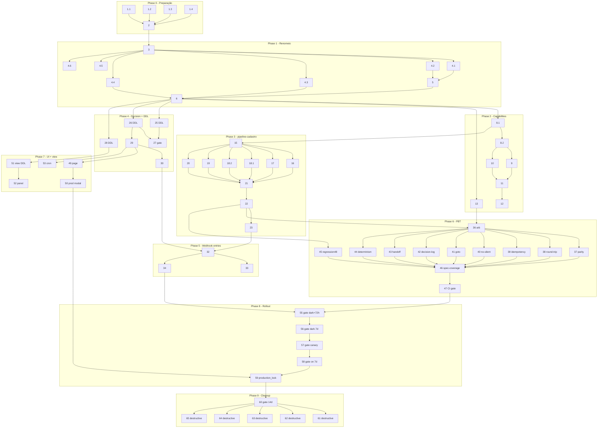

# Implementation Plan

## Overview

Plano em 10 fases (0–9) que materializa o design de
`bot-engine-channel-unification`. Cada fase respeita o gate da seguinte
e respeita o rollout faseado do Requisito 11. Linguagem de
implementação: **TypeScript (Deno)** para o motor, **SQL** para
migrações idempotentes, **Python (stdlib)** para os scripts de
auditoria já versionados na pasta da spec.

Convenções desta lista:

- Caminhos absolutos a partir da raiz do repo (`supabase/...`,
  `src/...`, `.kiro/specs/...`).
- `_Requirements: X.Y_` referencia acceptance criteria do
  `requirements.md` (números exatos).
- `_Validates: Property N (slug)_` referencia a seção
  "Correctness Properties" do `design.md`.
- Tasks de migração SQL são idempotentes (`IF NOT EXISTS`,
  `DO $$ … END $$` com `pg_constraint` check) e trazem o rollback
  documentado em comentário SQL.
- Tasks marcadas `[DESTRUCTIVE]` apagam código ou estruturas e só
  podem rodar quando o gate da fase 9 estiver verde.

## Tasks

### Phase 0 — Preparação

- [x] 1. Validar scripts Python de auditoria existentes
  - [x] 1.1 Rodar `python3 .kiro/specs/bot-engine-channel-unification/audit-cadastro-steps.py` e confirmar que stdout é JSON com 48 itens, todos com `categoria_proposta ∈ {cadastro-only, cta-conversacional, híbrido}`
    - Critério de aceite: `python3 ... | jq 'length'` retorna `48`
    - Anexar saída JSON ao description do PR de planejamento
    - _Requirements: 15.3, 15.5_

  - [x] 1.2 Rodar `python3 .kiro/specs/bot-engine-channel-unification/diff-bot-flow.py` e anexar saída JSON ao PR
    - Critério de aceite: stdout é JSON com chaves `total_diff_lines` e `regions[]`; baseline atual ≈957 linhas (Fase 0 apenas registra, não exige zero)
    - _Requirements: 15.1, 15.5_

  - [x] 1.3 Rodar `python3 .kiro/specs/bot-engine-channel-unification/diff-conversational.py` e anexar saída JSON ao PR
    - Critério de aceite: stdout é JSON; baseline atual ≈272 linhas
    - _Requirements: 15.2, 15.5_

  - [x] 1.4 Rodar `python3 .kiro/specs/bot-engine-channel-unification/v3-vs-legacy-metrics.py` lendo `engine_logs` das últimas 72h
    - Arquivo modificado: nenhum (somente leitura)
    - Critério de aceite: stdout é JSON com `engine_step_enter`, `engine_invalid_step`, `engine_no_match`, `engine_handoff` agregados por consultor
    - Anexar saída ao PR como evidência da Decisão_Engine_V3
    - _Requirements: 13.2, 13.3, 15.4, 15.5_

- [x] 2. Validar evidência de Auditoria_Cadastro_Steps já consolidada
  - Arquivo lido: `.kiro/specs/bot-engine-channel-unification/cadastro-steps-audit.md`
  - Critério de aceite: arquivo existe, contém 48 linhas na tabela canônica, com `decisão_super_admin` preenchido em todas
  - _Requirements: 3.1, 3.2, 3.7_

### Phase 1 — Renomeio sem mudança de comportamento

- [x] 3. Mover diretório `supabase/functions/_shared/flow-engine/` para `supabase/functions/_shared/engine/`
  - Usar `smartRelocate` por arquivo (preserva imports automaticamente):
    `engine.ts`, `dispatcher.ts`, `fallbacks.ts`, `helpers.ts`, `hooks.ts`,
    `router.ts`, `types.ts`, `webhook-hook.ts`, `engine_test.ts`,
    `v3-dispatcher.ts`, `v3-loader.ts`, `v3-runner.ts`, `v3-types.ts`,
    `v3-webhook-entry.ts`, `__tests__/arb.ts`,
    `__tests__/purity_lint_test.ts`, `__tests__/v3-runner_test.ts`,
    `variants/*.ts`
  - Critério de aceite: `deno check` em `supabase/functions/**/*.ts` retorna 0 erros e `git mv` preserva history para todos os arquivos
  - _Requirements: 1.1, 1.2_

- [x] 4. Renomear símbolos `v3-*` para nomes finais do motor unificado
  - [x] 4.1 `runEngineV3WebhookEntry` → `runUnifiedEngineWebhookEntry` em `_shared/engine/v3-webhook-entry.ts` via `semanticRename`
    - Atualiza call sites em `whapi-webhook/index.ts` e `evolution-webhook/index.ts`
    - _Requirements: 1.6_

  - [x] 4.2 Mover/renomear `_shared/engine/v3-webhook-entry.ts` → `_shared/engine/webhook-entry.ts` via `smartRelocate`
    - _Requirements: 1.6_

  - [x] 4.3 Mover/renomear `_shared/engine/v3-runner.ts` → `_shared/engine/runner.ts` via `smartRelocate`
    - _Requirements: 1.1_

  - [x] 4.4 Mover/renomear `_shared/engine/v3-types.ts` → `_shared/engine/types.ts` via `smartRelocate` (resolver colisão com `types.ts` existente do legado: o legado vira `legacy-router-types.ts` provisoriamente; será apagado na Fase 9)
    - _Requirements: 1.1_

  - [x] 4.5 Mover/renomear `_shared/engine/v3-dispatcher.ts` → `_shared/dispatcher/index.ts` via `smartRelocate` (cria diretório novo)
    - _Requirements: 1.1_

  - [x] 4.6 Mover/renomear `_shared/engine/v3-loader.ts` → `_shared/engine/loader.ts` via `smartRelocate`
    - _Requirements: 1.1_

- [x] 5. Criar `_shared/engine/decision.ts` com adapter de compatibilidade
  - Arquivos criados: `supabase/functions/_shared/engine/decision.ts`
  - Conteúdo: tipos `IndividualMode`, `EngineDecision`, função pura `resolveEngineDecision({prodMode, individualMode})` (corpo conforme design §3) — **sem cache nesta task**, sem leitura do Supabase
  - Função stub: `isEngineV3Enabled(supabase, consultantId)` reexporta de `decision.ts` retornando `true` quando `resolveEngineDecision({...}).kind === "engine_unified" || .kind === "shadow"` (preserva semântica atual da rota dark, que hoje só roda em paralelo)
  - Critério de aceite: `deno test supabase/functions/_shared/engine/__tests__/` continua verde
  - _Requirements: 1.6, 8.1_

- [x] 6. Estender purity lint para o novo path `_shared/engine/**`
  - Arquivo modificado: `supabase/functions/_shared/engine/__tests__/purity_lint_test.ts`
  - Mudanças mínimas nesta fase: walka `_shared/engine/**` (path novo); regras anti-`Date.now`/`fetch`/`Math.random`/`crypto.randomUUID`/`from(.*supabase` permanecem
  - Critério de aceite: `deno test purity_lint_test.ts` verde
  - _Validates: Property 7 (pureza estrutural)_
  - _Requirements: 1.4, 1.5_

- [x] 7. Checkpoint Fase 1 — comportamento idêntico ao baseline
  - Rodar `deno test supabase/functions/`, `deno fmt --check`, `deno lint`
  - Rodar `python3 .kiro/specs/bot-engine-channel-unification/v3-vs-legacy-metrics.py` e comparar contra a saída da Task 1.4 (sem regressão de `engine_invalid_step` ou `engine_no_match`)
  - Ensure all tests pass, ask the user if questions arise.

### Phase 2 — Channel capabilities + adapters consolidados

- [x] 8. Promover `ChannelCapabilities` ao vocabulário público do motor
  - [x] 8.1 Atualizar `supabase/functions/_shared/channels/types.ts`
    - Garantir que `ChannelCapabilities` inclui `channel`, `supportsButtons`, `maxButtons`, `supportsList`, `supportsAudio`, `supportsVideo`, `supportsTypingPresence`, `supportsReactions`, `inboundIdField` (conforme design §2)
    - Reexportar `ChannelCapabilities` em `_shared/engine/types.ts` para uso pelo runner
    - _Requirements: 2.1, 2.2_

  - [x] 8.2 Declarar constantes estáticas `WHAPI_CAPABILITIES` e `EVOLUTION_CAPABILITIES`
    - Arquivos modificados: `supabase/functions/_shared/channels/whapi.ts`, `supabase/functions/_shared/channels/evolution.ts`
    - Valores conforme design §2 (Whapi: `supportsButtons=true, maxButtons=3`; Evolution: `supportsButtons=false, maxButtons=0, supportsList=true`)
    - _Requirements: 2.1, 2.2_

- [ ] 9. Implementar `parseInbound` Whapi com `button_click`
  - Arquivo modificado: `supabase/functions/_shared/channels/whapi.ts`
  - Função `parseInbound(raw, capabilities, state)` retorna `InboundEvent` discriminado: `text`, `button_click` (com `buttonId`, `rawText`), `media`, `no_input`
  - Critério de aceite: `supabase/functions/_shared/channels/whapi_test.ts` cobre clique de botão e retorna `kind: "button_click"`
  - _Requirements: 2.7_

- [ ] 10. Implementar `parseInbound` Evolution com `number_reply` (Round_Trip_Botão_Número)
  - Arquivo modificado: `supabase/functions/_shared/channels/evolution.ts`
  - Função recebe `lastChoiceOptions: string[] | null` e, quando texto bate `^\d{1,2}$` E o índice está no range, retorna `kind: "number_reply", raw: text`
  - Inclui suporte a `listResponseMessage.singleSelectReply.selectedRowId` como `kind: "button_click"` (para uso futuro)
  - Critério de aceite: `supabase/functions/_shared/channels/evolution_test.ts` cobre dígitos `1`/`2` e retorna `kind: "number_reply"` mapeando para a opção correta
  - _Requirements: 2.6_

- [ ] 11. Implementar `renderChoice` com downgrade explícito Whapi >maxButtons → numbered
  - Arquivo modificado: `supabase/functions/_shared/channels/dispatch-choice.ts`
  - Implementação conforme design §2 (`Caminho 1` botões, `Caminho 2a/2b` numerada, retorna `log: "engine_choice_downgraded"` quando aplicável)
  - Persistir mapeamento `optionsByIndex` no `state.lastChoiceOptions` via dispatcher
  - Critério de aceite: `supabase/functions/_shared/channels/dispatch-choice_test.ts` cobre `(Whapi, 4 opções) → numbered + log` e `(Evolution, 2 opções) → numbered`
  - _Requirements: 2.3, 2.4, 2.5_

- [ ] 12. Implementar downgrade de capability para mídia/áudio
  - Arquivo modificado: `supabase/functions/_shared/dispatcher/index.ts`
  - Quando `capabilities.supportsAudio = false` e outbound é `kind: "audio_slot"`, dispatcher converte para `kind: "text"` com `step.audioFallbackText` e escreve `engine_logs.kind = "engine_capability_downgrade"`
  - Mesma regra para `kind: "media"` com `mediaKind: "video"` quando `supportsVideo = false`
  - _Requirements: 2.9, 5.6_

- [x] 13. Estender purity lint banindo literais `"whapi"` e `"evolution"` em `_shared/engine/**`
  - Arquivo modificado: `supabase/functions/_shared/engine/__tests__/purity_lint_test.ts`
  - Adicionar regex `/\b(whapi|evolution)\b/i` à lista de palavras proibidas dentro de `_shared/engine/**`
  - Permitir literais em `_shared/channels/**` e em `_shared/engine/__tests__/**` (via allowlist do walker)
  - Critério de aceite: lint falha se um único literal vazar do motor
  - _Validates: Property 7 (pureza estrutural)_
  - _Requirements: 2.8_

- [ ] 14. Checkpoint Fase 2 — Whapi×Evolution falando capability, não condicional
  - `deno test supabase/functions/_shared/channels/`, `deno test purity_lint_test.ts`
  - `grep -RE '\b(whapi|evolution)\b' supabase/functions/_shared/engine/` (esperado: zero matches fora de `__tests__/`)
  - Ensure all tests pass, ask the user if questions arise.

### Phase 3 — pipeline-cadastro unificado

- [x] 15. Criar `_shared/pipeline-cadastro/registry.ts` materializando a auditoria
  - Arquivo criado: `supabase/functions/_shared/pipeline-cadastro/registry.ts`
  - Exporta `CADASTRO_STEP_REGISTRY: Record<string, "cadastro-only" | "híbrido">` (48 entradas — 42 cadastro-only + 6 híbridos, copiado de `cadastro-steps-audit.md`)
  - Exporta `classifyStep(stepKey: string | null) → "pipeline" | "transition_first"`: cadastro-only → `pipeline`; híbrido ou key não declarada → `transition_first`
  - Critério de aceite: `Object.keys(CADASTRO_STEP_REGISTRY).length === 48`
  - _Requirements: 3.4, 3.5, 3.6_

- [ ] 16. Extrair OCR conta para `_shared/pipeline-cadastro/conta.ts`
  - Arquivos criados: `supabase/functions/_shared/pipeline-cadastro/conta.ts`
  - Origem: `whapi-webhook/handlers/bot-flow.ts` linhas que tratam `aguardando_conta`, `processando_ocr_conta`, `confirmando_dados_conta` (cf. `cadastro-steps-audit.md`)
  - Comportamento extraído deve ser equivalente ao do bot-flow.ts Whapi (que é a referência); divergências do Evolution caem para o comportamento Whapi
  - Critério de aceite: novo módulo passa em testes unitários simples (mock de adapter)
  - _Requirements: 3.4, 4.6_

- [ ] 17. Extrair OCR documento para `_shared/pipeline-cadastro/doc.ts`
  - Arquivos criados: `supabase/functions/_shared/pipeline-cadastro/doc.ts`
  - Cobre `ask_tipo_documento`, `aguardando_doc_auto`, `aguardando_doc_frente`, `aguardando_doc_verso`, `confirmando_dados_doc`, `confirmar_titularidade`, `ask_doc_frente_manual`, `ask_doc_verso_manual`
  - _Requirements: 3.4, 3.6, 4.6_

- [ ] 18. Extrair portal + OTP
  - [ ] 18.1 Criar `supabase/functions/_shared/pipeline-cadastro/portal.ts` cobrindo `portal_submitting`
    - _Requirements: 3.4, 4.6_

  - [ ] 18.2 Criar `supabase/functions/_shared/pipeline-cadastro/otp.ts` cobrindo `aguardando_otp`, `validando_otp` + função `interceptOtp(supabase, adapter, parsed)` (intercept antes do motor — Requisito 1.6 + 6.1)
    - _Requirements: 1.6, 3.4, 6.1_

- [ ] 19. Extrair facial + assinatura para `_shared/pipeline-cadastro/facial.ts`
  - Cobre `aguardando_facial`, `aguardando_assinatura`, `cadastro_em_analise`, `complete`
  - _Requirements: 3.4, 4.6_

- [ ] 20. Extrair edição pós-OCR para `_shared/pipeline-cadastro/editing.ts`
  - Cobre `editing_conta_*` (7 steps) e `editing_doc_*` (7 steps, incluindo os órfãos `editing_doc_pai/_mae` que ficam aqui mas sem entry-point — apagados na Fase 9)
  - _Requirements: 3.4, 4.6_

- [ ] 21. Criar `_shared/pipeline-cadastro/index.ts` expondo `PipelineCadastroHook` declarativo
  - Arquivos criados: `supabase/functions/_shared/pipeline-cadastro/index.ts`
  - Exporta `PipelineCadastroHook` com método `runStep(stepKey, state, inbound, capabilities, config) → EngineOutput | null` que despacha para os módulos das Tasks 16–20 baseado em `classifyStep(stepKey)`
  - _Requirements: 3.4, 3.6_

- [ ] 22. Wirar `PipelineCadastroHook` em `_shared/engine/hooks.ts`
  - Arquivo modificado: `supabase/functions/_shared/engine/hooks.ts`
  - Adiciona `pipelineCadastro: PipelineCadastroHook` ao tipo `EngineHooks` (em `types.ts`) e ao `defaultHooks`
  - Runner consulta `classifyStep(stepKey)`:
    - `pipeline` → chama `hooks.pipelineCadastro.runStep(...)` e retorna o resultado
    - `transition_first` → tenta `matchTransition`; se `null`, chama `hooks.pipelineCadastro.runStep(...)` (apenas para steps híbridos)
  - _Requirements: 3.4, 3.6_

- [ ] 23. Reduzir handlers legados de bot-flow para shims que delegam ao pipeline-cadastro
  - Arquivos modificados:
    - `supabase/functions/whapi-webhook/handlers/bot-flow.ts` → vira shim que chama `PipelineCadastroHook.runStep`
    - `supabase/functions/evolution-webhook/handlers/bot-flow.ts` → idem
  - Mantém entry-points exportados (`handleBotFlow`, etc.) para não quebrar imports até Fase 5
  - Critério de aceite: `python3 diff-bot-flow.py` reporta `total_diff_lines` significativamente menor que o baseline da Task 1.2
  - _Requirements: 4.6_

- [ ] 24. Checkpoint Fase 3 — pipeline unificado responde por ambos canais
  - `deno test supabase/functions/_shared/pipeline-cadastro/`
  - `python3 diff-bot-flow.py` e registrar nova contagem
  - Ensure all tests pass, ask the user if questions arise.


### Phase 4 — Decision + DDL

- [x] 25. Criar migração idempotente para `consultants.bot_engine_mode`
  - Arquivo criado: `supabase/migrations/<timestamp>_bot_engine_mode.sql`
  - SQL conforme design §6:
    - `ALTER TABLE public.consultants ADD COLUMN IF NOT EXISTS bot_engine_mode TEXT NOT NULL DEFAULT 'legacy';`
    - `DO $$ BEGIN IF NOT EXISTS (SELECT 1 FROM pg_constraint WHERE conname='consultants_bot_engine_mode_chk' AND conrelid='public.consultants'::regclass) THEN ALTER TABLE public.consultants ADD CONSTRAINT consultants_bot_engine_mode_chk CHECK (bot_engine_mode IN ('legacy','dark','canary','on')); END IF; END $$;`
    - `COMMENT ON COLUMN public.consultants.bot_engine_mode IS 'bot-engine-channel-unification Kill_Switch (Requisito 8.1). …';`
  - Rollback documentado em comentário SQL no topo: `-- Rollback: ALTER TABLE public.consultants DROP CONSTRAINT IF EXISTS consultants_bot_engine_mode_chk; ALTER TABLE public.consultants DROP COLUMN IF EXISTS bot_engine_mode;`
  - Aplicar via `mcp_supabase_apply_migration`
  - Critério de aceite: `mcp_supabase_list_tables(["public"])` mostra `bot_engine_mode` em `consultants`
  - _Requirements: 8.1_

- [x] 26. Criar migração idempotente para `app_settings.bot_engine_production_mode`
  - Arquivo criado: `supabase/migrations/<timestamp>_bot_engine_production_mode.sql`
  - SQL: `ALTER TABLE public.app_settings ADD COLUMN IF NOT EXISTS bot_engine_production_mode BOOLEAN NOT NULL DEFAULT FALSE;` + `COMMENT ON COLUMN ...`
  - Rollback documentado em comentário SQL: `-- Rollback: ALTER TABLE public.app_settings DROP COLUMN IF EXISTS bot_engine_production_mode;`
  - Aplicar via `mcp_supabase_apply_migration`
  - Critério de aceite: query `SELECT bot_engine_production_mode FROM public.app_settings WHERE id='global'` retorna `false`
  - _Requirements: 8.2_

- [x] 27. Gate Fase 4 — validar singleton `app_settings`
  - Tipo: gate (não-codificação)
  - Rodar via `mcp_supabase_execute_sql`: `SELECT count(*) FROM public.app_settings;`
  - Critério de aceite: count = 1 (singleton com `id='global'`)
  - Anexar saída ao PR
  - _Requirements: 8.2_

- [x] 28. Criar índice de saúde em `engine_logs`
  - Arquivo criado: `supabase/migrations/<timestamp>_engine_logs_kind_at_idx.sql`
  - SQL: `CREATE INDEX IF NOT EXISTS engine_logs_kind_at_idx ON public.engine_logs (kind, at DESC);`
  - Rollback documentado em comentário: `-- Rollback: DROP INDEX IF EXISTS public.engine_logs_kind_at_idx;`
  - _Requirements: 9.4_

- [x] 29. Implementar `resolveEngineDecisionWithCache` em `_shared/engine/decision.ts`
  - Arquivo modificado: `supabase/functions/_shared/engine/decision.ts`
  - Adiciona:
    - `readKillSwitch(supabase, consultantId): Promise<IndividualMode>` lendo `consultants.bot_engine_mode` (cache 30s; fallback 5min em falha; valor fora do domínio retorna `"legacy"` + log `engine_killswitch_invalid_value` + handoff alert via callback do dispatcher)
    - `readProdMode(supabase): Promise<boolean>` lendo `app_settings.bot_engine_production_mode` (mesma política de cache)
    - `resolveEngineDecisionWithCache(supabase, consultantId): Promise<EngineDecision>` que combina os dois usando `resolveEngineDecision` puro
  - Cache em memória de processo (Map em escopo de módulo); invalida apenas por TTL
  - Critério de aceite: testes unitários em `supabase/functions/_shared/engine/__tests__/decision_test.ts` cobrem (i) `prodMode=true → engine_unified` regardless de `individualMode`, (ii) `prodMode=false, mode=dark → shadow`, (iii) valor fora do domínio → `legacy` + log
  - _Requirements: 8.3, 8.4, 8.5, 8.6, 8.7, 8.9, 8.10_

- [ ] 30. Substituir `isEngineV3Enabled` pelo novo `resolveEngineDecisionWithCache`
  - Arquivos modificados:
    - `supabase/functions/_shared/engine/router.ts` (renomeio do `flow-engine/router.ts`): exporta `isEngineV3Enabled` como wrapper `@deprecated` que chama `resolveEngineDecisionWithCache` e retorna `decision.kind !== "legacy"` (preserva semântica até Fase 5)
    - `supabase/functions/whapi-webhook/index.ts`: usar `resolveEngineDecisionWithCache` no lugar do par `isEngineV3Enabled`
    - `supabase/functions/evolution-webhook/index.ts`: idem
  - Critério de aceite: ambos webhooks decidem motor olhando `EngineDecision`; rotas `legacy` e `shadow` continuam idênticas em comportamento
  - _Requirements: 1.6, 8.3_

- [ ] 31. Checkpoint Fase 4 — DDL aplicado e decisão centralizada
  - Rodar `mcp_supabase_list_migrations`, confirmar três entradas novas
  - Rodar `deno test supabase/functions/_shared/engine/__tests__/decision_test.ts`
  - Ensure all tests pass, ask the user if questions arise.

### Phase 5 — Webhook entries finos

- [ ] 32. Criar `runUnifiedEngineWebhookEntry` em `_shared/engine/webhook-entry.ts`
  - Arquivo modificado: `supabase/functions/_shared/engine/webhook-entry.ts` (já é o renomeio da Task 4.2)
  - Aceita argumentos: `{ supabase, adapter, parsed, customerId, consultantId, dryRun, productionOverride }`
  - Comportamento: `parseInbound` (já feito pelo caller) → `loadContext` → `runEngine` → `executeActions(dispatcher, { isDarkMode: dryRun })` → `crm-stage-sync` (best-effort)
  - Em qualquer throw: NÃO delega ao legado, emite safe-text `"Pode me responder, por favor? 🙂"`, escreve `engine_logs.kind = "engine_safe_text"` com `payload.branch = "webhook_entry_error"`, pausa o customer + handoff alert
  - _Requirements: 1.6, 6.4, 10.2_

- [ ] 33. Reescrever `whapi-webhook/index.ts` como entry fino
  - Arquivo modificado: `supabase/functions/whapi-webhook/index.ts`
  - Esqueleto exato do design §4: `parseInbound` (via `getAdapter({kind:"whapi"})`) → `interceptOtp` → `resolveCustomerAndConsultant` → `resolveEngineDecisionWithCache` → branch (`legacy` → `runLegacy`; `shadow` → `runUnified...({dryRun:true})`; `engine_unified` → `runUnified...({dryRun:false, productionOverride})`)
  - Tudo que não está no esqueleto sai do arquivo: parsing detalhado vai para `_shared/channels/whapi.ts`; OTP intercept vai para `_shared/pipeline-cadastro/otp.ts`; decisão vai para `decision.ts`; envio vai para `dispatcher`
  - Critério de aceite: `whapi-webhook/index.ts` < 200 linhas
  - _Requirements: 1.1, 1.6, 4.6_

- [ ] 34. Reescrever `evolution-webhook/index.ts` como entry fino
  - Arquivo modificado: `supabase/functions/evolution-webhook/index.ts`
  - Mesmo esqueleto da Task 33 modulo `getAdapter({kind:"evolution"})` e extração de `INSTANCE_NAME` do path
  - Critério de aceite: `evolution-webhook/index.ts` < 200 linhas; `diff` semântico contra `whapi-webhook/index.ts` mostra diferença apenas no `kind` e na extração de `INSTANCE_NAME`
  - _Requirements: 1.2, 1.6, 4.7_

- [ ] 35. Checkpoint Fase 5 — webhooks finos zerando duplicação de entry
  - `python3 diff-bot-flow.py` (esperado: drástica redução vs Task 23)
  - `python3 diff-conversational.py` (esperado: drástica redução)
  - Rodar `deno test` na suíte completa; rodar `deno fmt --check`
  - Ensure all tests pass, ask the user if questions arise.

### Phase 6 — Property-Based Tests

- [ ] 36. Mover/renomear `arb.ts` e atualizar geradores
  - Arquivo modificado: `supabase/functions/_shared/engine/__tests__/arb.ts` (já movido na Task 3)
  - Adicionar `arbCapabilities` (alterna entre `WHAPI_CAPABILITIES` e `EVOLUTION_CAPABILITIES`), `arbInboundEvent`, `arbCustomerSnapshot`, `arbConfig`, `arbStep`, `arbEngineInput`
  - Critério de aceite: `import` em testes `__tests__/pbt_*.ts` resolve sem erro
  - _Requirements: 12.1_

- [ ] 37. Property test: paridade Whapi×Evolution
  - Arquivo criado: `supabase/functions/_shared/engine/__tests__/pbt_parity_test.ts`
  - Implementação conforme design §7 com `stripChoiceRendering`, 200 runs
  - Critério de aceite: `deno test pbt_parity_test.ts` verde com seed pinada
  - _Validates: Property 1 (parity_whapi_evolution)_
  - _Requirements: 4.1, 12.1_

- [ ] 38. Property test: round-trip botão ↔ número
  - Arquivo criado: `supabase/functions/_shared/engine/__tests__/pbt_round_trip_test.ts`
  - 200 runs sobre `(step ask_choice, opção)`; assert que `buttonId` (Whapi) e índice (Evolution) mapeiam para a mesma `transition_id`
  - _Validates: Property 2 (round_trip_button_number)_
  - _Requirements: 2.6, 2.7, 4.2, 12.2_

- [ ] 39. Property test: idempotência adjacente
  - Arquivo criado: `supabase/functions/_shared/engine/__tests__/pbt_idempotency_test.ts`
  - 200 runs; assert que `outbound[i].idempotencyContent !== outbound[i+1].idempotencyContent` exceto quando `step.allowAdjacentRepeat=true` ou `intentionalRepeat=true`
  - _Validates: Property 3 (idempotência_de_outbound)_
  - _Requirements: 5.3, 5.4, 5.5, 12.3_

- [ ] 40. Property test: sem turno silencioso
  - Arquivo criado: `supabase/functions/_shared/engine/__tests__/pbt_no_silent_test.ts`
  - 200 runs; para `inbound.kind ∈ {text, button_click, number_reply, media}`, assert `outbound.length ≥ 1` OU `output.deferred` presente OU log `engine_*_deferred`
  - _Validates: Property 4 (sem_turno_silencioso)_
  - _Requirements: 6.1, 6.2, 6.3, 12.4_

- [ ] 41. Property test: validade do goto
  - Arquivo criado: `supabase/functions/_shared/engine/__tests__/pbt_goto_validity_test.ts`
  - 200 runs com geração que injeta no máximo 1 transição "envenenada"; assert que (i) toda transição aplicada referencia step existente, (ii) transições inválidas geram `engine_invalid_step` e caem no fallback
  - _Validates: Property 5 (validade_goto)_
  - _Requirements: 7.1, 7.2, 7.4, 12.5_

- [ ] 42. Property test: decisão única por turno
  - Arquivo criado: `supabase/functions/_shared/engine/__tests__/pbt_decision_log_test.ts`
  - 200 runs; assert que exatamente um `LogKind` de decisão (lista do Requisito 7.5) aparece em `result.logs`
  - _Validates: Property 6 (decisão_única)_
  - _Requirements: 7.5, 12.6_

- [ ] 43. Property test: único alerta de handoff
  - Arquivo criado: `supabase/functions/_shared/engine/__tests__/pbt_handoff_alert_test.ts`
  - 200 runs; assert que quando `result.stateUpdate.status === "paused_system"`, `result.logs` contém exatamente uma entrada com `sideEffect.kind === "insert_handoff_alert"`
  - _Validates: Property 8 (single_handoff_alert)_
  - _Requirements: 10.1, 10.3_

- [ ] 44. Property test: determinismo total
  - Arquivo criado: `supabase/functions/_shared/engine/__tests__/pbt_determinism_test.ts`
  - 200 runs; assert `deepEq(runEngine(x), runEngine(x))` para todo `EngineInput x` gerado
  - _Validates: Property 9 (determinismo total)_
  - _Requirements: 1.3, 12.1_

- [ ] 45. Regression test: 48 cadastro-steps em ambos os canais
  - Arquivos criados:
    - `supabase/functions/_shared/engine/__tests__/regression_cadastro_steps_test.ts`
    - `supabase/functions/_shared/engine/__tests__/snapshots/whapi/<step_key>.json` (48 arquivos)
    - `supabase/functions/_shared/engine/__tests__/snapshots/evolution/<step_key>.json` (48 arquivos)
  - Para cada uma das 48 entradas de `cadastro-steps-audit.md`, rodar `runEngine` com Whapi e Evolution, assertar contra snapshot revisado por humano e `assertEquals(stripRendering(w.outbound), stripRendering(e.outbound))`
  - Critério de aceite: 48 cenários verdes; snapshots revisados manualmente em PR dedicado
  - _Requirements: 12.7_

- [ ] 46. Meta-test: spec-coverage
  - Arquivo criado: `supabase/functions/_shared/engine/__tests__/spec-coverage_test.ts`
  - Tabela `(req_id, test_file, status)` cobrindo todos os ACs dos Requisitos 1.* a 10.* e 12.*; falha se algum AC fica órfão
  - _Requirements: 12.1, 12.2, 12.3, 12.4, 12.5, 12.6, 12.7_

- [ ] 47. Estender CI para anexar contraexemplo de PBT em falha
  - Arquivo modificado: `.github/workflows/ci.yml`
  - Job `pbt`: roda `deno test --filter pbt_` capturando stdout; on fail, faz `actions/upload-artifact` do log com seed/state/inbound/outbound; bloqueia merge incondicionalmente (sem override por status alternativo)
  - _Requirements: 4.5, 12.8_

- [ ] 48. Checkpoint Fase 6 — todos os PBT verdes
  - `deno test supabase/functions/_shared/engine/__tests__/`
  - Inspecionar log em CI; confirmar que job `pbt` está bloqueante
  - Ensure all tests pass, ask the user if questions arise.

### Phase 7 — UI SuperAdmin + view de saúde

- [ ] 49. Criar página `SuperAdminEngineRollout`
  - Arquivo criado: `src/pages/SuperAdminEngineRollout.tsx`
  - Lista de consultores com switch 4-opções (`legacy`/`dark`/`canary`/`on`) por `consultants.bot_engine_mode`
  - Mutation: `UPDATE consultants SET bot_engine_mode = $1 WHERE id = $2` (RLS já permite super_admin)
  - Critério de aceite: render local mostra switch funcional; mutation invalida cache via TTL natural
  - _Requirements: 8.8_

- [ ] 50. Adicionar controle global de produção com confirmação `"PRODUCAO"`
  - Arquivo modificado: `src/pages/SuperAdminEngineRollout.tsx`
  - Botão "Ativar produção global" abre modal com input texto; submit habilitado apenas quando input === `"PRODUCAO"`; submit faz `UPDATE app_settings SET bot_engine_production_mode = true WHERE id = 'global'`
  - Botão "Desligar produção global" mesma confirmação `"PRODUCAO"`
  - Toda ação grava em `rollout_audit` (`flag_kind = "bot_engine_production_mode"`)
  - _Requirements: 8.2, 8.8, 11.4_

- [x] 51. Criar view `v_bot_engine_health`
  - Arquivo criado: `supabase/migrations/<timestamp>_v_bot_engine_health.sql`
  - SQL: `CREATE OR REPLACE VIEW public.v_bot_engine_health AS SELECT consultant_id, channel, mode, kind, count(*) AS occurrences FROM (SELECT (payload->>'consultant_id') AS consultant_id, (payload->>'channel') AS channel, (payload->>'mode') AS mode, kind FROM public.engine_logs WHERE at >= now() - interval '72 hours') t GROUP BY 1, 2, 3, 4;`
  - Rollback documentado em comentário SQL: `-- Rollback: DROP VIEW IF EXISTS public.v_bot_engine_health;`
  - Aplicar via `mcp_supabase_apply_migration`
  - _Requirements: 9.4_

- [ ] 52. Renderizar `v_bot_engine_health` no painel SuperAdmin
  - Arquivo modificado: `src/pages/SuperAdminEngineRollout.tsx`
  - Tabela agregando linhas da view por consultor, canal, modo, kind nas últimas 72h
  - _Requirements: 9.4_

- [ ] 53. Estender cron `flow-engine-rollout-cron` para auto-killswitch
  - Arquivo modificado: `supabase/functions/flow-engine-rollout-cron/index.ts` (existente)
  - Janela 1h, threshold 5 linhas de `engine_invalid_step` para o mesmo consultor
  - Quando `bot_engine_production_mode=false`: rebaixa `consultants.bot_engine_mode='legacy'` + insere `bot_handoff_alerts` `reason='engine_invalid_step_burst'` + emite `engine_killswitch_auto`
  - Quando `bot_engine_production_mode=true`: emite `engine_killswitch_auto_suppressed` + `bot_handoff_alerts` `reason='engine_invalid_step_burst_production_locked'` + notificação SuperAdmin
  - _Requirements: 9.5_

- [ ] 54. Checkpoint Fase 7 — controles visíveis para o SuperAdmin
  - Build local: `npm run build` retorna 0 erros
  - Smoke local da rota `/admin/superadmin/engine-rollout`
  - Ensure all tests pass, ask the user if questions arise.

### Phase 8 — Rollout

- [ ] 55. Gate Fase 8a — métricas v3-vs-legacy do dark estendido (+72h focando outlier)
  - Tipo: gate (não-codificação)
  - Rodar `python3 .kiro/specs/bot-engine-channel-unification/v3-vs-legacy-metrics.py --consultant 0c2711ad-4836-41e6-afba-edd94f698ae3` e anexar saída ao PR
  - Critério de aceite: nas últimas 72h, `engine_invalid_step` para o consultor outlier ≤ 1; nenhum NOVO consultor distinto entrou no top de divergência (Reversal trigger do design §Decisão sobre Engine_V3)
  - _Requirements: 11.2, 13.2_

- [ ] 56. Gate Fase 8b — rollout `dark` global por 7 dias corridos
  - Tipo: gate (não-codificação)
  - SQL via `mcp_supabase_execute_sql`: `UPDATE consultants SET bot_engine_mode='dark' WHERE id IN (<lista doze consultores aprovados>);`
  - Aguardar 7 dias corridos com `engine_logs` ininterrupto
  - Critério de aceite: query `SELECT count(*) FROM engine_logs WHERE at >= now() - interval '7 days' GROUP BY consultant_id` mostra atividade contínua para os 12 consultores
  - _Requirements: 11.2_

- [ ] 57. Gate Fase 8c — rollout `canary` (≤3 consultores)
  - Tipo: gate (não-codificação)
  - SQL: `UPDATE consultants SET bot_engine_mode='canary' WHERE id IN (<lista 3 consultores definida no design>);`
  - Acompanhar `v_bot_engine_health` por 72h; abortar via `bot_engine_mode='legacy'` se aparecer `engine_invalid_step` ou `engine_handoff` fora da baseline
  - Critério de aceite: `bot_engine_canary_max_consultants` (default 3, máx absoluto 5) respeitado; zero `engine_killswitch_auto` na janela
  - _Requirements: 11.3_

- [ ] 58. Gate Fase 8d — rollout `on` (todos consultores aprovados)
  - Tipo: gate (não-codificação)
  - SQL: `UPDATE consultants SET bot_engine_mode='on' WHERE bot_engine_mode IN ('dark','canary');`
  - Aguardar 7 dias corridos sem nenhum acionamento de `engine_killswitch_auto`
  - Critério de aceite: query `SELECT count(*) FROM engine_logs WHERE kind='engine_killswitch_auto' AND at >= now() - interval '7 days'` retorna `0`
  - _Requirements: 11.4_

- [ ] 59. Gate Fase 8e — `production_lock` via UI SuperAdmin
  - Tipo: gate (não-codificação)
  - Pré-condição: Task 58 atendida (7 dias corridos sem `engine_killswitch_auto`)
  - Ação: SuperAdmin liga `bot_engine_production_mode = true` via UI (Task 50), digitando `"PRODUCAO"`
  - Critério de aceite: `SELECT bot_engine_production_mode FROM app_settings WHERE id='global'` retorna `true`; `engine_logs` posterior carrega `payload.production_override = true` para customers cujo consultor estava em `legacy`
  - _Requirements: 8.2, 8.4, 11.4, 11.8_

### Phase 9 — Cleanup destrutivo

- [ ] 60. Gate Fase 9 — 14 dias corridos em `production_mode=true` sem `engine_killswitch_auto_suppressed`
  - Tipo: gate (não-codificação)
  - Query via `mcp_supabase_execute_sql`: `SELECT count(*) FROM engine_logs WHERE kind='engine_killswitch_auto_suppressed' AND at >= now() - interval '14 days';`
  - Critério de aceite: count = 0; se houver acionamento na janela, contador reinicia (Requisito 11.5)
  - _Requirements: 11.5_

- [ ] 61. [DESTRUCTIVE] Apagar handlers legados de bot-flow Whapi e Evolution
  - Arquivos apagados:
    - `supabase/functions/whapi-webhook/handlers/bot-flow.ts`
    - `supabase/functions/evolution-webhook/handlers/bot-flow.ts`
  - Pré-condição: Tasks 23 (shim) e 33/34 (entries finos) ativas há ≥14 dias em produção
  - Critério de aceite: `python3 diff-bot-flow.py` retorna `total_diff_lines = 0` (ambos arquivos inexistentes)
  - _Requirements: 4.6, 11.5_

- [ ] 62. [DESTRUCTIVE] Apagar handlers conversational duplicados
  - Arquivos apagados:
    - `supabase/functions/whapi-webhook/handlers/conversational/index.ts`
    - `supabase/functions/evolution-webhook/handlers/conversational/index.ts`
  - Critério de aceite: `python3 diff-conversational.py` retorna `total_diff_lines = 0`
  - _Requirements: 4.7, 11.5_

- [ ] 63. [DESTRUCTIVE] Remover `routeEngine` e `CADASTRO_STEPS` legados
  - Arquivos modificados/apagados:
    - `supabase/functions/_shared/flow-router.ts` → apagar
    - `supabase/functions/_shared/flow-router_test.ts` → apagar
    - `supabase/functions/bot-audit-runner/index.ts` → remover usos de `routeEngine`/`CADASTRO_STEPS`; substitui por `classifyStep` de `_shared/pipeline-cadastro/registry.ts` quando aplicável
  - Critério de aceite: `grep -RE 'routeEngine|CADASTRO_STEPS' supabase/functions/` retorna zero matches
  - _Requirements: 3.8, 11.6_

- [ ] 64. [DESTRUCTIVE] Apagar wrapper `isEngineV3Enabled`
  - Arquivos modificados:
    - `supabase/functions/_shared/engine/router.ts` → remover export `@deprecated isEngineV3Enabled`
  - Critério de aceite: `grep -R 'isEngineV3Enabled' supabase/functions/` retorna zero matches
  - _Requirements: 1.6, 11.6_

- [ ] 65. [DESTRUCTIVE] Apagar steps órfãos `editing_doc_pai/_mae` do registry
  - Arquivos modificados:
    - `supabase/functions/_shared/pipeline-cadastro/registry.ts` (remover entradas; ajustar count para 46)
    - `supabase/functions/_shared/pipeline-cadastro/editing.ts` (remover branches mortos)
    - `supabase/functions/_shared/engine/__tests__/regression_cadastro_steps_test.ts` (remover 2 cenários e respectivos snapshots)
  - Critério de aceite: `grep -R 'editing_doc_pai\|editing_doc_mae' supabase/functions/` retorna zero matches
  - _Requirements: 11.5_

- [ ] 66. Checkpoint final — zero divergência entre canais
  - `python3 diff-bot-flow.py` → `0`
  - `python3 diff-conversational.py` → `0`
  - `deno test supabase/functions/` verde
  - `deno fmt --check`, `deno lint` verdes
  - `getDiagnostics` em `tasks.md` → 0
  - Ensure all tests pass, ask the user if questions arise.

## Notes

- Tasks marcadas com `*` (sub-tasks de teste) são opcionais; nesta spec
  os testes PBT são tratados como tasks regulares (não-opcionais)
  porque o Requisito 12 e o Requisito 4.5 fazem deles bloqueante de CI.
- Cada task referencia explicitamente os Requirements (ACs) que cobre.
- Tasks de teste anotam a Property que validam (forma 1:1 com a seção
  "Correctness Properties" do `design.md`).
- Tasks `[DESTRUCTIVE]` não rodam até que o gate da Task 60 esteja verde.
- Tasks de migração SQL aplicam idempotência (`IF NOT EXISTS`,
  `DO $$ … END $$`) e carregam rollback documentado em comentário SQL
  no topo do arquivo.

## Open Questions

1. **Adoção de `sendList` da Evolution.** Design §Open Questions
   pergunta se vale ativar `supportsList=true` em Evolution depois do
   `production_lock`. Não é bloqueador desta spec; ficará como nova
   feature.
2. **Janela do dedupe G1 cross-turn (2 segundos).** Heurística atual
   não foi medida em produção. Métrica `engine_dedupe_blocked` por hora
   na fase `dark` é o input para calibrar — observação, não task.
3. **Retry de webhook Whapi vs Evolution.** Context7 não trouxe
   contrato explícito; revisitar a janela de `webhook_message_dedup`
   antes da fase `canary` se aparecer evidência de processamento duplo.

## Task Dependency Graph



### Waves (parallel scheduling)

Tasks independentes dentro de uma wave podem rodar em paralelo. Cada
wave só começa depois que todas as waves anteriores terminam. Tasks de
checkpoint (7, 14, 24, 31, 35, 48, 54, 66) e tasks-container (1, 4, 8,
18) não entram nas waves — apenas os leaves de trabalho.

```json
{
  "waves": [
    { "id": 0,  "tasks": ["1.1", "1.2", "1.3", "1.4"] },
    { "id": 1,  "tasks": ["2"] },
    { "id": 2,  "tasks": ["3"] },
    { "id": 3,  "tasks": ["4.1", "4.2", "4.3", "4.4", "4.5", "4.6"] },
    { "id": 4,  "tasks": ["5"] },
    { "id": 5,  "tasks": ["6"] },
    { "id": 6,  "tasks": ["8.1", "13", "25", "26", "28"] },
    { "id": 7,  "tasks": ["8.2", "15", "27", "29", "51"] },
    { "id": 8,  "tasks": ["9", "10", "16", "17", "18.1", "18.2", "19", "20", "30", "49", "52", "53"] },
    { "id": 9,  "tasks": ["11", "21", "50"] },
    { "id": 10, "tasks": ["12", "22"] },
    { "id": 11, "tasks": ["23", "36", "45"] },
    { "id": 12, "tasks": ["32", "37", "38", "39", "40", "41", "42", "43", "44"] },
    { "id": 13, "tasks": ["33", "34", "46"] },
    { "id": 14, "tasks": ["47"] },
    { "id": 15, "tasks": ["55"] },
    { "id": 16, "tasks": ["56"] },
    { "id": 17, "tasks": ["57"] },
    { "id": 18, "tasks": ["58"] },
    { "id": 19, "tasks": ["59"] },
    { "id": 20, "tasks": ["60"] },
    { "id": 21, "tasks": ["61", "62", "63", "64", "65"] }
  ]
}
```
