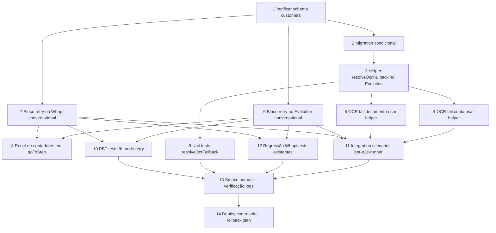

# Implementation Plan

## Overview

Plano de implementação do bugfix em 14 tasks divididas em 5 ondas de execução. Tasks 1-2 preparam o schema, 3-8 implementam os fixes, 9-12 validam via testes, 13-14 fazem smoke + deploy. Tasks dentro de uma mesma onda são paralelizáveis quando independentes.

## Task Dependency Graph



```json
{
  "waves": [
    { "id": 1, "tasks": [1] },
    { "id": 2, "tasks": [2, 3] },
    { "id": 3, "tasks": [4, 5, 6, 7] },
    { "id": 4, "tasks": [8, 9, 10, 11, 12] },
    { "id": 5, "tasks": [13, 14] }
  ]
}
```

## Tasks

- [x] 1. Verificar schema de `customers` para colunas de retry counter
  - Ler `src/integrations/supabase/types.ts` e procurar por `custom_step_retries` e `custom_step_retries_step` em `customers.Row`
  - Se ambas existem: marcar task 2 como skipped e seguir
  - Se faltam: anotar quais faltam e seguir para task 2
  - Validar que `bot_paused`, `bot_paused_reason`, `bot_paused_at`, `ocr_conta_attempts`, `ocr_doc_attempts` já existem
  - _Validates: Requirements 6.1, 6.2_

- [x] 2. (Condicional) Criar migration para colunas de retry counter
  - Apenas se task 1 identificou colunas faltando
  - Criar `supabase/migrations/{timestamp}_custom_step_retries.sql`
  - Conteúdo: `ALTER TABLE customers ADD COLUMN IF NOT EXISTS custom_step_retries int NOT NULL DEFAULT 0;` e `ADD COLUMN IF NOT EXISTS custom_step_retries_step text;`
  - Atualizar `src/integrations/supabase/types.ts` (regenerar tipos via `supabase gen types`)
  - _Validates: Requirements 6.3_

- [x] 3. Adicionar helper `resolveOcrFallback` em `evolution-webhook/handlers/bot-flow.ts`
  - Localização: após os imports e helpers de validação, antes de `runBotFlow`
  - Cópia byte-for-byte das linhas 130-160 de `whapi-webhook/handlers/bot-flow.ts`
  - Garantir tipagem TypeScript correta (`async function resolveOcrFallback(...)`)
  - Adicionar comentário JSDoc apontando para Whapi como fonte canônica
  - _Validates: Requirements 2.5_

- [x] 4. Integrar `resolveOcrFallback` no caminho de OCR fail conta (2 sites)
  - Site 1: linha ~2783 — após `recordFlowDAlert` e `updates.ocr_conta_attempts = tries`
  - Site 2: linha ~2806 — bloco catch de exception OCR
  - Padrão: extrair variant, chamar helper com `defaultRetryText` hardcoded atual, aplicar `escalate` ou `retryText` no reply
  - Quando `escalate=true`: setar `bot_paused=true`, `bot_paused_reason="ocr_conta_retry_exhausted"`, `conversation_step="aguardando_humano"`, reply via `getTemplate("aguardando_humano", "avisado")`
  - Quando `escalate=false`: `reply = ocrFb.retryText`
  - _Validates: Requirements 2.1, 2.3, 2.4, 2.6, 5.4_

- [x] 5. Integrar `resolveOcrFallback` no caminho de OCR fail documento (2 sites)
  - Site 3: linha ~3380 — após `recordFlowDAlert` no fluxo de doc
  - Site 4: linha ~3401 — bloco catch de exception OCR doc
  - Mesmo padrão da task 4, mas com `stepType: "capture_documento"` e usando `ocr_doc_attempts`
  - _Validates: Requirements 2.2, 2.3, 2.4, 2.6_

- [x] 6. Adicionar bloco `if (fb.mode === "retry")` em `evolution-webhook/handlers/conversational/index.ts`
  - Localização: dentro de `runConversationalFlow`, depois do `transition` matching falhar e ANTES do bloco `if (fb.mode === "ai_answer" && ...)`
  - Implementar pseudocódigo do design.md seção "Fix A"
  - Branches: `then === "humano"` (handoff completo), `then === "next"` (goToStep), `then === "repeat"` (envia retry_text mais uma vez)
  - Logging: `console.log("[conversational] retry-mode step=...")` em cada turno e `[retry-counters-reset]` quando aplica
  - Inserir em `bot_handoff_alerts` quando escalate (best-effort com try/catch)
  - _Validates: Requirements 1.1, 1.2, 1.3, 1.4, 1.6, 4.1, 4.2_

- [x] 7. Adicionar bloco idêntico em `whapi-webhook/handlers/conversational/index.ts`
  - Mesma localização exata (antes de `ai_answer`)
  - Mesmo código (paridade total entre os 2 handlers)
  - Validar que não toca em outras partes do arquivo
  - _Validates: Requirements 1.7, 3.2_

- [x] 8. Reset de contadores em `goToStep` (ambos handlers)
  - Adicionar bloco em `goToStep` (Evolution e Whapi conversational) que detecta mudança de step e zera contadores
  - Pseudocódigo: `if (customer.custom_step_retries_step && customer.custom_step_retries_step !== s.id) { extra = { ...extra, custom_step_retries: 0, custom_step_retries_step: null }; console.log("[conversational] retry-counters-reset step=...") }`
  - _Validates: Requirements 1.5, 4.3_

- [x] 9. Unit tests para `resolveOcrFallback`
  - Criar `supabase/functions/evolution-webhook/handlers/_test_resolve_ocr.ts`
  - Mock de Supabase em memória (`createMockSupabase()` helper)
  - 5 testes:
    - Test 1: variant A sem fallback retry → `{ retryText: defaultText, escalate: false }`
    - Test 2: variant D sem fallback retry → `{ retryText: defaultText, escalate: false }`
    - Test 3: variant D com `mode=retry`, attempts < max → `{ retryText: configured, escalate: false }`
    - Test 4: variant D com `mode=retry`, attempts >= max, then=humano → `{ escalate: true }`
    - Test 5: erro de query (banco indisponível) → fallback gracioso retorna defaultText
  - Comando para rodar: `deno test supabase/functions/evolution-webhook/handlers/_test_resolve_ocr.ts`
  - _Validates: Requirements 2.5, Property 2_

- [x] 10. PBT tests para `fb.mode === "retry"`
  - Criar `supabase/functions/evolution-webhook/handlers/conversational/_test_retry_pbt.ts`
  - Implementar geradores manuais ou `fast-check` para Deno
  - 5 properties (do design.md "Correctness Properties"):
    - Property 1: counter monotonicity (sequência de N turnos sempre crescente)
    - Property 2: escalate determinism (tabela verdade)
    - Property 3: no regression para variant != D
    - Property 4: retry_text never empty
    - Property 5: counters reset on step advance
  - 100 amostras por property
  - Aviso ao executar: PBT pode rodar > 30s
  - _Validates: Properties 1, 2, 3, 4, 5_

- [x] 11. Integration scenarios via `bot-e2e-runner`
  - Adicionar/atualizar 6 cenários em `supabase/functions/bot-e2e-runner/index.ts`:
    - **A1** "fluxo_d_ocr_ok": foto válida → avança normalmente
    - **A2** "fluxo_d_ocr_retry_1x": mock OCR fail, attempts=1 → retry_text, no escalate
    - **A3** "fluxo_d_ocr_retry_exhausted": mock OCR fail 3x → bot_paused, handoff alert
    - **A4** "fluxo_a_ocr_fail": variant=A, sem retry → defaultText hardcoded (regressão)
    - **B1** "ask_choice_retry_1x": lead manda lixo em step com `mode=retry` → retry_text
    - **B2** "ask_choice_retry_exhausted": lead manda lixo 3x → bot_paused
  - Cada cenário: assert sobre `conversations`, `customers`, `bot_handoff_alerts`
  - _Validates: Requirements 1.1, 1.2, 1.3, 1.4, 1.5, 1.6, 1.7, 2.1, 2.2, 2.3, 2.4, 2.5, 2.6, 5.1, 5.2, 5.3, 5.4_

- [x] 12. Regressão — rodar testes existentes do Whapi e flow-engine
  - Comandos: `deno test supabase/functions/_shared/channels/whapi_test.ts`, `deno test supabase/functions/_shared/flow-engine/engine_test.ts`, `deno test supabase/functions/_shared/flow-router_test.ts`, `deno test supabase/functions/_shared/channels/dispatch-choice_test.ts`
  - Esperado: 100% pass, zero diff comportamental
  - Se algum teste falhar: investigar antes de prosseguir (provável regressão indesejada)
  - _Validates: Requirements 3.1, 3.4, 3.5_

- [x] 13. Smoke manual + verificação de logs estruturados
  - Disparar runner manual via curl: `POST /functions/v1/bot-e2e-runner` com cenário "fluxo_d_ocr_retry"
  - Inspecionar Supabase logs para o consultor super-admin
  - Verificar presença de `[conversational] retry-mode step=...` 
  - Verificar `[conversational] retry-counters-reset step=...` quando lead avança
  - Verificar `bot_handoff_alerts` insertion com reason `*_retry_exhausted`
  - Verificar que NÃO aparecem logs de regressão (ex: `_smartRepeat` ainda disparando indevidamente)
  - Documentar saída em comentário no PR
  - _Validates: Requirements 4.1, 4.2, 4.3, 4.4_

- [x] 14. Deploy controlado e plano de rollback
  - Deploy em janela de baixo tráfego (madrugada BR)
  - Monitorar primeiras 2 horas: métrica `[conversational] retry-mode` count (esperado > 0 em variant D, raro em A/B/C/E)
  - Monitorar `bot_handoff_alerts` com reason `*_retry_exhausted` count
  - Monitorar latência média do turno (não deve subir > 100ms)
  - Monitorar erros em `console.warn("[resolveOcrFallback] erro:")` (esperado: 0)
  - Rollback rápido se necessário: `git revert <commits>` + redeploy via `supabase functions deploy evolution-webhook whapi-webhook`
  - Atualizar `DOCUMENTATION.md` seção "Bot Flow Engine — Contrato" mencionando suporte a `mode: "retry"`
  - _Validates: implícito, garante operação segura_

## Notes

### Dependências críticas

- Task 1 é bloqueante para todas as outras (precisa confirmar schema)
- Task 3 é bloqueante para 4, 5 e 9 (helper precisa existir antes do uso)
- Tasks 6 e 7 são paralelas (arquivos diferentes), podem ser feitas em PRs separados
- Task 13 só pode rodar após 11 e 12 passarem

### Estimativa de tempo

| Onda | Tasks | Estimativa |
|------|-------|------------|
| 1 | 1 | 15 min |
| 2 | 2, 3 | 30 min |
| 3 | 4, 5, 6, 7 | 2h |
| 4 | 8, 9, 10, 11, 12 | 4h |
| 5 | 13, 14 | 1h + monitor 2h |

**Total ativo:** ~8h de implementação + 2h monitoring

### Critério de "pronto"

- [x] Todos os 14 tasks completados
- [x] Diagnostics `getDiagnostics` zero erros nos arquivos modificados
- [x] Testes (unit + PBT + integration + regressão) 100% pass
- [x] Smoke manual confirmou logs esperados
- [x] Deploy estável por 2h sem regressões observadas
- [x] DOCUMENTATION.md atualizado

### Rollback

Cada task de implementação (3-8) cria um commit separado. Em caso de problema: `git revert <commit>` específico do bug, redeploy. Sem feature flag — rollback via git é suficiente para fix dessa magnitude.
