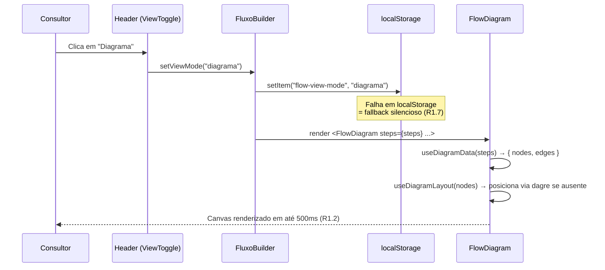
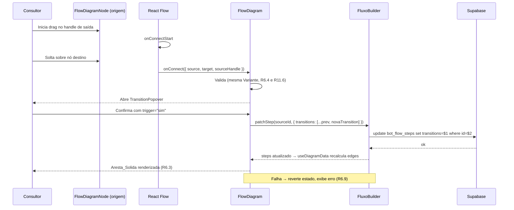

# Design Document

## Overview

Esta funcionalidade adiciona uma **visualização em diagrama tipo canvas** ao editor de fluxo existente em `/admin/fluxo` (`src/pages/FluxoBuilder.tsx`), coexistindo com a lista vertical drag-and-drop atual via um Toggle "Lista | Diagrama" no header. O diagrama é construído sobre o **React Flow v12** (`@xyflow/react`) e reutiliza integralmente a camada de dados (`bot_flow_steps`), as rotinas de validação (`useFlowValidation`), o Inspector (`StepInspector`) e o preview (`WhatsAppPreview`).

A única alteração de schema é uma coluna nullable `layout` jsonb na tabela `bot_flow_steps` para persistir posições manuais por passo. Nenhuma alteração no engine de runtime de Whapi e Evolution.

A IA (Gemini) é tratada como **dado de leitura, não escrita pelo diagrama**: passos onde a IA decide são identificados pelos helpers existentes (`isAiAnswerStep`, `isOcrStep`) e pelo conjunto de `trigger_intent` reconhecidos pelo runtime (`default | palavra_chave | media_received` são determinísticos; o resto é Trigger_Semantico). Edição de campos críticos da IA continua sendo feita exclusivamente pelo `StepInspector`.

## Steering Documents Alignment

Não há steering files customizados em `.kiro/steering/` que definam regras desta feature. Este design segue as convenções implícitas do repositório:

- TypeScript estrito; sem `any` exceto em pontes para libs externas.
- Componentes React colocalizados em `src/components/admin/flow-builder/` quando específicos da feature; hooks em `src/hooks/` quando reutilizáveis.
- Tailwind + Shadcn/ui para UI, com tokens de cor já existentes (`primary`, `destructive`, `muted`, `purple-500`, `amber-500`, `emerald-500`).
- Migrations em `supabase/migrations/` com timestamp NN_NN_NN_NN_NN.
- Acessibilidade WCAG 2.1 AA já praticada em outros componentes (`StepCard`, `StepInspector`).
- Comentários em português brasileiro alinhados ao restante do codebase.

## Code Reuse Analysis

### Existing Components to Leverage

- **`FluxoBuilder` (`src/pages/FluxoBuilder.tsx`)**: container principal. Vai ganhar um Toggle no header e um wrapper que escolhe entre `<FlowDiagram>` e a lista atual. Estado de `steps`, `selectedId`, `inspectorId`, `editingVariant`, `flowId`, `consultantName`, `mediaCounts`, `validation` permanece único.
- **`StepInspector` (`src/components/admin/flow-builder/StepInspector.tsx`)**: reusado integralmente sem alterações. Recebe os mesmos props do Modo_Lista atual ao ser aberto pelo diagrama.
- **`WhatsAppPreview` (`src/components/admin/flow-builder/WhatsAppPreview.tsx`)**: reusado sem alterações; renderizado ao lado do canvas quando há `selectedId`.
- **`useFlowValidation` (`src/components/admin/flow-builder/useFlowValidation.ts`)**: invocado uma única vez sobre `steps` e seu retorno (`warnings`, `byStep`, `errors`, `total`, `autoFixablePatches`) é compartilhado com Modo_Lista e Modo_Diagrama. `byStep` é a fonte de verdade para o badge ⚠ por nó (R3.9).
- **`flowTypes.ts`**: helpers `isAiAnswerStep`, `isOcrStep`, `getButtons`, `resolveGotoLabel`, `renderVarsPreview`, `STEP_TYPE_OPTIONS`, `BUTTON_PRESETS`, `parseTransitions`, `parseCaptures`, `parseFallback` reusados sem mudança.
- **`AiPreferencesCard`, `VariantDistributionBar`, `FlowTemplatesDialog`, `CreateFlowFromTemplateDialog`, `FlowSimulator`**: continuam sendo renderizados pelo `FluxoBuilder`, fora do `<FlowDiagram>`.
- **`ConfirmDialog` (`useConfirm`)**: reusado para "Reorganizar automaticamente", remover passo, etc.

### Integration Points

- **Supabase / `bot_flow_steps`**: leituras e escritas exclusivamente pela mesma rotina `reload(uid, variant)` do `FluxoBuilder`. Operações novas (`update layout`) usam o cliente já configurado em `@/integrations/supabase/client`.
- **`v_flow_step_funnel`**: consultada apenas quando o Toggle "Métricas" está ligado. Cliente Supabase com filtro `consultant_id`. View já é `security_invoker = true`, RLS aplicada.
- **Runtime engine**: zero alterações. Os adapters de canal (`_shared/channels/whapi.ts`, `_shared/channels/evolution.ts`) continuam expondo `maxButtons = 3` e `flow-router.ts` continua aplicando precedência `trigger_phrases` literais > `trigger_intent` semântico. O diagrama lê esses fatos do código (constantes), nunca os altera.

## Architecture

### Modular Design Principles

- **Responsabilidade única**: `FlowDiagram` renderiza canvas; `FlowDiagramNode` renderiza um nó; `FlowDiagramEdge` renderiza uma aresta; `useDiagramData` faz mapping de `Step[]` para nodes/edges; `useDiagramLayout` lida com auto-layout e persistência. Cada um sem conhecimento dos outros além das interfaces.
- **Estado único**: `steps` continua no `FluxoBuilder`; `FlowDiagram` recebe via props. Nenhum cache duplicado.
- **Reuso máximo de componentes existentes**: nenhum fork de `StepInspector` ou `WhatsAppPreview`.
- **Edição via diagrama é açúcar de UX, não nova API**: criar/editar/remover transition no canvas chama as mesmas mutations que o `StepInspector` chamaria.

### Architecture Diagram

```mermaid
flowchart TB
  subgraph FluxoBuilder["FluxoBuilder.tsx (página /admin/fluxo)"]
    Header["Header + ViewToggle (Lista | Diagrama)"]
    State["Estado React: steps, selectedId, inspectorId, editingVariant, mediaCounts, validation"]
    Inspector["StepInspector (Sheet)"]
    Preview["WhatsAppPreview"]
  end

  subgraph DiagramView["Modo_Diagrama"]
    DiagramRoot["FlowDiagram"]
    Hooks["useDiagramData<br/>useDiagramLayout<br/>useDiagramSync"]
    Nodes["FlowDiagramNode<br/>(custom node)"]
    Edges["FlowDiagramEdge<br/>(custom edge)"]
    Terminals["TerminalNode<br/>(Cadastro/Humano/Repetir)"]
    Toolbar["DiagramToolbar<br/>(Centralizar, Reorganizar,<br/>Métricas, Buscar, Exportar)"]
  end

  subgraph ListView["Modo_Lista"]
    StepCards["StepCard (drag-drop)"]
  end

  subgraph DB[(Supabase)]
    Steps["bot_flow_steps<br/>+ layout jsonb"]
    Funnel["v_flow_step_funnel"]
  end

  Header --> ListView
  Header --> DiagramView
  State --> ListView
  State --> DiagramRoot
  DiagramRoot --> Nodes
  DiagramRoot --> Edges
  DiagramRoot --> Terminals
  DiagramRoot --> Toolbar
  DiagramRoot --> Hooks
  Hooks --> DB
  ListView --> Inspector
  DiagramView --> Inspector
  ListView --> Preview
  DiagramView --> Preview
```

### Sequence: Toggle Lista → Diagrama (R1)



### Sequence: Edição de Transition Arrastando Aresta (R6)



## Components and Interfaces

### Component 1: `ViewToggle` (novo)

- **Localização**: `src/components/admin/flow-builder/ViewToggle.tsx`
- **Propósito**: Controle segmentado no header com duas opções "Lista" e "Diagrama" (R1).
- **Interface**:
  ```typescript
  interface ViewToggleProps {
    value: "lista" | "diagrama";
    onChange: (next: "lista" | "diagrama") => void;
    /** Quando true, exibe tooltip "Melhor visualização em desktop" sobre "Diagrama" (R15.1). */
    diagramHint?: boolean;
  }
  ```
- **Dependências**: `@/components/ui/tabs` (radix-style segmented). Tooltip de Shadcn.
- **Reúso**: Tooltip do `StepCard` (mesma fonte tipográfica e contraste).

### Component 2: `FlowDiagram` (novo, root do canvas)

- **Localização**: `src/components/admin/flow-builder/FlowDiagram.tsx`
- **Propósito**: Container do canvas. Mapeia `steps` para `nodes`/`edges`, instancia `<ReactFlow>`, gerencia toolbar e popovers.
- **Interface**:
  ```typescript
  interface FlowDiagramProps {
    steps: Step[];
    selectedId: string | null;
    consultantId: string;
    consultantName: string;
    consultantSlug: string;
    flowId: string | null;
    editingVariant: Variant;
    mediaCounts: Record<string, { audio: number; image: number; video: number }>;
    validation: FlowValidation;
    /** Modo somente leitura quando viewport <768px (R15.2). */
    readOnly: boolean;

    onSelectStep: (id: string | null) => void;
    onOpenInspector: (id: string) => void;
    /** Mesma assinatura usada hoje no FluxoBuilder. */
    onPatchStep: (id: string, patch: Partial<Step>) => Promise<void>;
    onAddStep: (initialPosition?: { x: number; y: number }) => Promise<Step | null>;
    onDuplicateStep: (id: string) => Promise<void>;
    onDeleteStep: (id: string) => Promise<void>;
    onAutoFixAll: () => Promise<void>;
  }
  ```
- **Estado interno**:
  - `viewport` (zoom/pan) — sincronizado com `localStorage` por `(consultantId, variant)` (R10.14).
  - `metricsEnabled` (boolean), `metricsData` (`Map<step_key, FunnelRow>`).
  - `searchQuery` (R19), `dottedEdgesVisible` (R3.6).
  - `transitionPopover` (estado do popover de criação/edição de transition).
  - `contextMenu` (estado do menu de contexto do nó).
- **Renderização**:
  ```tsx
  <ReactFlow
    nodes={nodes}
    edges={edges}
    nodeTypes={NODE_TYPES}
    edgeTypes={EDGE_TYPES}
    onNodeClick={handleNodeClick}
    onNodeDoubleClick={handleNodeDoubleClick}
    onNodeContextMenu={handleNodeContextMenu}
    onConnect={handleConnect}
    onConnectStart={handleConnectStart}
    onConnectEnd={handleConnectEnd}
    isValidConnection={isValidConnection}
    nodesDraggable={!readOnly}
    nodesConnectable={!readOnly}
    edgesUpdatable={!readOnly}
    minZoom={0.25}
    maxZoom={2}
    fitView
    fitViewOptions={{ padding: 0.15 }}
    proOptions={{ hideAttribution: true }}
  >
    <Background />
    <Controls showInteractive={false} />
    <MiniMap pannable zoomable nodeStrokeWidth={3} />
    <Panel position="top-left"><DiagramToolbar /></Panel>
    {transitionPopover && <TransitionPopover {...transitionPopover} />}
    {contextMenu && <NodeContextMenu {...contextMenu} />}
  </ReactFlow>
  ```

### Component 3: `FlowDiagramNode` (custom node)

- **Localização**: `src/components/admin/flow-builder/diagram/FlowDiagramNode.tsx`
- **Propósito**: Nó do canvas equivalente a um `StepCard` da lista.
- **Interface (React Flow node `data`)**:
  ```typescript
  type FlowDiagramNodeData = {
    step: Step;
    selected: boolean;
    mediaCount?: { audio: number; image: number; video: number };
    warnings: FlowWarning[];
    isAiAnswer: boolean;
    ocrKind: "conta" | "documento" | null;
    metrics?: { abandonmentPct?: number; avgConfidence?: number; avgDurationS?: number };
    /** Estado de busca: 'match' realça, 'dim' atenua, null neutro (R19). */
    searchState: "match" | "dim" | null;
    onContextMenu: (e: React.MouseEvent, stepId: string) => void;
  };
  ```
- **Estrutura JSX** (reúso visual do `StepCard`):
  ```tsx
  <div role="button" tabIndex={0}
    aria-label={`Passo ${step.position}: ${step.title || "sem título"}, tipo ${typeLabel}`}>
    <Handle type="target" position={Position.Left} />
    <Header position={step.position} emoji={typeMeta.emoji} title={step.title} inactive={!step.is_active} />
    <Preview text={renderVarsPreview(step.message_text).slice(0, 80)} />
    <Badges aiAnswer={isAiAnswer} ocr={ocrKind} mediaCount={mediaCount} />
    <ButtonsRow buttons={getButtons(step)}>
      {/* cada botão é um Handle source com id="btn:<id>" — R7.3 */}
    </ButtonsRow>
    {warnings.length > 0 && <WarningBadge warnings={warnings} />}
    {metrics && metricsVisible && <MetricsRow {...metrics} />}
    <Handle type="source" position={Position.Right} id="default" />
  </div>
  ```
- **Handles múltiplos**: cada `Botao_Interativo` produz um handle adicional `id="btn:<button.id>"` posicionado à direita (`Position.Right`) em offsets verticais distintos. O handle "default" é usado por transitions sem botão associado e pelo fallback (R7.3).

### Component 4: `TerminalNode` (custom node)

- **Localização**: `src/components/admin/flow-builder/diagram/TerminalNode.tsx`
- **Propósito**: Nós sintéticos de destino especial: 📝 Cadastro, 👤 Humano, 🔁 Repetir (R3.2). Não correspondem a registros de `bot_flow_steps`.
- **Interface (React Flow node `data`)**:
  ```typescript
  type TerminalNodeData = {
    kind: "cadastro" | "humano" | "repeat";
    label: string;
    icon: string;
  };
  ```
- **Comportamento**: apenas `Handle type="target"`. Não pode ser fonte de aresta. Não pode ser arrastado para outra posição (`draggable: false`). É posicionado pelo `useDiagramLayout` em coluna fixa à direita (R10.2). O nó-terminal é selecionável apenas para visualização; clicar duas vezes não abre Inspector.

### Component 5: `FlowDiagramEdge` (custom edge)

- **Localização**: `src/components/admin/flow-builder/diagram/FlowDiagramEdge.tsx`
- **Propósito**: Aresta unificada que cobre 5 categorias visuais.
- **Interface (`data` da edge)**:
  ```typescript
  type FlowDiagramEdgeData = {
    category: "solid" | "dashed-amber" | "dotted-gray" | "ai-purple" | "error-red";
    label: string;            // truncado em 40 chars
    fullLabel: string;        // tooltip com valor completo
    /** Quando true, atenuar para 30% (R3.7). */
    dimmed: boolean;
    /** Múltiplos triggers colapsados (R3.8). */
    collapsedTriggers?: string[];
  };
  ```
- **Renderização**: usa `getSmoothStepPath` para arestas verticais e `getBezierPath` para arestas que voltam (loop, R13.1). `EdgeLabelRenderer` posiciona o label no centro com classes Tailwind. Stroke, dasharray e cor são derivados de `category`.
- **Padrões visuais**:

  | Category | Stroke | Dasharray | Width |
  |---|---|---|---|
  | `solid` | `hsl(var(--primary))` | none | 1.5 |
  | `dashed-amber` | `hsl(38 92% 50%)` | `6 4` | 1.5 |
  | `dotted-gray` | `hsl(var(--muted-foreground))` | `2 4` | 1 |
  | `ai-purple` | `hsl(270 80% 60%)` | `3 3` | 1.5 |
  | `error-red` | `hsl(var(--destructive))` | none | 2 |

- **Precedência visual** (R8.9): quando há arestas `solid` e `ai-purple` saindo do mesmo nó, o stroke da `solid` é multiplicado para 3 e renderizado por último (z-order superior).

### Component 6: `DiagramToolbar` (novo)

- **Localização**: `src/components/admin/flow-builder/diagram/DiagramToolbar.tsx`
- **Propósito**: Barra superior dentro do canvas com controles do Modo_Diagrama.
- **Conteúdo**:
  - Campo de busca (R19) com placeholder "Buscar por título ou step_key" e atalho `Ctrl+K`/`Cmd+K`.
  - Toggle "Mostrar sequência" para Arestas_Pontilhadas (R3.6).
  - Toggle "Métricas" (R9.1) com label adjacente "últimos 30 dias" (R9.3).
  - Botão "Atualizar métricas" (R9.10).
  - Botão "Centralizar" (R2.8).
  - Botão "Reorganizar automaticamente" (R10.9).
  - Menu "Exportar" → opções "PNG" e "SVG" (R16.1).
- **Interface**:
  ```typescript
  interface DiagramToolbarProps {
    searchQuery: string;
    onSearchChange: (q: string) => void;
    onSearchEnter: () => void;
    dottedEdgesVisible: boolean;
    onDottedEdgesToggle: (v: boolean) => void;
    metricsEnabled: boolean;
    onMetricsToggle: (v: boolean) => void;
    onMetricsRefresh: () => void;
    onCenter: () => void;
    onAutoLayout: () => void;
    onExport: (format: "png" | "svg") => void;
    nodeCount: number;
    canExport: boolean;
    exporting: boolean;
  }
  ```

### Component 7: `TransitionPopover` (novo)

- **Localização**: `src/components/admin/flow-builder/diagram/TransitionPopover.tsx`
- **Propósito**: Popover compacto para criar (R6.2) ou editar (R6.5) transition.
- **Interface**:
  ```typescript
  type TransitionPopoverState =
    | { kind: "create"; sourceId: string; sourceHandle?: string; targetId: string | TerminalKind; x: number; y: number }
    | { kind: "edit"; edgeId: string; x: number; y: number };

  interface TransitionPopoverProps {
    state: TransitionPopoverState;
    steps: Step[];
    onConfirm: (input: { triggerPhrase: string; triggerIntent: string }) => Promise<void>;
    onRemove?: () => Promise<void>;
    onRedirect?: (newTargetId: string) => Promise<void>;
    onCancel: () => void;
  }
  ```
- **UI**: campo de texto para `trigger_phrase` (60 chars max), select com presets de `trigger_intent` (lista derivada de `BUTTON_PRESETS` + valores comuns: `palavra_chave`, `afirmacao`, `negacao`, `interesse_alto`, `media_received`), botões "Confirmar" e "Cancelar".
- **Validação client-side** (R6.3): bloqueia confirmação quando `triggerPhrase` e `triggerIntent` ambos vazios; exibe mensagem inline "Informe pelo menos um gatilho".

### Component 8: `NodeContextMenu` (novo)

- **Localização**: `src/components/admin/flow-builder/diagram/NodeContextMenu.tsx`
- **Propósito**: Menu de contexto via clique direito (R5.3).
- **Itens**: "Editar", "Duplicar", "Ativar/Desativar", "Remover". Cada item dispara a rotina equivalente do Modo_Lista, recebida via props como callbacks.
- **Posicionamento**: replicado do exemplo oficial do React Flow (`onNodeContextMenu` + `onPaneClick` para fechar).

### Component 9: `WarningBadge` (novo)

- **Localização**: `src/components/admin/flow-builder/diagram/WarningBadge.tsx`
- **Propósito**: Badge "⚠" no canto superior esquerdo do nó (R3.9).
- **Interface**:
  ```typescript
  interface WarningBadgeProps {
    warnings: FlowWarning[]; // já filtrados pela `byStep[stepId]`
  }
  ```
- **UI**: ícone `AlertTriangle` em vermelho. Tooltip ao foco/hover por ≥300ms exibe lista de até 5 mensagens; "+N restantes" quando houver mais.

### Hook 1: `useDiagramData` (novo)

- **Localização**: `src/hooks/useDiagramData.ts`
- **Assinatura**:
  ```typescript
  function useDiagramData(args: {
    steps: Step[];
    validation: FlowValidation;
    mediaCounts: Record<string, { audio: number; image: number; video: number }>;
    metricsData: Map<string, FunnelRow> | null;
    searchQuery: string;
    selectedId: string | null;
    dottedEdgesVisible: boolean;
  }): { nodes: Node[]; edges: Edge[]; terminalsUsed: Set<TerminalKind> };
  ```
- **Algoritmo (puro, memoizado)**:
  1. Para cada `Step`, gera um `Node` de tipo `"flow"` com `data: FlowDiagramNodeData`.
  2. Detecta quais `goto_special` aparecem em qualquer `transitions[].goto_special` da Variante. Para cada um presente em `{cadastro, humano, repeat}`, gera um `Node` de tipo `"terminal"`.
  3. Para cada Transition de cada Step:
     - Determina `category`: `solid` se Trigger_Determinístico (`trigger_intent ∈ {default, palavra_chave, media_received}`); `ai-purple` se Trigger_Semantico (R8.4).
     - Resolve `target`:
       - `goto_step_id` válido + ativo → edge para esse Step.
       - `goto_step_id` apontando para passo removido ou inativo → category vira `error-red`, target sintético `__warning_${stepId}`.
       - `goto_special ∈ {cadastro, humano, repeat}` → edge para `terminal-${kind}`.
       - `goto_special` fora do conjunto → category `error-red` com label "goto_special inválido: ${valor}".
     - Para botões: se algum elemento de `trigger_phrases` ou `trigger_intent` corresponde a um `Botao_Interativo` (case-insensitive title ou exact id), `sourceHandle = btn:${button.id}`; senão, `sourceHandle = default` (R7.3).
  4. Para cada Step com `fallback.mode === "goto"` e destino válido → edge `dashed-amber`. Com `mode ∈ {ai_answer, ai_limit}` → edge `ai-purple` para o próprio Step (auto-loop, R8.4).
  5. Para cada Step sem nenhuma Transition resolvida nem Fallback `goto` resolvido, e que existe um próximo por `position + 1` ativo → edge `dotted-gray`. Pulado se `dottedEdgesVisible === false`.
  6. Múltiplas Transitions com mesmo `(source, target)` colapsam em uma única edge cuja `category` segue a Transition de menor índice e `data.collapsedTriggers` lista todos (R3.8).
  7. `searchState` por nó é calculado: `match` se `searchQuery` não vazio e `step.title` ou `step.step_key` contém a query (case-insensitive, NFD); `dim` se `searchQuery` não vazio e nó não match; `null` caso contrário (R19.2).
  8. Quando `selectedId` é não nulo, opacidade do nó é calculada via min entre faixa "inativa" do Critério 4 e atenuação por seleção do Critério 7 (R2.5).
- **Importante**: este hook NÃO toca em `bot_flow_steps`. É puro.

### Hook 2: `useDiagramLayout` (novo)

- **Localização**: `src/hooks/useDiagramLayout.ts`
- **Assinatura**:
  ```typescript
  function useDiagramLayout(args: {
    flowId: string | null;
    steps: Step[];
    terminalsUsed: Set<TerminalKind>;
  }): {
    /** Aplica posições aos nodes recebidos. */
    layoutNodes: (nodes: Node[]) => Node[];
    /** Salva posição manual de um nó (debounced). */
    saveNodePosition: (stepId: string, position: { x: number; y: number }) => void;
    /** Reorganiza tudo (R10.9). */
    autoLayoutAll: () => Promise<void>;
    /** Indica se há posição pendente persistindo. */
    saving: boolean;
  };
  ```
- **Algoritmo `layoutNodes`**:
  1. Para cada `step.layout` válido (`{x: number, y: number}` com x e y em `[-100000, 100000]`), usa o valor como posição.
  2. Para Steps sem `layout` ou inválido (R10.7), executa dagre apenas sobre o subgrafo desses Steps com `rankdir = "LR"`, `nodesep = 80`, `ranksep = 60`, e atribui as coordenadas calculadas.
  3. Para `terminalsUsed`, posiciona em coluna fixa: `x = max(x_passo) + 240`, `y` distribuído de cima para baixo com `100px` entre eles (R10.2).
- **Algoritmo `saveNodePosition`**:
  - Debounce de 500ms por `stepId` (R10.4). Coalesce: se novo drag chega antes do timer expirar, reinicia.
  - `update bot_flow_steps set layout = $1 where id = $2`. Em falha, mantém estado local, exibe `toast.error` e tenta novamente respeitando o debounce até a página ser deixada (R10.13).
- **Algoritmo `autoLayoutAll`**:
  - Modal de confirmação via `useConfirm` (R10.9).
  - Em uma única transação: `update bot_flow_steps set layout = null where flow_id = $1`. Em falha, `toast.error` e estado local revertido para o último Layout válido (R10.10).
  - Após sucesso, recarrega Steps e re-executa dagre sobre todos.

### Hook 3: `useDiagramSearch` (novo)

- **Localização**: `src/hooks/useDiagramSearch.ts`
- **Assinatura**:
  ```typescript
  function useDiagramSearch(args: {
    nodes: Node[];
    reactFlowInstance: ReactFlowInstance | null;
  }): {
    query: string;
    setQuery: (q: string) => void;
    /** Avança para o próximo match em ordem de position. */
    next: () => void;
    matches: number;
    inputRef: React.RefObject<HTMLInputElement>;
  };
  ```
- **Atalho**: listener global `keydown` com `Ctrl+K`/`Cmd+K` que chama `inputRef.current?.focus()` (R19.1).
- **Centralização**: em `next()`, usa `reactFlowInstance.setCenter(node.position.x, node.position.y, { zoom: getZoom(), duration: 500 })` (R19.3).

### Hook 4: `useDiagramMetrics` (novo)

- **Localização**: `src/hooks/useDiagramMetrics.ts`
- **Assinatura**:
  ```typescript
  function useDiagramMetrics(args: {
    enabled: boolean;
    consultantId: string;
    variant: Variant;
  }): {
    data: Map<string, FunnelRow> | null;
    loading: boolean;
    error: string | null;
    refresh: () => Promise<void>;
  };

  type FunnelRow = {
    step_key: string;
    abandonment_rate_pct: number | null;
    avg_duration_ms: number | null;
    avg_confidence: number | null;
  };
  ```
- **Query**: `select step_key, abandonment_rate_pct, avg_duration_ms, avg_confidence from v_flow_step_funnel where consultant_id = $1` (R9.2). View já filtra por `created_at > now() - interval '30 days'`.
- **Cache**: por `(consultantId, variant)` em estado React. Invalida quando `enabled` muda para true ou quando `refresh()` é chamado (R9.10). Sem polling.

### Hook 5: `useDiagramExport` (novo)

- **Localização**: `src/hooks/useDiagramExport.ts`
- **Assinatura**:
  ```typescript
  function useDiagramExport(args: {
    consultantSlug: string;
    variant: Variant;
    reactFlowInstance: ReactFlowInstance | null;
  }): {
    exportPng: () => Promise<void>;
    exportSvg: () => Promise<void>;
    exporting: boolean;
  };
  ```
- **Algoritmo** (R16):
  1. Calcula bounds via `getNodesBounds(reactFlowInstance.getNodes())`.
  2. Calcula viewport via `getViewportForBounds(bounds, width, height, 0.5, 2, padding=20)`.
  3. Chama `toPng(element, { backgroundColor: '#fff', pixelRatio: 2, width, height, style: { transform: `translate(${vp.x}px, ${vp.y}px) scale(${vp.zoom})` } })` ou `toSvg(...)`.
  4. Cria `<a download="fluxo-${slug}-variante-${variant}-${YYYYMMDD}.${ext}">` e dispara click.
  5. Timeout de 10s; em falha, `toast.error` e nada é baixado (R16.7).
- **Dependência nova**: `html-to-image@1.11.11` (versão pinned recomendada pelo React Flow).

### Hook 6: `useViewportPersistence` (novo)

- **Localização**: `src/hooks/useViewportPersistence.ts`
- **Assinatura**:
  ```typescript
  function useViewportPersistence(args: {
    consultantId: string;
    variant: Variant;
    reactFlowInstance: ReactFlowInstance | null;
  }): void;
  ```
- **Comportamento**: subscribe ao evento `onMove` do React Flow, debounce de 500ms, grava `{x, y, zoom}` em `localStorage` na chave `flow-viewport:${consultantId}:${variant}`. Na montagem, restaura via `setViewport()` se válido. Falha em `localStorage` é silenciosa (R10.14, R1.7).

## Data Models

### Schema Change (única alteração)

```sql
-- Migration: 20260601000000_add_layout_to_bot_flow_steps.sql
ALTER TABLE public.bot_flow_steps
  ADD COLUMN IF NOT EXISTS layout jsonb DEFAULT NULL;

COMMENT ON COLUMN public.bot_flow_steps.layout IS
  'Coordenadas {x, y} do passo no editor em diagrama (Modo_Diagrama). '
  'Nulo significa "não posicionado manualmente"; o renderer aplica auto-layout dagre. '
  'Não afetam o engine de runtime.';
```

- **Compatibilidade**: nullable, sem default. Migrações pré-existentes continuam válidas. Engine ignora a coluna (R17).
- **Tamanho**: jsonb pequeno (~30 bytes por passo). Índice não necessário; nunca filtramos por `layout`.

### Type Updates

```typescript
// src/components/admin/flow-builder/flowTypes.ts (adições)

/** Coordenada de layout persistida em bot_flow_steps.layout. */
export type StepLayout = { x: number; y: number };

export type Step = {
  // ...campos existentes
  layout?: StepLayout | null;
};

/** Versões válidas de goto_special reconhecidas pelo runtime. */
export const VALID_GOTO_SPECIAL = ["cadastro", "humano", "repeat"] as const;
export type GotoSpecial = typeof VALID_GOTO_SPECIAL[number];

/** Conjunto fechado de trigger_intent determinísticos no runtime. */
export const DETERMINISTIC_INTENTS = new Set(["default", "palavra_chave", "media_received"]);
export function isDeterministicIntent(intent: string | null | undefined): boolean {
  if (!intent) return true; // sem intent = casa por trigger_phrases literal
  return DETERMINISTIC_INTENTS.has(intent);
}
```

> **Observação**: o tipo atual `Transition.goto_special` em `flowTypes.ts` lista `"cadastro" | "humano" | "repeat" | "ai" | null`, mas o runtime nunca trata `"ai"`. Esta feature **não corrige** esse tipo (escopo separado), mas o renderer ignora `"ai"` tratando-o como `error-red` (R3.2).

### Diagram State (in-memory, não persistido em DB)

```typescript
type DiagramState = {
  viewport: { x: number; y: number; zoom: number }; // localStorage
  metricsEnabled: boolean;                           // sessão (não persiste)
  searchQuery: string;                               // sessão
  dottedEdgesVisible: boolean;                       // sessão (default true)
  exporting: boolean;
  saving: boolean;
};
```

## Error Handling

### Error Scenario 1: Falha ao persistir transition criada via diagrama (R6.9)

- **Trigger**: `update bot_flow_steps` retorna erro de rede ou banco.
- **Reação**:
  1. Estado local é revertido (rollback no `setSteps`).
  2. `toast.error("Não foi possível salvar a regra. Tente novamente.")` com botão "Tentar novamente" que repete a operação.
  3. Aresta-fantasma não é deixada renderizada.
- **Telemetria**: `console.error` com `{ operation: "diagram_create_transition", stepId, targetId, error }`.

### Error Scenario 2: Falha ao persistir layout durante drag (R10.13)

- **Trigger**: `update bot_flow_steps set layout = $1` retorna erro.
- **Reação**:
  1. Estado local da posição arrastada é mantido (não reverte UI).
  2. Indicador "💾 Salvando..." vira "⚠ Erro ao salvar" no canto inferior direito do canvas.
  3. Sistema agenda nova tentativa respeitando debounce de 500ms até a página ser deixada ou até obter sucesso.
- **Justificativa**: a posição é cosmética; reverter o drag seria pior UX que manter o nó deslocado e tentar de novo.

### Error Scenario 3: Falha em "Reorganizar automaticamente" (R10.10)

- **Trigger**: transação `update bot_flow_steps set layout = null where flow_id = $1` falha total ou parcial.
- **Reação**:
  1. Estado local é revertido para o snapshot do último Layout válido tirado antes da operação.
  2. `toast.error("Não foi possível reorganizar o diagrama. Tente novamente.")`.
  3. Botão "Reorganizar automaticamente" volta a ficar disponível.
- **Garantia**: nunca deixar a Variante em estado misto (alguns nós com `layout = null`, outros com valor antigo).

### Error Scenario 4: Falha ao consultar `v_flow_step_funnel` (R9.7)

- **Trigger**: select retorna erro.
- **Reação**:
  1. Todos os Nós_Diagrama renderizam sem indicadores de métrica.
  2. `toast.warning("Não foi possível carregar métricas. Verifique sua conexão.")` em até 1s, não modal.
  3. Toggle "Métricas" permanece em "ligado" para que o Consultor possa clicar em "Atualizar métricas".

### Error Scenario 5: Falha ao exportar PNG/SVG (R16.7)

- **Trigger**: `html-to-image` lança erro ou timeout de 10s atinge.
- **Reação**:
  1. `toast.error("Não foi possível exportar o diagrama. Tente novamente.")`.
  2. Estado do canvas inalterado.
  3. Botão "Exportar" volta a ficar habilitado (`exporting = false`).

### Error Scenario 6: localStorage indisponível (R1.7, R10.14)

- **Trigger**: `localStorage.setItem` lança (incognito, cota cheia, política de cookies).
- **Reação**:
  1. Toggle continua funcionando em memória.
  2. Próximo reload abre em Modo_Lista (fallback default).
  3. Sem mensagem ao usuário (silencioso).

### Error Scenario 7: Múltiplos cliques rápidos em "Adicionar passo" (R5.6)

- **Mitigação**: botão "Adicionar passo" fica desabilitado durante a execução do `insert`. Em falha, reabilita e exibe `toast.error`. Sem nó-fantasma.

## Testing Strategy

### Unit Tests

#### `useDiagramData.test.ts`

Cobre o mapping puro de `Step[]` → `{ nodes, edges, terminalsUsed }`. Casos:

- Step com 0 transitions e fallback `repeat` → 1 nó, 1 edge `dotted-gray` para próximo position quando `dottedEdgesVisible=true`; 0 edges quando `false`.
- Step com transition `goto_step_id` válido → 1 edge `solid` com label correto.
- Step com transition `trigger_intent="afirmacao"` (semântico) → 1 edge `ai-purple`.
- Step com `goto_special="cadastro"` → 1 edge `solid` para terminal `cadastro`; `terminalsUsed.has("cadastro")`.
- Step com `goto_special="ai"` (legado, não suportado) → 1 edge `error-red` com label "goto_special inválido: ai".
- 2 transitions com mesmo (source, target) → 1 edge colapsada com `collapsedTriggers.length === 2`.
- Step com fallback `goto` para passo inativo → 1 edge `error-red`.
- Botão `_buttons` com title casando `trigger_phrase` → edge usa `sourceHandle = btn:${button.id}`.
- Botão sem regra → nó tem warning, edge não é gerada para ele.

#### `useDiagramLayout.test.ts`

- `layoutNodes` aplica posição salva quando `layout` é válido.
- `layoutNodes` aplica dagre apenas a nós sem layout, preservando os com layout válido (R10.7).
- `layoutNodes` posiciona terminals em coluna fixa à direita (R10.2).
- `saveNodePosition` debounca: 3 chamadas em 500ms resultam em 1 update.
- `autoLayoutAll` chama `update ... where flow_id = $1` uma única vez.

#### `useFlowValidation` (já existe)

Sem mudança. Reutilizado.

### Integration Tests

Usando React Testing Library e mock do cliente Supabase (`@/integrations/supabase/client`):

- **Toggle Lista ↔ Diagrama (R1)**: render `<FluxoBuilder />` com mock de `bot_flow_steps`, clicar em "Diagrama" muda área principal para canvas, recarregar a página com `localStorage.flow-view-mode = "diagrama"` abre direto no canvas.
- **Sincronização (R4)**: editar título no Inspector via diagrama, verificar que `StepCard` da lista (renderizado em paralelo) reflete a mudança em até 1s.
- **Auto-layout primeira abertura (R10.1)**: render com 5 steps todos com `layout = null`, esperar nodes posicionados pelo dagre.
- **Persistência de drag (R10.4)**: simular drag de um nó, verificar que após 500ms `update bot_flow_steps set layout = $1` foi chamado uma vez com `{x, y}` corretos.
- **Mobile read-only (R15.2)**: render com `window.innerWidth = 600`, verificar `nodesDraggable=false`, `nodesConnectable=false`, mensagem persistente visível.
- **Botões Whapi/Evolution (R7)**: render Step com 4 botões em `_buttons`, verificar que apenas 3 primeiros aparecem com handles, indicador "+1 ignorado pelo runtime" visível.

### End-to-End Tests

Adicionar `playwright/flow-diagram.spec.ts`:

- **Cenário "consultor leigo desenha fluxo"**:
  1. Acessa `/admin/fluxo`, alterna para Modo_Diagrama.
  2. Clica "Adicionar passo" → novo nó aparece na viewport.
  3. Arrasta handle do nó 1 para o nó 2 → popover abre com input vazio.
  4. Digita "sim" → confirma → aresta `solid` aparece com label "sim".
  5. Atualiza a página → nó e aresta persistem.
  6. Volta para Modo_Lista → nó e regra aparecem na lista.
- **Cenário "exportar PNG"**:
  1. Modo_Diagrama com 5 nós.
  2. Clica "Exportar" → "PNG".
  3. Verifica download iniciado com nome `fluxo-*-variante-A-*.png`.
- **Cenário "métricas"**:
  1. Modo_Diagrama, ativa Toggle "Métricas".
  2. Verifica que percentuais aparecem nos nós com `step_key` presente em `v_flow_step_funnel`.
  3. Clica "Atualizar métricas" → re-fetch.

### Performance Tests

Em ambiente de dev local com 200 steps simulados:

- Tempo de primeiro render do `<FlowDiagram>` com auto-layout: alvo <1500ms (R12.3).
- Latência de drag de um nó: alvo <100ms até 100 nós, <200ms entre 101 e 200 (R12.1).
- Memória após 5 minutos de uso: sem vazamentos detectáveis pelo Chrome DevTools (heap snapshot estável após GC).

### Accessibility Tests

- Axe-core run sobre o canvas renderizado: zero violações sérias.
- Teste manual com leitor de tela (NVDA): cada nó é anunciado com formato "Passo {position}: {title}, tipo {step_type_label}" (R14.6).
- Navegação por `Tab` percorre todos os nós em ordem de `position` (R14.1); `Enter` seleciona; `F2` abre Inspector; setas movem foco direcional (R14.4).

### Regression Tests

Garantir que rotas e contratos do engine de runtime não foram afetados:

- Rodar suite Deno existente em `supabase/functions/_shared/flow-engine/`.
- Verificar que migrations existentes não quebram pelo `ALTER TABLE ADD COLUMN` (testar em snapshot do banco de dev).
- E2E `bot-e2e-runner` (já existente) deve continuar passando.

## Dependencies

### Novas dependências

| Pacote | Versão | Uso | Tamanho |
|---|---|---|---|
| `@xyflow/react` | `^12.3.0` | Canvas, custom nodes/edges, controls, minimap | ~120 kB gz |
| `dagre` | `^0.8.5` | Auto-layout horizontal | ~38 kB gz |
| `@types/dagre` | `^0.7.52` | Tipos | dev only |
| `html-to-image` | `1.11.11` | Export PNG/SVG (versão pinada por recomendação oficial do React Flow) | ~12 kB gz |

Total adicionado ao bundle de produção: ~170 kB gz, lazy-loaded apenas quando `/admin/fluxo` é acessado e Modo_Diagrama é ativado (via `React.lazy(() => import("./FlowDiagram"))`).

### Dependências existentes reusadas

`@dnd-kit/sortable` continua sendo usado pelo Modo_Lista, sem conflito com React Flow. Shadcn/ui (`Sheet`, `Tabs`, `Tooltip`, `Popover`, `Button`, `Input`) usado nos componentes auxiliares. Lucide-react para ícones. Sonner para toasts.

## Performance Considerations

- **Lazy load**: `FlowDiagram` em chunk separado via `React.lazy`. Usuários que ficam apenas no Modo_Lista não pagam o custo de bundle.
- **Memoização agressiva**: `useDiagramData` é `useMemo` com deps `[steps, validation, mediaCounts, metricsData, searchQuery, selectedId, dottedEdgesVisible]`. Evita reconstruir nodes/edges em cada render.
- **Virtualização**: React Flow v12 já virtualiza viewports nativamente; nós e arestas fora da área visível não são renderizados como DOM.
- **Estabilidade de IDs**: cada `Node.id = step.id` (UUID estável); cada `Edge.id = ${stepId}-${targetId}-${transitionIdx}` (estável enquanto array não muda).
- **Debounce de persistência**: drag (500ms), viewport persistence (500ms), search (200ms input → recalcula opacidade).

## Migration Plan

### Phase 1 — Schema (5 min, reversível)

```sql
ALTER TABLE public.bot_flow_steps ADD COLUMN IF NOT EXISTS layout jsonb DEFAULT NULL;
COMMENT ON COLUMN public.bot_flow_steps.layout IS '...';
```

Rollback: `ALTER TABLE public.bot_flow_steps DROP COLUMN layout;` (sem perda de dados pré-existentes).

### Phase 2 — Code (lazy chunk)

- Adicionar dependências (`bun add @xyflow/react dagre html-to-image@1.11.11 -d @types/dagre`).
- Criar componentes e hooks novos.
- Adicionar `<ViewToggle>` e `<FlowDiagram>` em `FluxoBuilder.tsx`.
- Nenhuma alteração nos handlers de `bot-flow.ts`, `flow-router.ts`, adapters de canal ou engine.

### Phase 3 — Roll-out

- Feature está disponível para todos os consultores no momento do deploy. Modo_Diagrama é opt-in (default é Modo_Lista, que continua exatamente como hoje).
- Sem feature flag necessária — a coluna `layout` nullable não muda comportamento de quem não usa.

## Correctness Properties

Estas são propriedades invariantes que devem ser **demonstravelmente verdadeiras** em qualquer estado do Modo_Diagrama. Cada uma é testável via property-based test (`fast-check`) ou unit test direto.

### Property 1: Idempotência do mapping de dados

PARA QUALQUER `steps: Step[]` válido, `useDiagramData(steps).nodes.length` é igual a `steps.length + terminalsUsed.size`. Chamar o hook duas vezes com o mesmo input retorna nodes/edges semanticamente idênticos (mesmos `id`, mesmos `data`, mesmas `category`).

**Validates: Requirements 4.1, 4.4, 4.5**

> **Verificável por**: `useDiagramData.test.ts` com snapshots; ferramenta: Vitest.

### Property 2: Single source of truth para `steps`

EM QUALQUER MOMENTO, o array `steps` em `FluxoBuilder` é a única fonte de leitura para Modo_Lista, Modo_Diagrama, Inspector e WhatsAppPreview. Não existe cache duplicado em estado de filhos. Mutações ocorrem exclusivamente via `patchStep`, `addStep`, `duplicateStep`, `deleteStep` no `FluxoBuilder` (R4.1).

**Validates: Requirements 4.1**

> **Verificável por**: inspeção estática (lint customizado pode falhar se um filho mantiver `useState<Step[]>` próprio).

### Property 3: Conservação do conjunto de Transitions

PARA QUALQUER edição de aresta no Modo_Diagrama (criar, editar, remover), o conjunto resultante de `transitions` em `bot_flow_steps` é **igual** ao conjunto que o `StepInspector` produziria para a mesma operação. Especificamente:

- Criar aresta a partir de handle de botão produz `{ trigger_phrases: [btn.title, btn.id], trigger_intent: "palavra_chave", goto_step_id: target, goto_special: null }` (R7.7), que é exatamente o formato gerado por `setButtonGoto` em `StepInspector.tsx`.
- Criar aresta a partir de handle default produz `{ trigger_phrases: [phrase], trigger_intent: intent || "palavra_chave", goto_step_id: target, goto_special: null }`.

**Validates: Requirements 6.3, 7.7**

> **Verificável por**: integration test que abre o Inspector e o popover do diagrama para a mesma operação e compara o `transitions` resultante.

### Property 4: Não-alteração do payload de runtime

PARA QUALQUER fluxo executado pelo runtime após alterações via Modo_Diagrama, o payload enviado a Whapi e Evolution é byte-a-byte **idêntico** ao que seria enviado se as mesmas alterações fossem feitas via Modo_Lista. A coluna `layout` é estritamente cosmética (R17.4).

**Validates: Requirements 17.1, 17.4, 17.5**

> **Verificável por**: regression suite Deno em `_shared/flow-engine/__tests__/` mantida verde após o merge.

### Property 5: Visibilidade respeita precedência da IA

PARA QUALQUER Step com Transitions Trigger_Determinístico e Trigger_Semantico saindo dele, as Arestas_Solidas têm `strokeWidth ≥ 2 × strokeWidth` da Aresta_IA correspondente E são renderizadas com z-order superior (R8.9). Isso reflete que `flow-router.ts` tenta `trigger_phrases` antes de classificação semântica.

**Validates: Requirements 8.9**

> **Verificável por**: snapshot test com nó tendo ambos os tipos; assert sobre o atributo `stroke-width` no DOM.

### Property 6: Compatibilidade entre variantes (isolamento)

PARA QUAISQUER duas Variantes V1 e V2 do mesmo consultor, o Layout salvo em V1 nunca é lido nem escrito quando V2 está em edição. `update bot_flow_steps set layout = $1 where id = $2` sempre opera em IDs cujo `flow_id` corresponde à Variante atual (R11.4).

**Validates: Requirements 11.4**

> **Verificável por**: integration test com 2 variantes; mover nó em V1, trocar para V2, verificar que `layout` em V2 não foi alterado.

### Property 7: Persistência de layout não interfere com reorder

PARA QUALQUER reorder feito no Modo_Lista (mudança apenas de `position`), o `layout` de todos os Passos da Variante permanece inalterado (R10.8). Reorder e drag-no-canvas são operações ortogonais.

**Validates: Requirements 10.8**

> **Verificável por**: unit test em `useDiagramLayout`: dado `steps` com `layout` setado, mudar `position` de um deles, assert que `layout` não muda.

### Property 8: Acessibilidade — toda interação tem caminho por teclado

PARA QUALQUER ação possível via mouse no Modo_Diagrama, existe ao menos um caminho via teclado para a mesma ação:

| Ação mouse | Equivalente teclado |
|---|---|
| Selecionar nó | `Tab` até o nó + `Enter` |
| Abrir Inspector | `Tab` até o nó + `F2` |
| Mover foco entre nós | Setas (R14.4) |
| Ativar Toggle Métricas | `Tab` até o toggle + `Espaço` |
| Buscar passo | `Ctrl+K` / `Cmd+K` |
| Centralizar | `Tab` até botão + `Enter` |
| Exportar | `Tab` até menu + `Enter` |

**Validates: Requirements 14.1, 14.2, 14.3, 14.4, 14.7, 19.1**

> **Verificável por**: E2E Playwright sem mouse, percorrendo a checklist.

### Property 9: Falhas de persistência nunca deixam UI em estado inconsistente

PARA QUALQUER falha em `update`/`insert`/`delete` originada pelo Modo_Diagrama, o estado local do array `steps` e do canvas é revertido para o estado pré-operação OU o estado é mantido com indicador de erro visível (caso de drag de posição, R10.13). NUNCA é deixado em estado parcial sem indicação ao usuário.

**Validates: Requirements 4.3, 4.5, 6.9, 7.8, 10.10, 10.13**

> **Verificável por**: integration test com cliente Supabase mockado para retornar erro, asserts sobre estado pós-erro.


## Open Questions for Implementation

Itens que serão resolvidos durante a fase de tasks, listados aqui para registro:

1. **Estilo visual dos nós em zoom baixo**: contextual zoom (mostrar apenas título e emoji quando zoom <50%) é um nice-to-have. Decidir se entra no MVP ou em fast-follow.
2. **Animação de aresta para steps "ativos" no momento (live)**: integrar com `LiveConversationsPanel` para destacar onde os leads estão agora seria poderoso, mas é fora deste escopo. Será listado como follow-up.
3. **Undo/redo de operações no canvas**: não previsto nos requisitos. React Flow não traz undo nativo. Avaliar custo separadamente.
