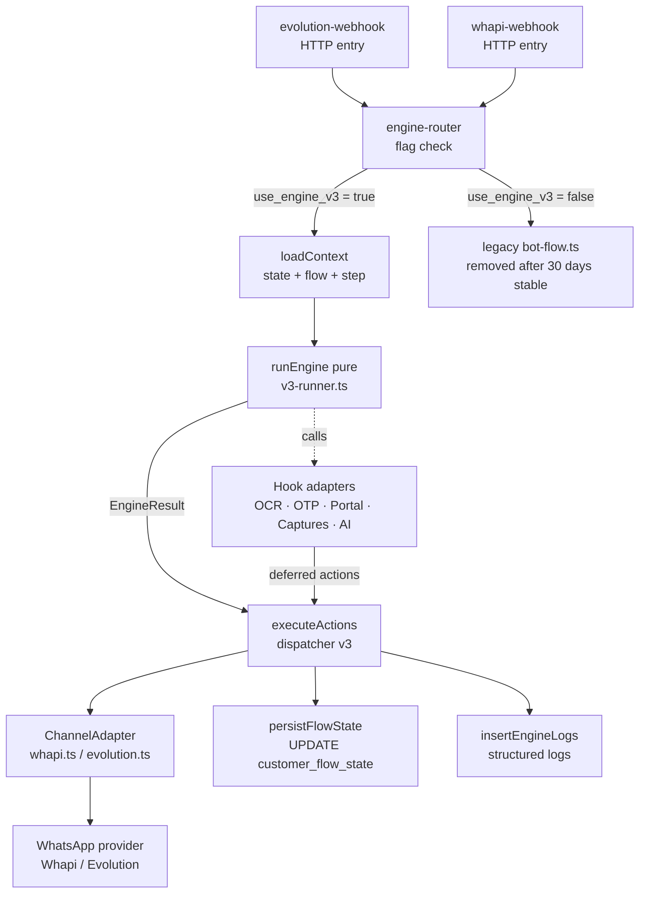
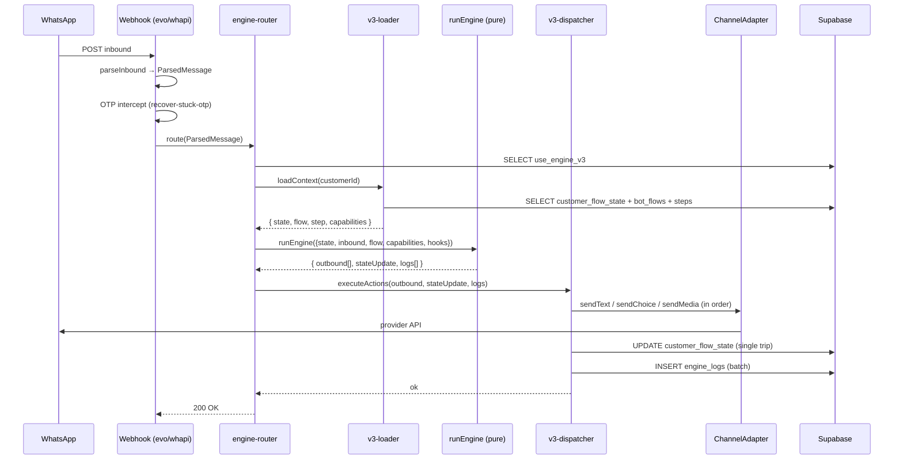
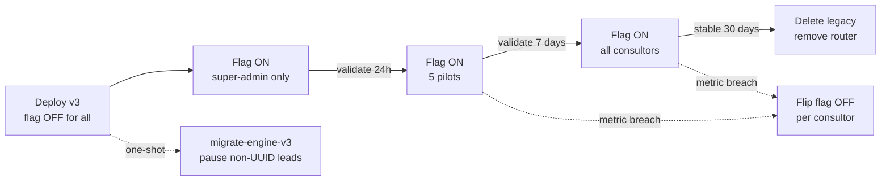

# Design Document: flow-engine-v3-rewrite

## Overview

Complete rewrite of the WhatsApp bot conversational engine for the iGreen Energy multi-tenant platform. Two competing engines (`runBotFlow` hardcoded "sys" pipeline + `runConversationalFlow` data-driven flow) duplicated across `evolution-webhook` and `whapi-webhook` are replaced by a single pure function `runEngine` in `_shared/flow-engine/v3-runner.ts`. Webhook entries become thin: parse inbound → load state → call engine → execute outbounds via channel adapter → persist update. All business logic lives in the pure runner; everything else is I/O.

The contract is a single source of truth: what the consultor configures in `/admin/fluxos` (FluxoBuilder UI, table `bot_flow_steps`) is what the bot emits, to the letter — no hidden AI fallback, no path competition, no duplicate sends. Six guarantees are enforced **by construction** (engine shape) rather than by tests, and validated by property-based tests, integration scenarios in `bot-e2e-runner`, and prod smoke against the super-admin's Fluxo D.

The migration uses the existing flag column convention: `consultants.use_engine_v3 BOOLEAN DEFAULT FALSE`. In-progress leads with non-UUID `customers.conversation_step` are paused at deploy time for human takeover; new leads start fresh on v3.

---

## Architecture

> **Part 1 — High-Level Design** (per the user's required `design.md` sections).

### 1.1 System Diagram



The router is a tiny new file `_shared/flow-engine/router.ts` that reads `consultants.use_engine_v3` and either calls v3 or the legacy handlers. After 30 days stable, the router and legacy branch are deleted, leaving only v3.

### 1.2 Component Map

| Component | Path | Responsibility | LOC target |
|---|---|---|---|
| `runEngine` | `_shared/flow-engine/v3-runner.ts` | Pure function. Decides outbounds + state update + logs. No I/O. | ~1500 |
| `executeActions` | `_shared/flow-engine/v3-dispatcher.ts` | Side effects only: hits adapter, persists state, writes logs. | ~400 |
| `loadContext` | `_shared/flow-engine/v3-loader.ts` | Reads `customer_flow_state` + `bot_flows` + `bot_flow_steps`. Single round-trip. | ~200 |
| `router` | `_shared/flow-engine/router.ts` | Reads `use_engine_v3`; dispatches to v3 or legacy. Removed after stable. | ~80 |
| `VariantStrategy` (A, B, D) | `_shared/flow-engine/variants/{a,b,d}.ts` | Per-variant outbound builder (text/media ordering). | ~150 each |
| `FallbackHandler` | `_shared/flow-engine/fallbacks.ts` | One handler per `mode`: `repeat`, `goto`, `ai_answer`, `ai`, `humano`, `null` (safe-text). | ~250 |
| `Hooks` | `_shared/flow-engine/hooks.ts` | Adapter contract for OCR, OTP, Portal, Captures, AI. Default impls bind to existing modules. | ~200 |
| `migrate-engine-v3` | `supabase/functions/migrate-engine-v3/index.ts` | One-shot migration: pause leads with non-UUID `conversation_step`. | ~120 |

Preserved intact (no changes touching internals):
- `_shared/channels/whapi.ts`, `_shared/channels/evolution.ts`, `_shared/channels/dispatch-choice.ts` — the adapter API is the v3 contract.
- `_shared/captureExtractors.ts`, `_shared/validators.ts` — exposed via `hooks.captures`.
- `_shared/ai-faq-answerer.ts` — exposed via `hooks.aiAnswer`.
- `_shared/ocr.ts`, OCR review pipeline (table `ocr_review_pending`, cron `ocr-review-timeout`) — exposed via `hooks.ocr`.
- `_shared/portal-worker.ts`, `submit-otp` — exposed via `hooks.portal` and `hooks.otp`.
- `recover-stuck-otp` (OTP intercept) — runs before v3 in webhook entry, untouched.
- `bot-e2e-runner` — extended with new scenarios; runner code unchanged.
- FluxoBuilder UI (`src/components/admin/fluxo/*`), DB schema (`bot_flows`, `bot_flow_steps`, `customer_flow_state`).

### 1.3 Data Flow per Turn



Two key invariants encoded in this diagram:

1. **One inbound → one engine call → one ordered outbound array.** Cascade-of-media spaghetti is eliminated because the engine emits a single `OutboundMessage[]` and the dispatcher iterates without conditional branching.
2. **State update is a single UPDATE** at the end of the turn. The engine never mutates DB; it returns `Partial<CustomerFlowState>` for the dispatcher to apply atomically.

### 1.4 Migration Plan Diagram



Concrete metric gates per phase are listed in §2.9.

---

## Components and Interfaces

> **Part 2 — Low-Level Design** (per the user's required `design.md` sections).

### 2.1 Engine Pure-Function Signature

```typescript
// _shared/flow-engine/v3-runner.ts

import type {
  ChannelCapabilities,
  MediaPayload,
  OutboundChoice,
} from "../channels/types.ts";

/** Single source of truth for the engine's public contract. */
export interface EngineInput {
  state: CustomerSnapshot;
  inbound: InboundEvent;
  flow: BotFlow;
  capabilities: ChannelCapabilities;
  hooks: EngineHooks;
  config: EngineConfig;
}

export interface EngineOutput {
  outbound: OutboundMessage[];
  stateUpdate: Partial<CustomerSnapshot>;
  logs: StructuredLog[];
}

export function runEngine(input: EngineInput): EngineOutput;
```

`runEngine` is the only exported symbol. It is referentially transparent: same `EngineInput` always yields the same `EngineOutput`. It does not call `Date.now`, `fetch`, `Math.random`, or `supabase`. Anything time-like is taken from `config.now` and `config.minuteBucket`. Anything random is derived from `config.idempotencyKeyFn`. Anything async (OCR, AI, portal) is **declared as a deferred action**, not awaited inside the engine — see §2.7.

#### 2.1.1 CustomerSnapshot

```typescript
export interface CustomerSnapshot {
  customerId: string;
  consultantId: string;
  flowId: string;
  /** Always a UUID of bot_flow_steps.id (post-migration invariant). */
  currentStepId: string | null;
  status:
    | "new" | "running" | "waiting_reply" | "waiting_media"
    | "waiting_timer" | "paused_manual" | "paused_system"
    | "converted" | "lost";
  pauseReason: string | null;
  retries: number;
  enteredStepAt: string;        // ISO-8601 from DB; engine treats as opaque
  expiresAt: string | null;
  lastInboundAt: string | null;
  lastOutboundAt: string | null;
  lastOutboundContentHash: string | null;  // for dedupe guarantee
  /** Subset of customers.* needed for guards. */
  customer: {
    name: string | null;
    electricityBillValue: number | null;
    documentUploaded: boolean;
    otpValidatedAt: string | null;
    phoneWhatsapp: string | null;
  };
}
```

Note: `currentStepId` is **always a UUID** in v3. The legacy literal-string and `flow:` prefix cases are eliminated; the migration script (§2.8) handles in-progress leads. `lastOutboundContentHash` is a new column (added in migration) used to enforce guarantee G1 across turns, not just within a single turn.

#### 2.1.2 BotFlow

```typescript
export interface BotFlow {
  id: string;
  consultantId: string;
  variant: "A" | "B" | "C" | "D";
  strictMode: boolean;          // bot_flows.strict_mode — disables AI even when step says ai*
  steps: BotFlowStep[];
  /** Map of stepKey → ordered MediaItem list, resolved from
   *  consultants.flow_step_media_order at load time. */
  mediaOrderByStepKey: Record<string, MediaOrderEntry[]>;
}

export interface BotFlowStep {
  id: string;                    // UUID
  flowId: string;
  stepKey: string | null;
  stepType:
    | "text_message" | "media_message" | "audio_slot"
    | "ask_text" | "ask_choice" | "ask_media"
    | "branch" | "system_capture";
  position: number;
  messageText: string | null;
  /** Optional persuasive text used by variant B; falls back to messageText. */
  persuasiveText: string | null;
  choiceOptions: ChoiceOptionSpec[] | null;
  preferredChoiceKind: "button" | "list" | "number" | null;
  captures: CaptureSpec[];
  transitions: TransitionSpec[];
  fallback: FallbackSpec;
  waitFor: "none" | "reply" | "media" | "timer";
  waitSeconds: number;
  pipelineKind:
    | "cadastro_portal" | "ocr_conta" | "ocr_documento"
    | "finalizar_cadastro" | null;
  slotKey: string | null;
  conditionExpr: Record<string, unknown> | null;
  /** Pre-computed list of valid next step ids. Engine validates `goto_step_id` against this. */
  reachableStepIds: string[];
}

export type MediaOrderEntry =
  | { kind: "text"; text: string; delayMs?: number }
  | { kind: "image"; url: string; caption?: string; delayMs?: number }
  | { kind: "audio"; url: string; durationSec: number; delayMs?: number }
  | { kind: "video"; url: string; caption?: string; durationSec: number; delayMs?: number }
  | { kind: "document"; url: string; filename: string; delayMs?: number };
```

`mediaOrderByStepKey` is materialized by `v3-loader.ts` reading `consultants.flow_step_media_order` (existing JSONB column; UI written by `src/components/admin/fluxo/StepMediaPanel.tsx`). The engine never touches the consultant row; it only sees the resolved per-step ordering.

#### 2.1.3 InboundEvent

```typescript
export type InboundEvent =
  | { kind: "text"; text: string }
  | { kind: "button_click"; buttonId: string; rawText?: string }
  | { kind: "number_reply"; raw: string }     // "1", "2" against numbered list
  | { kind: "media"; mediaKind: "image" | "audio" | "video" | "document"; mediaRef: string }
  | { kind: "timer_expired" }
  | { kind: "no_input" };                     // engine called without an event (cron resume)
```

`mediaRef` is an opaque token (e.g. provider message id) the dispatcher uses to download via `ChannelAdapter.downloadMedia`. The engine itself never downloads.

#### 2.1.4 EngineConfig

```typescript
export interface EngineConfig {
  now: string;                                // ISO-8601, injected by caller
  minuteBucket: number;                       // floor(epoch_ms / 60000)
  isDarkMode: boolean;                        // when true: compute only, no actions emitted as side-effect tokens
  allowedDomains: string[];
  idempotencyKeyFn: (parts: { stepId: string; content: string; minuteBucket: number }) => string;
  humanDelayFn: (charLen: number) => number;
  /** Hard ceilings — engine bails to safe-text or handoff if exceeded. */
  limits: {
    maxOutboundsPerTurn: number;              // default 6
    maxRetriesBeforeHandoff: number;          // default 3
    maxAiQuestionsPerStep: number;            // default 3
  };
}
```

### 2.2 Variant Strategy Interfaces

Each variant is a tiny module exporting a single function. The runner picks one based on `flow.variant`.

```typescript
// _shared/flow-engine/variants/types.ts
export interface VariantStrategy {
  /** Build outbound array for the current step's *enter* moment
   *  (i.e. when engine just transitioned to this step or is repeating it). */
  buildStepOutbound(args: {
    step: BotFlowStep;
    flow: BotFlow;
    capabilities: ChannelCapabilities;
    config: EngineConfig;
  }): OutboundMessage[];
}
```

#### 2.2.1 Variant A — Padrão com áudio

```typescript
// _shared/flow-engine/variants/a.ts
export const variantA: VariantStrategy = {
  buildStepOutbound({ step, flow, capabilities, config }) {
    const order = flow.mediaOrderByStepKey[step.stepKey ?? ""] ?? [];
    if (order.length === 0) {
      // Fallback: synthesize from messageText + choiceOptions.
      return synthesizeFromStep(step, capabilities);
    }
    // Render exactly in `media_order` declared by consultor.
    return order.flatMap((item) => renderMediaItem(item, capabilities, config));
  },
};
```

`renderMediaItem` is a pure switch on `item.kind`. Audio items are emitted regardless of capabilities (Whapi and Evolution both support it). Buttons attach to the **last text item** when the step is `ask_choice`.

#### 2.2.2 Variant B — Sem áudio, texto persuasivo

```typescript
// _shared/flow-engine/variants/b.ts
export const variantB: VariantStrategy = {
  buildStepOutbound({ step, capabilities }) {
    const text = step.persuasiveText ?? step.messageText ?? "";
    const out: OutboundMessage[] = [];
    if (text.trim()) {
      out.push({ kind: "text", text, idempotencyContent: text });
    }
    if (step.stepType === "ask_choice" && step.choiceOptions?.length) {
      out.push({
        kind: "choice",
        prompt: text || "Escolha uma opção:",
        choice: { preferred: step.preferredChoiceKind ?? "button", options: step.choiceOptions },
        idempotencyContent: serializeChoice(step.choiceOptions),
      });
    }
    // CRITICAL: variant B never emits audio, regardless of media_order config.
    return out;
  },
};
```

Static guarantee: `variantB.buildStepOutbound` never returns an item with `kind: "audio"`. Property test asserts this over generated steps (§3, P4).

#### 2.2.3 Variant D — Botões interativos

```typescript
// _shared/flow-engine/variants/d.ts
export const variantD: VariantStrategy = {
  buildStepOutbound({ step, flow, capabilities, config }) {
    // Same media ordering as A, but always tries buttons when:
    //   step.stepType === "ask_choice" AND capabilities.supportsButtons
    // Adapter handles downgrade to numbered text — engine just emits choice.
    const out = variantA.buildStepOutbound({ step, flow, capabilities, config });
    return out.map((item) => {
      if (item.kind === "choice" && capabilities.supportsButtons) {
        // Cap at 3 — Whapi limit.
        return {
          ...item,
          choice: {
            ...item.choice,
            preferred: "button",
            options: item.choice.options.slice(0, 3),
          },
        };
      }
      return item;
    });
  },
};
```

#### 2.2.4 Variant C — Placeholder

```typescript
// _shared/flow-engine/variants/c.ts
export const variantC: VariantStrategy = {
  buildStepOutbound() {
    throw new Error("variantC: not implemented yet — out of scope for v3 rewrite");
  },
};
```

The runner short-circuits to handoff if it ever sees `flow.variant === "C"`. Logged as `engine_variant_unsupported`.

### 2.3 Fallback Handler Interfaces

A fallback fires when the inbound does not match any transition on the current step. Exactly one handler runs per turn — chosen by `step.fallback.mode`.

```typescript
// _shared/flow-engine/fallbacks.ts
export interface FallbackContext {
  state: CustomerSnapshot;
  inbound: InboundEvent;
  step: BotFlowStep;
  flow: BotFlow;
  capabilities: ChannelCapabilities;
  config: EngineConfig;
}

export interface FallbackHandler {
  /** Returns partial EngineOutput; runner merges into final result. */
  handle(ctx: FallbackContext): {
    outbound: OutboundMessage[];
    stateUpdate: Partial<CustomerSnapshot>;
    logs: StructuredLog[];
    /** When set, runner emits a deferred AI action; sync result is empty. */
    deferred?: DeferredAction;
  };
}

export const FALLBACK_HANDLERS: Record<FallbackSpec["mode"], FallbackHandler> = {
  repeat:    repeatHandler,
  retry:     retryHandler,           // alias of repeat with retry counter increment
  goto:      gotoHandler,
  ai:        aiDecideHandler,        // uses hooks.aiDecide; deferred
  ai_answer: aiAnswerHandler,        // uses hooks.aiAnswer; deferred; returns to same step
  humano:    humanoHandler,          // pause + bot_handoff_alerts insert
  advance:   advanceHandler,         // jump to next position; rare
};

/** When step.fallback is null/undefined OR mode is unknown, runner uses safe-text. */
export const SAFE_TEXT_FALLBACK: FallbackHandler;
```

#### 2.3.1 `repeat` / `retry`

Re-emits the current step's outbound (built via `VariantStrategy`), increments `retries`. When `retries >= step.fallback.max_retries ?? config.limits.maxRetriesBeforeHandoff`, escalates per `step.fallback.on_fail`:
- `"advance"` → goto next position.
- `"handoff"` → run `humanoHandler`.
- `"repeat"` → cap retries (no-op), keep waiting.
- `"next"` → goto next position.

The `mode=retry` semantics from the just-deployed `flow-d-retry-rules-fix` spec are absorbed here; there is no separate `retry` code path.

#### 2.3.2 `goto`

```typescript
function gotoHandler(ctx: FallbackContext): ReturnType<FallbackHandler["handle"]> {
  const target = ctx.step.fallback.goto_step_id;
  if (!target || !ctx.step.reachableStepIds.includes(target)) {
    return SAFE_TEXT_FALLBACK.handle(ctx);  // invalid config → safe-text
  }
  const targetStep = ctx.flow.steps.find((s) => s.id === target);
  if (!targetStep) return SAFE_TEXT_FALLBACK.handle(ctx);
  const variant = pickVariant(ctx.flow.variant);
  const outbound = variant.buildStepOutbound({
    step: targetStep, flow: ctx.flow, capabilities: ctx.capabilities, config: ctx.config,
  });
  return {
    outbound,
    stateUpdate: {
      currentStepId: target,
      retries: 0,
      enteredStepAt: ctx.config.now,
      status: deriveStatusFor(targetStep),
    },
    logs: [{ kind: "engine_goto", payload: { from: ctx.step.id, to: target } }],
  };
}
```

#### 2.3.3 `ai_answer` (RETURNS to same step)

Emits a deferred action; runner returns immediately with empty outbound and the deferred token. Dispatcher resolves the AI call asynchronously, then re-enters the engine with `inbound = { kind: "no_input" }` and a synthetic flag to repeat the step's outbound.

```typescript
function aiAnswerHandler(ctx: FallbackContext): ReturnType<FallbackHandler["handle"]> {
  if (ctx.flow.strictMode) return SAFE_TEXT_FALLBACK.handle(ctx);
  if (ctx.inbound.kind !== "text") return SAFE_TEXT_FALLBACK.handle(ctx);
  const aiQuestionsAsked = (ctx.state.retries ?? 0);
  if (aiQuestionsAsked >= ctx.config.limits.maxAiQuestionsPerStep) {
    return humanoHandler.handle({
      ...ctx,
      step: { ...ctx.step, fallback: { ...ctx.step.fallback, mode: "humano", handoff_reason: "ai_limit_atingido" } },
    });
  }
  return {
    outbound: [],
    stateUpdate: { retries: ctx.state.retries + 1 },
    logs: [{ kind: "engine_ai_answer_deferred", payload: { stepId: ctx.step.id, question: ctx.inbound.text } }],
    deferred: {
      kind: "ai_answer",
      question: ctx.inbound.text,
      stepId: ctx.step.id,
      flowId: ctx.flow.id,
      /** After AI replies, dispatcher must re-emit the step's normal outbound. */
      thenRepeatStep: true,
    },
  };
}
```

#### 2.3.4 `ai` (decides next step)

```typescript
function aiDecideHandler(ctx: FallbackContext): ReturnType<FallbackHandler["handle"]> {
  if (ctx.flow.strictMode) return SAFE_TEXT_FALLBACK.handle(ctx);
  return {
    outbound: [],
    stateUpdate: {},
    logs: [{ kind: "engine_ai_decide_deferred", payload: { stepId: ctx.step.id } }],
    deferred: {
      kind: "ai_decide",
      stepId: ctx.step.id,
      flowId: ctx.flow.id,
      candidates: ctx.step.transitions
        .map((t) => t.goto_step_id)
        .filter((id): id is string => !!id && ctx.step.reachableStepIds.includes(id)),
      inboundText: ctx.inbound.kind === "text" ? ctx.inbound.text : "",
    },
  };
}
```

Constraint: AI's chosen step id MUST be in `candidates`. The dispatcher validates the AI response before re-entering the engine. If AI returns out-of-list, dispatcher synthesizes `{ kind: "no_input" }` and runner falls back to safe-text — no silent acceptance of unconfigured paths.

#### 2.3.5 `humano`

```typescript
function humanoHandler(ctx: FallbackContext): ReturnType<FallbackHandler["handle"]> {
  return {
    outbound: [{
      kind: "text",
      text: handoffMessageFor(ctx.step.fallback.handoff_reason),
      idempotencyContent: `handoff:${ctx.step.id}:${ctx.step.fallback.handoff_reason}`,
    }],
    stateUpdate: {
      status: "paused_system",
      pauseReason: (ctx.step.fallback.handoff_reason as any) ?? "lead_pediu_humano",
    },
    logs: [{
      kind: "engine_handoff",
      payload: { stepId: ctx.step.id, reason: ctx.step.fallback.handoff_reason },
      /** Sentinel: dispatcher MUST insert one row in bot_handoff_alerts. */
      sideEffect: { kind: "insert_handoff_alert", reason: ctx.step.fallback.handoff_reason },
    }],
  };
}
```

The handoff alert insert is declared in `logs[].sideEffect` to keep the engine pure. Guarantee G5 (one channel of escalation) is enforced by the dispatcher: every `engine_handoff` log MUST result in exactly one `bot_handoff_alerts` insert; the sentinel is the only way the engine can request that insert.

#### 2.3.6 Safe-text (null fallback)

```typescript
export const SAFE_TEXT_FALLBACK: FallbackHandler = {
  handle({ step, state }) {
    const text = step.messageText?.trim() ||
                 "Desculpa, não entendi. Pode escrever de outro jeito?";
    return {
      outbound: [{ kind: "text", text, idempotencyContent: `safe:${step.id}:${state.retries}` }],
      stateUpdate: { retries: state.retries + 1 },
      logs: [{ kind: "engine_safe_text", payload: { stepId: step.id } }],
    };
  },
};
```

This is the deterministic last-resort. Guarantee G2 (no silent turn) reduces to: if all other handlers return empty outbound and there is no deferred action, runner replaces with `SAFE_TEXT_FALLBACK.handle(ctx)`.

### 2.4 Hook Contracts

Hooks bind side-effecting modules into the engine's deferred action protocol. The engine never imports them directly; it only reads the `EngineHooks` shape passed in.

```typescript
// _shared/flow-engine/hooks.ts

export interface EngineHooks {
  ocr: OcrHook;
  otp: OtpHook;
  portal: PortalHook;
  captures: CapturesHook;
  aiAnswer: AiAnswerHook;
  aiDecide: AiDecideHook;
}

export interface OcrHook {
  /** Inspect an image inbound and return structured fields. Pure spec — actual call is async in dispatcher. */
  describe(): { kind: "ocr"; pipelines: ("ocr_conta" | "ocr_documento")[] };
}

export interface OtpHook {
  describe(): { kind: "otp"; intercepts: "before_engine" };
}

export interface PortalHook {
  /** Triggered by step.pipelineKind === "cadastro_portal" or "finalizar_cadastro". */
  describe(): { kind: "portal"; pipelines: ("cadastro_portal" | "finalizar_cadastro")[] };
}

export interface CapturesHook {
  /** Pure: extract field values from inbound text. Bound to _shared/captureExtractors.ts. */
  extract(args: { inbound: InboundEvent; specs: CaptureSpec[] }): Record<string, unknown>;
}

export interface AiAnswerHook {
  describe(): { kind: "ai_answer"; module: "_shared/ai-faq-answerer.ts" };
}

export interface AiDecideHook {
  describe(): { kind: "ai_decide"; module: "_shared/ai-decisions.ts" };
}
```

The `describe()` pattern keeps hooks declarative inside the engine: the engine only knows what kinds of deferred actions are *allowed*. The dispatcher reads the same hooks and binds them to actual implementations (Gemini, Whapi, Playwright, etc.).

`captures.extract` is pure (regex + string parsing) and runs synchronously inside the engine — that's why it's the only hook with an executable method instead of `describe`.

### 2.5 Outbound Message Types

```typescript
export type OutboundMessage =
  | { kind: "text"; text: string; idempotencyContent: string; humanDelayMs?: number }
  | { kind: "choice"; prompt: string; choice: OutboundChoice; idempotencyContent: string }
  | { kind: "media"; media: MediaPayload; idempotencyContent: string }
  | { kind: "audio_slot"; slotKey: string; idempotencyContent: string }
  | { kind: "presence"; presenceKind: "composing" | "recording"; durationMs: number };

export interface DeferredAction {
  kind: "ai_answer" | "ai_decide" | "ocr" | "portal_submit" | "otp_submit";
  /** Inputs the dispatcher needs to run the side-effecting call. */
  [key: string]: unknown;
  thenRepeatStep?: boolean;
}
```

`OutboundMessage` is intentionally narrower than the existing `EngineAction` (which mixed `delegate_legacy_runBotFlow` and `delegate_ai_agent_router`). v3 has no legacy delegation: anything the engine can't handle is either a fallback path or a handoff. The shape is also designed so the dispatcher can iterate without conditional logic — every kind has a 1:1 mapping to a `ChannelAdapter` method.

### 2.6 Structured Log Types

```typescript
export type LogKind =
  | "engine_step_enter"
  | "engine_transition_match"
  | "engine_no_match"
  | "engine_safe_text"
  | "engine_repeat"
  | "engine_goto"
  | "engine_ai_answer_deferred"
  | "engine_ai_decide_deferred"
  | "engine_ai_decide_invalid"
  | "engine_handoff"
  | "engine_variant_unsupported"
  | "engine_capture_extracted"
  | "engine_capture_validation_failed"
  | "engine_strict_mode_blocked_ai"
  | "engine_dedupe_blocked"
  | "engine_outbound_limit_exceeded";

export interface StructuredLog {
  kind: LogKind;
  /** ISO-8601 from config.now. Engine never reads system clock. */
  at: string;
  customerId: string;
  flowId: string;
  stepId: string | null;
  payload: Record<string, unknown>;
  /** Optional sentinel telling dispatcher to perform a guaranteed side effect. */
  sideEffect?:
    | { kind: "insert_handoff_alert"; reason: string }
    | { kind: "increment_metric"; metric: string };
}
```

These logs land in a new `engine_logs` table (single insert per turn, batched). They are the basis for production smoke metrics (§4.4).

### 2.7 Engine Evaluation Order (Guarantee Wiring)

Pseudocode for `runEngine` reflecting how each guarantee is enforced by the shape:

```pascal
ALGORITHM runEngine(input)
INPUT: input of type EngineInput
OUTPUT: EngineOutput
PRECONDITIONS:
  - input.state.currentStepId IS NULL OR
    input.state.currentStepId IN input.flow.steps.map(s => s.id)
  - input.inbound matches one of the 6 InboundEvent variants
POSTCONDITIONS:
  - result.outbound has length ≤ input.config.limits.maxOutboundsPerTurn
  - For all i ∈ [0, result.outbound.length - 2]:
      result.outbound[i].idempotencyContent ≠ result.outbound[i+1].idempotencyContent  -- G1 (within turn)
  - result.outbound is non-empty WHEN input.inbound.kind ∈ {"text","button_click","number_reply","media"}
    AND result.deferred is undefined                                                  -- G2
  - Exactly one of: transition match | fallback handler | safe-text fired             -- G3
  - For variant B: all outbound items have kind ≠ "audio"                              -- G4
  - When stateUpdate.status = "paused_system": logs contains exactly one              -- G5
    log with sideEffect.kind = "insert_handoff_alert"
  - When flow.strictMode = true: no log of kind "engine_ai_*_deferred"                -- G6

BEGIN
  step ← input.flow.steps.find(s => s.id = input.state.currentStepId)
  IF step IS NULL THEN
    RETURN handleNewLead(input)               -- enters first step of flow
  END IF

  -- 1. Apply captures from inbound (pure, synchronous).
  captured ← input.hooks.captures.extract({ inbound: input.inbound, specs: step.captures })

  -- 2. Try to match a transition.
  matched ← matchTransition(step.transitions, input.inbound, captured)
  IF matched ≠ NULL THEN
    targetStep ← input.flow.steps.find(s => s.id = matched.goto_step_id)
    ASSERT targetStep ≠ NULL                  -- guaranteed by step.reachableStepIds invariant
    variant ← pickVariant(input.flow.variant)
    outbound ← variant.buildStepOutbound({ step: targetStep, flow: input.flow, ... })
    outbound ← dedupeAdjacent(outbound)       -- G1
    outbound ← capLimits(outbound, input.config.limits.maxOutboundsPerTurn)
    RETURN {
      outbound,
      stateUpdate: { currentStepId: targetStep.id, retries: 0, enteredStepAt: input.config.now, ... },
      logs: [{ kind: "engine_transition_match", at: input.config.now, ... }, ...captureLogs]
    }
  END IF

  -- 3. No transition matched → run fallback handler.
  handler ← FALLBACK_HANDLERS[step.fallback.mode] ?? SAFE_TEXT_FALLBACK
  IF input.flow.strictMode AND step.fallback.mode IN {"ai", "ai_answer"} THEN
    handler ← SAFE_TEXT_FALLBACK              -- G6
    logs.push({ kind: "engine_strict_mode_blocked_ai", ... })
  END IF
  result ← handler.handle({ state, inbound, step, flow, capabilities, config })

  -- 4. Enforce G2: never a silent turn unless deferred.
  IF result.outbound.length = 0 AND result.deferred IS UNDEFINED
     AND input.inbound.kind IN {"text", "button_click", "number_reply", "media"} THEN
    result ← SAFE_TEXT_FALLBACK.handle({ state, inbound, step, flow, capabilities, config })
    logs.push({ kind: "engine_no_match", ... })
  END IF

  -- 5. Cross-turn dedupe (G1 across turns): drop leading outbound when its hash
  --    equals state.lastOutboundContentHash AND it was emitted < 2s ago.
  result.outbound ← dropDuplicateLeader(result.outbound, input.state)
  result.outbound ← dedupeAdjacent(result.outbound)
  result.outbound ← capLimits(result.outbound, input.config.limits.maxOutboundsPerTurn)

  -- 6. Variant B static check (defensive).
  IF input.flow.variant = "B" THEN
    ASSERT result.outbound.every(o => o.kind ≠ "audio_slot" AND o.media?.kind ≠ "audio")  -- G4
  END IF

  -- 7. Compute lastOutboundContentHash for next turn.
  IF result.outbound.length > 0 THEN
    result.stateUpdate.lastOutboundContentHash ← hash(result.outbound[result.outbound.length - 1].idempotencyContent)
  END IF

  RETURN result
END
LOOP INVARIANTS: N/A (no loops; transitions are O(steps) lookup, capped at flow size)
```

The runner's evaluation order is the single decision tree. There is no place for a competing branch because every "what to do" question routes through `matchTransition → fallback → safe-text` exactly once.

### 2.8 Migration Script Pseudocode

```pascal
ALGORITHM migrateEngineV3()
INPUT: none
OUTPUT: { paused: integer, alreadyUUID: integer, errors: integer }
PRECONDITIONS:
  - run during a maintenance window
  - bot_paused_reason "engine_v3_migration" reserved for this script

BEGIN
  paused ← 0; alreadyUUID ← 0; errors ← 0
  cursor ← cursorOver("customers", "WHERE conversation_step IS NOT NULL AND bot_paused = false")
  WHILE cursor.hasNext() DO
    batch ← cursor.next(500)                            -- 500 rows per batch
    FOR each row IN batch DO
      IF isUUID(row.conversation_step) THEN
        alreadyUUID ← alreadyUUID + 1
        CONTINUE
      END IF
      result ← UPDATE customers
                  SET bot_paused = true,
                      bot_paused_reason = 'engine_v3_migration',
                      bot_paused_at = NOW()
                  WHERE id = row.id
      IF result.error THEN errors ← errors + 1
      ELSE
        INSERT INTO bot_handoff_alerts(customer_id, reason, source)
        VALUES (row.id, 'engine_v3_migration', 'migration')
        paused ← paused + 1
      END IF
    END FOR
  END WHILE
  RETURN { paused, alreadyUUID, errors }
END

LOOP INVARIANTS:
  - paused + alreadyUUID + errors = rows processed so far
  - All UPDATEs touch a single row each (no batch UPDATE) so a partial failure
    leaves the system in a consistent state.
```

The script is exposed as a Supabase Edge Function `migrate-engine-v3` invoked manually with a service-role JWT. It's idempotent: re-running it only pauses leads that haven't been paused yet.

### 2.9 Feature Flag Rollout Plan with Metric Gates

Column: `consultants.use_engine_v3 BOOLEAN DEFAULT FALSE` (added in the same migration as `customer_flow_state.last_outbound_content_hash`).

Phases:

| Phase | Population | Gate to advance | Rollback trigger |
|---|---|---|---|
| **0 — Deploy** | flag OFF for all | v3 functions deployed; legacy still serves traffic | Any deploy error |
| **1 — Super-admin** | flag ON for `0c2711ad-4836-41e6-afba-edd94f698ae3` | 24h of: 0 duplicate outbounds, 0 silent turns, 100% transition match where applicable on smoke | Any guarantee breach in `engine_logs` |
| **2 — 5 pilots** | super-admin + 5 hand-picked consultors | 7 days of: G1–G6 violation rate = 0 in `engine_logs`; CSAT proxy (lead replies / lead messages) ≥ baseline -2pp | G1 or G3 violation; CSAT drop > 5pp; >2 handoffs/day attributable to engine |
| **3 — All consultors** | flag ON for all (UPDATE consultants SET use_engine_v3 = true) | 30 days of: legacy idle (0 calls); G1–G6 = 0; AI cost within ±10% of pre-rewrite baseline | Any G1/G3 violation rate > 0.1%; AI cost surge > 30% sustained 24h |
| **4 — Delete legacy** | n/a | After Phase 3 stable for 30 days | n/a — destructive |

Concrete metric definitions (computed by `flow-engine-rollout-cron` daily):

- **G1 violation rate** = `count(engine_logs WHERE kind="engine_dedupe_blocked") / count(turns)` — should be 0; engine self-reports any dedupe firing as a violation candidate; investigate root.
- **G2 violation rate** = `count(turns where outbound count = 0 AND inbound was user-driven AND no deferred action) / total turns` — engineered to be 0; alarm if > 0.
- **G3 violation rate** = `count(engine_logs WHERE kind="engine_no_match") / count(turns)` — alarm if > 5% sustained.
- **G5 violation rate** = `count(handoff logs without bot_handoff_alerts row within 60s) / count(handoff logs)` — should be 0.
- **AI cost** = sum of cost rows in `ai_decisions` and `ai_faq_answers` tables tagged with `engine="v3"`.

Rollback: a single SQL `UPDATE consultants SET use_engine_v3 = false WHERE id = ?` flips a consultor back to legacy on the next inbound. The router checks the flag fresh each request.

---

## Data Models

The engine is dataflow-oriented; the canonical data shapes are defined alongside the interfaces in §2.1–§2.6. This section enumerates them as a reference index and lists their persistence mappings.

| Type | Defined in | Persistence | Validation rules |
|---|---|---|---|
| `CustomerSnapshot` | §2.1.1 | Read from `customer_flow_state` + `customers` (single join). Written via `Partial<CustomerSnapshot>` returned by engine, applied by dispatcher in one UPDATE. | `currentStepId` MUST be UUID or null (post-migration invariant). `retries` ≥ 0. `status` ∈ enum. |
| `BotFlow` | §2.1.2 | Read from `bot_flows` + `bot_flow_steps`; `mediaOrderByStepKey` resolved from `consultants.flow_step_media_order` JSONB. | `variant` ∈ {A,B,C,D}. Every `transitions[].goto_step_id` must be a member of any step's `reachableStepIds`. |
| `BotFlowStep` | §2.1.2 | One row of `bot_flow_steps`. | `id` UUID. `position` ≥ 0. `stepType` ∈ enum. `fallback.mode` ∈ enum. |
| `MediaOrderEntry` | §2.1.2 | JSONB array under `consultants.flow_step_media_order[stepKey]`. | When `kind = "audio"`, `durationSec` > 0 (used for human-pace). |
| `InboundEvent` | §2.1.3 | Built by `parseInbound` (channel adapter) from provider webhook body. | Discriminated union on `kind`. |
| `EngineConfig` | §2.1.4 | Synthesized per turn by webhook entry — never persisted. | `now` ISO-8601. `minuteBucket` integer. `limits` non-negative. |
| `OutboundMessage` | §2.5 | Not persisted; consumed by dispatcher in order. | `idempotencyContent` non-empty string. |
| `DeferredAction` | §2.5 | Not persisted; consumed by dispatcher; bound to a hook (OCR/AI/Portal/OTP). | `kind` ∈ enum. |
| `StructuredLog` | §2.6 | INSERTed batch into new `engine_logs` table. | `at` ISO-8601. `kind` ∈ `LogKind` enum. |

New columns added by this rewrite (one migration):

```sql
ALTER TABLE consultants ADD COLUMN use_engine_v3 BOOLEAN NOT NULL DEFAULT FALSE;
ALTER TABLE customer_flow_state ADD COLUMN last_outbound_content_hash TEXT;
ALTER TABLE bot_flow_steps ADD COLUMN persuasive_text TEXT;  -- variant B persuasive content

CREATE TABLE engine_logs (
  id           BIGSERIAL PRIMARY KEY,
  at           TIMESTAMPTZ NOT NULL,
  kind         TEXT NOT NULL,
  customer_id  UUID NOT NULL REFERENCES customers(id) ON DELETE CASCADE,
  flow_id      UUID NOT NULL REFERENCES bot_flows(id) ON DELETE CASCADE,
  step_id      UUID REFERENCES bot_flow_steps(id) ON DELETE SET NULL,
  payload      JSONB NOT NULL DEFAULT '{}'::jsonb,
  side_effect  JSONB
);
CREATE INDEX engine_logs_customer_at ON engine_logs (customer_id, at DESC);
CREATE INDEX engine_logs_kind_at     ON engine_logs (kind, at DESC);
```

No tables are dropped or restructured; existing schema (`bot_flows`, `bot_flow_steps`, `customer_flow_state`, `customers`, `bot_handoff_alerts`) is preserved.

---

## Correctness Properties

The six guarantees, expressed as property statements over `runEngine`. Each property comes with a fast-check generator sketch.

### Property 1: G1 — No duplicate consecutive outbounds (within a turn)

**Validates: Requirements 1.1, 1.2** _(placeholder — design-first; finalized when requirements.md is generated)_

**Statement:** For every `EngineInput`, `runEngine(input).outbound` contains no two adjacent items with the same `idempotencyContent`.

```typescript
import fc from "https://esm.sh/fast-check@3";

fc.assert(fc.property(
  arbEngineInput(),
  (input) => {
    const out = runEngine(input).outbound;
    for (let i = 0; i < out.length - 1; i++) {
      if (out[i].idempotencyContent === out[i + 1].idempotencyContent) return false;
    }
    return true;
  }
), { numRuns: 100 });
```

### Property 2: G2 — No silent turn (when inbound is user-driven and no deferred)

**Validates: Requirements 2.1, 2.2** _(placeholder — design-first; finalized when requirements.md is generated)_

**Statement:** For every `EngineInput` where `inbound.kind ∈ {"text","button_click","number_reply","media"}`, `runEngine(input)` either (a) returns a non-empty `outbound` array OR (b) emits a deferred AI/portal/OCR action visible in logs.

```typescript
fc.assert(fc.property(
  arbEngineInput().filter(i =>
    ["text","button_click","number_reply","media"].includes(i.inbound.kind)),
  (input) => {
    const r = runEngine(input);
    const hasDeferred = r.logs.some(l =>
      l.kind === "engine_ai_answer_deferred" ||
      l.kind === "engine_ai_decide_deferred");
    return r.outbound.length > 0 || hasDeferred;
  }
), { numRuns: 100 });
```

### Property 3: G3 — No path competition (exactly one decision branch per turn)

**Validates: Requirements 3.1, 3.2** _(placeholder — design-first; finalized when requirements.md is generated)_

**Statement:** Across `runEngine(input).logs`, exactly one of these decision logs appears: `engine_transition_match`, `engine_repeat`, `engine_goto`, `engine_safe_text`, `engine_handoff`, `engine_ai_answer_deferred`, `engine_ai_decide_deferred`, `engine_no_match` (the last is itself a wrapper that triggers safe-text).

```typescript
const DECISION_LOGS = new Set([
  "engine_transition_match", "engine_repeat", "engine_goto",
  "engine_safe_text", "engine_handoff",
  "engine_ai_answer_deferred", "engine_ai_decide_deferred",
]);
fc.assert(fc.property(
  arbEngineInput(),
  (input) => {
    const r = runEngine(input);
    const decisions = r.logs.filter(l => DECISION_LOGS.has(l.kind));
    return decisions.length === 1;
  }
), { numRuns: 100 });
```

### Property 4: G4 — Variant fidelity

**Validates: Requirements 4.1, 4.2, 4.3** _(placeholder — design-first; finalized when requirements.md is generated)_

**Statement (G4a, variant A):** When `flow.variant === "A"` and `flow.mediaOrderByStepKey[step.stepKey]` is defined, the order of outbound media kinds matches the configured order (texts and presence may interleave but media kinds appear in declared order).

**Statement (G4b, variant B):** When `flow.variant === "B"`, no outbound has `kind === "audio_slot"` and no `kind === "media"` with `media.kind === "audio"`.

**Statement (G4c, variant D):** When `flow.variant === "D"` and `capabilities.supportsButtons === true` and the current step is `ask_choice`, the outbound contains at least one item of `kind: "choice"` with `choice.preferred === "button"` and `choice.options.length ≤ 3`.

```typescript
fc.assert(fc.property(
  arbEngineInput().filter(i => i.flow.variant === "B"),
  (input) => {
    const r = runEngine(input);
    return r.outbound.every(o =>
      o.kind !== "audio_slot" &&
      !(o.kind === "media" && o.media.kind === "audio"));
  }
), { numRuns: 100 });
```

### Property 5: G5 — One channel of escalation

**Validates: Requirements 5.1, 5.2** _(placeholder — design-first; finalized when requirements.md is generated)_

**Statement:** When `runEngine(input).stateUpdate.status === "paused_system"`, exactly one `StructuredLog` in `logs` carries `sideEffect.kind === "insert_handoff_alert"`.

```typescript
fc.assert(fc.property(
  arbEngineInput(),
  (input) => {
    const r = runEngine(input);
    if (r.stateUpdate.status !== "paused_system") return true;
    const alerts = r.logs.filter(l =>
      l.sideEffect?.kind === "insert_handoff_alert");
    return alerts.length === 1;
  }
), { numRuns: 100 });
```

### Property 6: G6 — Strict-script when configured

**Validates: Requirements 6.1, 6.2** _(placeholder — design-first; finalized when requirements.md is generated)_

**Statement:** When `flow.strictMode === true`, no log of kind `engine_ai_answer_deferred` or `engine_ai_decide_deferred` is emitted regardless of step config.

```typescript
fc.assert(fc.property(
  arbEngineInput().map(i => ({ ...i, flow: { ...i.flow, strictMode: true } })),
  (input) => {
    const r = runEngine(input);
    return !r.logs.some(l =>
      l.kind === "engine_ai_answer_deferred" ||
      l.kind === "engine_ai_decide_deferred");
  }
), { numRuns: 100 });
```

### Sample fast-check generators

```typescript
// supabase/functions/_shared/flow-engine/__tests__/arb.ts

import fc from "https://esm.sh/fast-check@3";

export const arbStepType = fc.constantFrom(
  "text_message", "ask_text", "ask_choice", "ask_media", "branch", "system_capture"
);

export const arbVariant = fc.constantFrom("A", "B", "D");

export const arbFallbackMode = fc.constantFrom(
  "repeat", "retry", "goto", "ai", "ai_answer", "humano", "advance"
);

export const arbInboundEvent = fc.oneof(
  fc.record({ kind: fc.constant("text"), text: fc.string({ minLength: 1, maxLength: 200 }) }),
  fc.record({ kind: fc.constant("button_click"), buttonId: fc.uuid() }),
  fc.record({ kind: fc.constant("number_reply"), raw: fc.constantFrom("1", "2", "3") }),
  fc.record({ kind: fc.constant("media"), mediaKind: fc.constantFrom("image", "audio", "document"), mediaRef: fc.uuid() }),
  fc.record({ kind: fc.constant("timer_expired") }),
  fc.record({ kind: fc.constant("no_input") }),
);

export const arbStep = (allStepIds: string[]) => fc.record({
  id: fc.uuid(),
  flowId: fc.uuid(),
  stepKey: fc.option(fc.string({ minLength: 1, maxLength: 16 })),
  stepType: arbStepType,
  position: fc.nat({ max: 30 }),
  messageText: fc.option(fc.string({ minLength: 1, maxLength: 500 })),
  persuasiveText: fc.option(fc.string({ minLength: 1, maxLength: 500 })),
  choiceOptions: fc.option(fc.array(fc.record({
    id: fc.uuid(),
    title: fc.string({ minLength: 1, maxLength: 24 }),
  }), { minLength: 1, maxLength: 5 })),
  preferredChoiceKind: fc.constantFrom("button", "list", "number", null),
  captures: fc.constant([]),
  transitions: fc.array(fc.record({
    trigger_phrases: fc.option(fc.array(fc.string({ minLength: 1, maxLength: 16 }), { maxLength: 4 })),
    goto_step_id: fc.option(fc.constantFrom(...allStepIds)),
  }), { maxLength: 4 }),
  fallback: fc.record({
    mode: arbFallbackMode,
    goto_step_id: fc.option(fc.constantFrom(...allStepIds)),
    max_retries: fc.integer({ min: 1, max: 5 }),
    on_fail: fc.constantFrom("advance", "handoff", "repeat", "next"),
  }),
  reachableStepIds: fc.constant(allStepIds),
});

export const arbEngineInput = (): fc.Arbitrary<EngineInput> => {
  return fc.uuidV(4).chain(() => {
    const ids = Array.from({ length: 5 }, () => crypto.randomUUID());
    return fc.record({
      flow: fc.record({
        id: fc.uuid(),
        consultantId: fc.uuid(),
        variant: arbVariant,
        strictMode: fc.boolean(),
        steps: fc.array(arbStep(ids), { minLength: ids.length, maxLength: ids.length }),
        mediaOrderByStepKey: fc.constant({}),
      }),
      state: arbCustomerSnapshot(ids),
      inbound: arbInboundEvent,
      capabilities: arbCapabilities(),
      hooks: fc.constant(STUB_HOOKS),
      config: arbConfig(),
    });
  });
};
```

The arbitraries are layered: `arbStep` takes the full id set so transitions and fallback `goto_step_id` always reference valid steps (matches the v3 invariant `reachableStepIds`).

---

---

## Error Handling

The engine is pure and never throws on user-driven inputs. All failure modes are encoded as either a fallback path (safe-text) or a structured log + handoff. The dispatcher (impure layer) catches its own I/O errors and reports them via Sentry; the engine itself has only a small set of internal invariants.

| Error Scenario | Where detected | Engine response | Recovery |
|---|---|---|---|
| `currentStepId` not in `flow.steps` | runtime check at engine entry | log `engine_invalid_step`; reset to first step | None automatic; if it recurs, handoff |
| `flow.variant === "C"` (out-of-scope) | runtime check at variant pick | log `engine_variant_unsupported`; trigger `humanoHandler` with reason `variant_c_not_supported` | Manual: consultor changes variant in `/admin/fluxos` |
| Transition resolves to a `goto_step_id` not in any step | runtime check after `matchTransition` | log `engine_invalid_step`; fall through to fallback | Engineering investigates; safe-text continues conversation |
| AI returns step id outside `candidates` | dispatcher (after deferred call), before re-entry | log `engine_ai_decide_invalid`; re-enter engine with `no_input` → safe-text | Operational: investigate prompt; consultor may flip strict mode |
| Capture validation fails (e.g., `validator: "email"` on garbage) | `captures.extract` returns empty | log `engine_capture_validation_failed`; treat as no-match → fallback | Lead retries; max retries → handoff |
| Outbound count exceeds `config.limits.maxOutboundsPerTurn` | runtime check after build | log `engine_outbound_limit_exceeded`; truncate to limit | Engineering: investigate config that produced > 6 items |
| Strict mode tries AI fallback | runtime check before fallback dispatch | log `engine_strict_mode_blocked_ai`; route to safe-text | None — this is the intended behavior |
| Channel send fails (network/rate-limited) | dispatcher catches `SendResult.ok = false` | engine not re-entered; dispatcher schedules retry via `outbound-media-flush-cron` | Cron retries; persistent failure → handoff |
| Hook (OCR/AI/Portal) throws/returns null | dispatcher catches | dispatcher logs Sentry; re-enters engine with `no_input`; safe-text fires | Cron retries deferred actions stored in `pending-outbound-media` table |
| Migration script encounters DB error on a row | migration script | row count incremented in `errors`; script continues | Run script again — idempotent |

Engine invariants enforced at the function boundary (assertions in dev, validated by PBT termination property in prod):

1. `runEngine(input)` never throws given a well-typed `input`.
2. `runEngine(input).outbound.length ≤ config.limits.maxOutboundsPerTurn`.
3. `runEngine(input).logs` always contains exactly one decision log (G3).
4. `runEngine(input).stateUpdate.retries` (when set) is non-negative and ≤ previous + 1.

---

## Testing Strategy

### 4.1 Unit Tests (pure)

`_shared/flow-engine/v3-runner_test.ts` — Deno test, no Supabase, no network.

- One test per branch in §2.7 evaluation order.
- One test per fallback handler.
- One test per variant strategy.
- Edge cases: empty flow, single step, step with no transitions and null fallback, `currentStepId = null` (new lead).

### 4.2 Property-Based Tests

`_shared/flow-engine/v3-runner_pbt_test.ts` — fast-check via esm.sh, 100 runs per property.

- G1, G2, G3, G4a/b/c, G5, G6 (8 properties).
- Plus a "round-trip" property: applying `stateUpdate` and re-running with `inbound = no_input` does not produce a different state.
- Plus a "termination" property: starting from any valid state and any sequence of up to 20 inbounds, the engine reaches `status ∈ {converted, lost, paused_*}` or stays in `running` — never crashes.

### 4.3 Integration Tests via `bot-e2e-runner`

Reuse the existing `supabase/functions/bot-e2e-runner/index.ts` runner. Add new scenarios to its scenario registry; runner code unchanged.

| Scenario | Variant | Inbound script | Expected |
|---|---|---|---|
| `V_A1` | A | "oi" → "1" → photo | Greets in `media_order`, advances on choice, OCR pipeline triggered |
| `V_B1` | B | "oi" → "queria saber se vale a pena" | No audio sent; persuasive text only; `ai_answer` deferred; returns to step |
| `V_D1` | D | "oi" → button click | Buttons rendered (Whapi); numbered fallback (Evolution) |
| `V_D2` | D | "oi" → "2" (number reply) | Same as button click — engine treats both as button_click match |
| `AI1` | A | step with `mode: ai_answer` → user asks unrelated | AI answers via `hooks.aiAnswer`; same step re-emitted |
| `AI2` | A | step with `mode: ai` → user replies ambiguous | AI picks transition from candidate list; engine validates; advances |
| `SILENT` | A | inbound = `no_input` (cron-driven) | Either schedules timer or remains silent — no spurious outbound |
| `A1` (carryover) | A | retry rules per `flow-d-retry-rules-fix` | Same outcome via v3 |
| `A2` (carryover) | A | retry → goto on max | Same outcome |
| `A3` (carryover) | A | retry → handoff on max | bot_handoff_alerts inserted |
| `A4` (carryover) | A | retry → advance on max | step advances |
| `B1` (carryover) | B | choice match | Choice respected |
| `B2` (carryover) | B | choice no-match → fallback | Fallback fires |

Each scenario:
1. Creates a synthetic consultor + flow + customer in test schema.
2. Drives inbounds through `runEngine` directly (no real Whapi/Evo).
3. Asserts `outbound`, `stateUpdate`, `logs` against expected shapes.
4. Tears down test data.

### 4.4 Real Production Smoke

After Phase 1 flag flip:
- Run `bot-e2e-runner` against super-admin's actual Fluxo D in test mode (`bot_test_mode = true` flag on a synthetic customer).
- Manually drive a real inbound from a test phone; confirm:
  - One inbound → expected outbound count.
  - `engine_logs` shows exactly one decision log.
  - `bot_handoff_alerts` empty unless handoff explicitly tested.
- Read `flow-engine-rollout-cron` daily report after each phase.

### 4.5 Rollback Procedure

Per consultor:
```sql
UPDATE consultants SET use_engine_v3 = false WHERE id = '<uuid>';
```
The router re-reads the flag each request; the next inbound on that consultor goes to legacy. No deploy needed.

Global rollback (Phase 3 emergency):
```sql
UPDATE consultants SET use_engine_v3 = false;
```
Followed by a Sentry incident and root-cause analysis.

---

## Glossary

| Term | Definition |
|---|---|
| **State** (`CustomerSnapshot`) | The minimum slice of `customer_flow_state` + `customers` the engine reads. Mutated only by the dispatcher applying `stateUpdate`. |
| **BotFlow** | One row of `bot_flows` (variant, strict mode) plus all rows of `bot_flow_steps` for that flow plus the consultor's resolved `flow_step_media_order`. |
| **ChannelCapabilities** | Static declaration of what the channel can do: buttons, list, audio, video, max buttons, etc. Defined in `_shared/channels/types.ts`. |
| **OutboundMessage** | A single send command emitted by the engine: text, choice, media, audio_slot, presence. Mapped 1:1 to a `ChannelAdapter` method by the dispatcher. |
| **Variant** | The product configuration A/B/C/D set per flow. Determines `VariantStrategy`. **Not** the same as a step type. |
| **Flow** | One `bot_flows` row owned by a consultor. Contains many steps. |
| **Step** | One `bot_flow_steps` row. Has a type, captures, transitions, fallback. |
| **Transition** | One declared rule moving from a step to another step (`trigger_phrases` / `trigger_intent` → `goto_step_id`). |
| **Fallback** | What happens when no transition matches the inbound. `mode ∈ {repeat, retry, goto, ai, ai_answer, humano, advance}`. **Not** the same as a transition. |
| **Cascade** (legacy term, eliminated) | The old "send text + media + button" sequence built ad-hoc inside `bot-flow.ts`. v3 has no cascade — only an ordered `OutboundMessage[]`. |
| **Hook** | A declarative binding the engine knows about (OCR, OTP, portal, captures, AI). The engine's `runEngine` only sees `EngineHooks`; the dispatcher binds them to real modules. |
| **Deferred action** | An async side effect (AI call, OCR call, portal submit) the engine asks the dispatcher to perform. Engine returns immediately; dispatcher re-enters engine with the result. |
| **Strict mode** | `bot_flows.strict_mode = true`. Disables AI fallbacks (`ai`, `ai_answer`) regardless of per-step config. Enforces "exactly what consultor wrote". |
| **Idempotency content** | A string derived from outbound content, used to dedupe within and across turns. |
| **Engine v3** | The new pure runner in `_shared/flow-engine/v3-runner.ts`. |
| **Legacy** | The two parallel engines being deleted: `runBotFlow` (sys pipeline) and `runConversationalFlow` (data-driven), each duplicated in evolution and whapi handlers. |

---

## Risks and Mitigations

### R1 — Drift during rollout (legacy fixes vs v3 fixes)

**Risk:** During Phase 1–3 (up to 60 days), legacy and v3 coexist. A bug found in legacy must be fixed in legacy too, otherwise consultors on legacy see different behavior from v3.

**Mitigation:**
- Freeze legacy code: only security fixes accepted. Any product-level bug is fixed in v3 only and the affected consultor is migrated to v3 to receive the fix. Tracked via PR label `legacy-frozen`.
- `flow-engine-rollout-cron` reports daily diff of behavior on a synthetic suite (run both engines on `bot-e2e-runner`'s carryover scenarios; compare outbounds).

### R2 — In-progress leads at migration moment

**Risk:** A lead is mid-conversation (`customers.conversation_step` = literal string like "ask_doc") at the moment the migration script runs. v3 expects UUIDs.

**Mitigation:**
- Migration script (§2.8) pauses these leads with `bot_paused_reason = "engine_v3_migration"` and creates a `bot_handoff_alerts` row.
- Consultor is notified through the existing alerts dashboard.
- New leads (post-migration) start fresh on v3 and are unaffected.
- Acceptance criterion: 0 leads with non-UUID `conversation_step` after migration script completes.

### R3 — AI cost spikes from misconfigured `mode=ai`/`ai_answer`

**Risk:** Consultor sets `mode: ai_answer` on a step that lots of leads hit; AI is called for every out-of-flow message. Cost balloons.

**Mitigation:**
- Hard limit: `config.limits.maxAiQuestionsPerStep = 3`; after that, escalate to handoff.
- Per-consultor monthly cap surfaced in `ai_cost_tracker` table and enforced at the hook layer (`hooks.aiAnswer` returns cap-exceeded → falls back to safe-text).
- Phase 2 monitors AI cost; ±10% gate to advance to Phase 3.
- Strict mode flag (`bot_flows.strict_mode`) lets a consultor disable AI entirely with one toggle.

### R4 — Channel adapter behavior differences (Evolution sendButtons fallback)

**Risk:** Evolution's `sendButtons` is unreliable; existing adapter falls back to numbered text. Variant D expects buttons; lead sees text instead.

**Mitigation:**
- Adapter behavior is part of `ChannelCapabilities`: Evolution declares `supportsButtons: false` for its specific instance types where the API is broken. Engine renders numbered text directly when `supportsButtons === false` — no surprise downgrade at adapter time.
- When adapter does perform a runtime downgrade (rare, configured override), it logs `channel_choice_downgrade` so we can audit.
- Variant D scenarios `V_D1` (Whapi) and `V_D2` (Evolution number reply) cover both paths in `bot-e2e-runner`.

### R5 — Pure function purity violation through hooks

**Risk:** A future change adds a hook that does I/O directly inside the engine (e.g., a "quick" Supabase read). Purity is silently broken; PBTs become flaky.

**Mitigation:**
- Hooks expose `describe()` returning a value tag, not a method that performs the side effect. The single executable hook (`captures.extract`) is itself pure (regex/string).
- A linter rule (custom Deno test) runs in CI: parses `v3-runner.ts` and rejects imports of `supabase-js`, `fetch`, `Date.now`, `crypto.randomUUID`. Fails the build.

### R6 — `mode=retry` regression

**Risk:** The just-deployed `flow-d-retry-rules-fix` introduced `mode=retry` semantics. v3 absorbs them but tiny semantic differences could regress production fluxos.

**Mitigation:**
- Carryover scenarios `A1`–`A4` in `bot-e2e-runner` are the exact reproducer suite from `flow-d-retry-rules-fix`. They run on every PR.
- Phase 1 (super-admin only) explicitly exercises Fluxo D for 24h before advancing.
