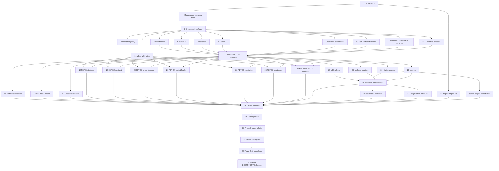

# Implementation Plan: flow-engine-v3-rewrite

## Overview

Rewrite of the WhatsApp bot conversational engine into a single pure function `runEngine` (`_shared/flow-engine/v3-runner.ts`) replacing the two competing legacy engines (`runBotFlow` + `runConversationalFlow`) duplicated across `evolution-webhook` and `whapi-webhook`. Webhook entries become thin: parse inbound → load state → call engine → execute outbounds via channel adapter → persist update. Six correctness guarantees (G1–G6) are encoded by construction in the runner shape and validated by property-based tests over `runEngine`, integration scenarios in `bot-e2e-runner`, and a phased per-consultor flag rollout (`consultants.use_engine_v3`).

The plan is 39 tasks across 6 waves: Wave 1 prepares schema/types/lint sequentially; Wave 2 implements pure primitives in parallel; Wave 3 wires unit + property tests; Wave 4 builds the impure I/O layer (loader, dispatcher, hooks, router, webhook entries); Wave 5 adds integration scenarios + migration script + daily metrics cron; Wave 6 executes a 4-phase rollout culminating in a guarded destructive cleanup of the legacy engine.

## Task Dependency Graph



```json
{
  "waves": [
    { "id": 1, "tasks": [1, 2, 3, 4] },
    { "id": 2, "tasks": [5, 6, 7, 8, 9, 10, 11, 12, 13] },
    { "id": 3, "tasks": [14, 15, 16, 17, 18, 19, 20, 21, 22, 23, 24] },
    { "id": 4, "tasks": [25, 26, 27, 28, 29] },
    { "id": 5, "tasks": [30, 31, 32, 33] },
    { "id": 6, "tasks": [34, 35, 36, 37, 38, 39] }
  ]
}
```

## Tasks

- [x] 1. Create non-destructive DB migration for engine v3 schema additions
  - Create `supabase/migrations/{timestamp}_engine_v3_schema.sql`
  - Add `ALTER TABLE consultants ADD COLUMN use_engine_v3 BOOLEAN NOT NULL DEFAULT FALSE`
  - Add `ALTER TABLE customer_flow_state ADD COLUMN last_outbound_content_hash TEXT`
  - Add `ALTER TABLE bot_flow_steps ADD COLUMN persuasive_text TEXT` (nullable, optional)
  - Create `engine_logs` table with columns `id BIGSERIAL PK`, `at TIMESTAMPTZ`, `kind TEXT`, `customer_id UUID FK`, `flow_id UUID FK`, `step_id UUID FK NULL`, `payload JSONB`, `side_effect JSONB`
  - Add indexes `engine_logs_customer_at (customer_id, at DESC)` and `engine_logs_kind_at (kind, at DESC)`
  - Per design §"Data Models" SQL block; no tables dropped or restructured
  - _Validates: Requirements 11.1, 14.1, 14.3, 16.2, 16.3_

- [x] 2. Regenerate `src/integrations/supabase/types.ts`
  - Run `supabase gen types typescript --linked > src/integrations/supabase/types.ts` after migration applied locally
  - Confirm `Database["public"]["Tables"]["consultants"]["Row"]` now exposes `use_engine_v3: boolean`
  - Confirm `customer_flow_state` row has `last_outbound_content_hash: string | null`
  - Confirm `bot_flow_steps` row has `persuasive_text: string | null`
  - Confirm `engine_logs` row + insert types are emitted
  - Commit regenerated file alongside migration to keep schema and types coherent
  - _Validates: Requirements 11.5, 16.1, 16.2_

- [x] 3. Create `_shared/flow-engine/v3-types.ts` with all engine interfaces
  - Create file `supabase/functions/_shared/flow-engine/v3-types.ts`
  - Export `EngineInput`, `EngineOutput`, `CustomerSnapshot`, `BotFlow`, `BotFlowStep`, `MediaOrderEntry`, `InboundEvent`, `EngineConfig`, `EngineHooks`, `OutboundMessage`, `DeferredAction`, `StructuredLog`, `LogKind`, `FallbackContext`, `FallbackHandler`, `VariantStrategy` per design §2.1–§2.6
  - Use `import type` for `ChannelCapabilities`, `MediaPayload`, `OutboundChoice` from `../channels/types.ts` to avoid value imports
  - Re-export `OutboundMessage` shape with discriminated union on `kind` (text | choice | media | audio_slot | presence)
  - Document `idempotencyContent` requirement (non-empty string) inline as JSDoc
  - _Validates: Requirements 1.3, 2.4, 12.1, 12.5_

- [x] 4. Add CI lint rule preventing impure imports in `v3-runner.ts`
  - Create `supabase/functions/_shared/flow-engine/__tests__/purity_lint_test.ts` (Deno test)
  - Read `v3-runner.ts` source as a string and assert it contains none of: `from "@supabase/supabase-js"`, `supabase.from(`, ` fetch(`, `Date.now(`, `Math.random(`, `crypto.randomUUID(`, `setTimeout(`, `setInterval(`
  - Whitelist `import type` statements explicitly
  - Add the test path to `.github/workflows/ci.yml` so it runs on every PR (extend the existing `deno test` step or add a dedicated job named `engine-purity-check`)
  - Failure message must point engineers to the design's hook + config injection patterns (§2.1, §2.4)
  - _Validates: Requirements 1.3, 1.4, 1.5, 1.6_

- [x] 5. Implement pure engine helpers in `_shared/flow-engine/helpers.ts`
  - Create `supabase/functions/_shared/flow-engine/helpers.ts`
  - Export `matchTransition(transitions, inbound, captured)` — returns the first transition whose `trigger_phrases` or `trigger_intent` matches the inbound, or `null`
  - Export `dedupeAdjacent(outbound)` — removes the second of any two adjacent items sharing `idempotencyContent` (per design §2.7 step 5)
  - Export `dropDuplicateLeader(outbound, state)` — drops `outbound[0]` when `hash(outbound[0].idempotencyContent) === state.lastOutboundContentHash` and `state.lastOutboundAt` is within 2 seconds (uses `config.now`, threshold derived from epoch difference, no `Date.now` calls)
  - Export `capLimits(outbound, max)` — truncates and emits `engine_outbound_limit_exceeded` log via callback
  - Export `hash(content)` — deterministic content hash (SHA-256 hex via `await crypto.subtle.digest`); for purity, the runner must call this through `EngineConfig.idempotencyKeyFn` instead — keep `hash` synchronous via a small string fold or `djb2` instead of Web Crypto
  - Export `pickVariant(variant)` returning the matching `VariantStrategy`
  - All functions are pure and synchronous; no `Date.now`, no `fetch`, no `crypto.randomUUID`
  - _Validates: Requirements 1.3, 1.4, 1.5, 2.1, 2.2, 2.3, 2.4, 15.1_

- [x] 6. Implement Variant A strategy in `variants/a.ts`
  - Create `supabase/functions/_shared/flow-engine/variants/a.ts`
  - Export `variantA: VariantStrategy` per design §2.2.1
  - Read `flow.mediaOrderByStepKey[step.stepKey ?? ""]`; when defined and non-empty, render exactly in declared order (`text` → `image` → `audio` → `video` → `document`)
  - When `mediaOrderByStepKey` is empty for the step, synthesize from `step.messageText` + `step.choiceOptions` (text first, choice last) — call this `synthesizeFromStep`
  - Pure function: takes `{ step, flow, capabilities, config }` and returns `OutboundMessage[]` with non-empty `idempotencyContent` derived from item content + `step.id`
  - _Validates: Requirements 5.1, 5.2, 8.1, 8.2, 8.3, 16.6_

- [x] 7. Implement Variant B strategy in `variants/b.ts`
  - Create `supabase/functions/_shared/flow-engine/variants/b.ts`
  - Export `variantB: VariantStrategy` per design §2.2.2
  - Build text from `step.persuasiveText?.trim() || step.messageText?.trim() || ""`; throw an error to surface to dispatcher when both are empty (per Requirement 16.6) so safe-text doesn't mask misconfiguration
  - When `step.stepType === "ask_choice"` and `choiceOptions` non-empty, append a `choice` outbound respecting `step.preferredChoiceKind`
  - STATIC GUARANTEE: function body must never construct an outbound with `kind === "audio_slot"` or `media.kind === "audio"` regardless of `mediaOrderByStepKey` content; treat any audio entry as a no-op
  - _Validates: Requirements 5.3, 5.4, 16.3, 16.6_

- [x] 8. Implement Variant D strategy in `variants/d.ts`
  - Create `supabase/functions/_shared/flow-engine/variants/d.ts`
  - Export `variantD: VariantStrategy` per design §2.2.3
  - Delegate base outbound construction to `variantA.buildStepOutbound`
  - When `step.stepType === "ask_choice"` AND `capabilities.supportsButtons === true`: rewrite the `choice` outbound to `choice.preferred = "button"` and slice options to `≤ 3` (Whapi limit)
  - When `capabilities.supportsButtons === false`: leave `choice.preferred = "text"` (numbered text list) — never emit `preferred = "button"`
  - When `capabilities.maxButtons === 0` and `capabilities.supportsList === true`: emit `choice.preferred = "list"`
  - _Validates: Requirements 5.5, 5.6, 12.3, 12.5_

- [x] 9. Implement Variant C placeholder in `variants/c.ts` and variant picker
  - Create `supabase/functions/_shared/flow-engine/variants/c.ts`
  - Export `variantC: VariantStrategy` whose `buildStepOutbound` throws `Error("variantC: not implemented yet — out of scope for v3 rewrite")`
  - The runner short-circuits BEFORE calling `variantC`: when `flow.variant === "C"`, the runner emits log `engine_variant_unsupported` and routes to `humanoHandler` with `handoff_reason = "variant_c_not_supported"` (covered in task 13)
  - Export `pickVariant(variant)` lookup from `helpers.ts` mapping "A" → variantA, "B" → variantB, "D" → variantD; "C" returns variantC sentinel that the runner detects before invocation
  - _Validates: Requirements 5.7_

- [x] 10. Implement synchronous fallback handlers in `fallbacks.ts`
  - Create `supabase/functions/_shared/flow-engine/fallbacks.ts`
  - Export `repeatHandler` and `retryHandler` (alias: same code path with retry counter) — re-emit the current step's outbound via `pickVariant(flow.variant).buildStepOutbound`, increment `retries`; when `state.retries >= config.limits.maxRetriesBeforeHandoff`, escalate per `step.fallback.on_fail` (`advance` | `handoff` | `next` | `repeat`) per design §2.3.1
  - Export `gotoHandler` per design §2.3.2 — validate `target ∈ step.reachableStepIds`; on invalid config, fall through to `SAFE_TEXT_FALLBACK`; on success, emit `engine_goto` log with `{ from, to }` and reset `retries: 0`, set `enteredStepAt: config.now`
  - Export `advanceHandler` — finds next step by `position` and invokes the variant strategy on it
  - Export `FALLBACK_HANDLERS` map keyed by `FallbackSpec["mode"]`
  - All handlers pure; no `Date.now`, no DB
  - _Validates: Requirements 4.1, 4.2, 4.3, 15.2, 15.4_

- [x] 11. Implement `humanoHandler` and `SAFE_TEXT_FALLBACK` in `fallbacks.ts`
  - Add `humanoHandler` per design §2.3.5: emits one text outbound (`handoffMessageFor(reason)`), sets `stateUpdate.status = "paused_system"`, sets `pauseReason`, emits `engine_handoff` log with `sideEffect = { kind: "insert_handoff_alert", reason }` — exactly one sentinel per turn
  - Add `SAFE_TEXT_FALLBACK` per design §2.3.6: emits one text outbound using `step.messageText?.trim() || "Desculpa, não entendi. Pode escrever de outro jeito?"`, increments `retries`, emits `engine_safe_text` log
  - Add helper `handoffMessageFor(reason)` mapping `lead_pediu_humano`, `ai_limit_atingido`, `variant_c_not_supported`, `engine_v3_migration` to user-facing strings
  - Both handlers pure; `idempotencyContent` derived from `step.id` + reason/retries to preserve uniqueness
  - _Validates: Requirements 3.2, 3.3, 3.4, 6.1, 6.2, 6.3, 15.2_

- [x] 12. Implement deferred AI fallback handlers in `fallbacks.ts`
  - Add `aiAnswerHandler` per design §2.3.3: returns empty outbound + `deferred = { kind: "ai_answer", question, stepId, flowId, thenRepeatStep: true }`; bumps `retries`; emits `engine_ai_answer_deferred` log
  - When `flow.strictMode === true` OR `inbound.kind !== "text"`: route to `SAFE_TEXT_FALLBACK` (no AI invocation)
  - When `state.retries >= config.limits.maxAiQuestionsPerStep`: invoke `humanoHandler` with `handoff_reason = "ai_limit_atingido"`
  - Add `aiDecideHandler` per design §2.3.4: returns empty outbound + `deferred = { kind: "ai_decide", stepId, flowId, candidates, inboundText }`; `candidates` = `step.transitions.map(t => t.goto_step_id).filter(id => id && step.reachableStepIds.includes(id))`; emits `engine_ai_decide_deferred` log
  - When `flow.strictMode === true`: route to `SAFE_TEXT_FALLBACK` and emit `engine_strict_mode_blocked_ai` log
  - Both handlers pure; no `fetch`, no AI hook calls inside the engine
  - _Validates: Requirements 7.1, 7.2, 7.3, 9.1, 9.2, 9.3, 9.4, 9.5, 15.3_

- [x] 13. Implement `runEngine` core integration in `v3-runner.ts`
  - Create `supabase/functions/_shared/flow-engine/v3-runner.ts`
  - Export single function `runEngine(input: EngineInput): EngineOutput` per design §2.7 evaluation order
  - Step 1: resolve current step (`null` → enter first step via `handleNewLead`); when `currentStepId` not in `flow.steps`, emit `engine_invalid_step` log and reset
  - Step 2: short-circuit on `flow.variant === "C"` — emit `engine_variant_unsupported` and call `humanoHandler` with `handoff_reason = "variant_c_not_supported"`
  - Step 3: `captured = hooks.captures.extract({ inbound, specs: step.captures })`
  - Step 4: try `matchTransition` — when matched, build outbound via `pickVariant(flow.variant)`, dedupeAdjacent, capLimits, emit exactly one `engine_transition_match` log
  - Step 5: no transition matched — pick fallback handler from `FALLBACK_HANDLERS[step.fallback.mode]`; when `flow.strictMode && mode ∈ {ai, ai_answer}`, replace handler with `SAFE_TEXT_FALLBACK` and push `engine_strict_mode_blocked_ai` log
  - Step 6: enforce G2 — when result.outbound.length === 0 AND result.deferred is undefined AND inbound is user-driven, replace with `SAFE_TEXT_FALLBACK` and push `engine_no_match` log
  - Step 7: cross-turn dedupe via `dropDuplicateLeader` (emits `engine_dedupe_blocked` when triggered); apply `dedupeAdjacent` and `capLimits` again
  - Step 8: when `flow.variant === "B"`: assert no `audio_slot`/`audio` outbound (defensive, since variantB cannot emit them)
  - Step 9: when `result.outbound.length > 0`: set `stateUpdate.lastOutboundContentHash = hash(last.idempotencyContent)`
  - Step 10: clamp `stateUpdate.retries` to `[0, state.retries + 1]` (Requirement 15.4)
  - Add try/catch wrapper at the top: any thrown error from a child module produces a single safe-text outbound + `engine_safe_text` log (Requirement 3.4)
  - _Validates: Requirements 1.1, 1.2, 1.3, 2.1, 2.2, 2.3, 3.1, 3.2, 3.3, 3.4, 4.1, 4.2, 4.3, 5.7, 6.3, 7.1, 7.2, 7.3, 9.4, 15.1, 15.4_

- [x] 14. Create test arbitraries module `__tests__/arb.ts`
  - Create `supabase/functions/_shared/flow-engine/__tests__/arb.ts`
  - Import fast-check from `https://esm.sh/fast-check@3`
  - Export `arbStepType`, `arbVariant` (constantFrom A/B/D — exclude C from default to keep PBT signal clean; export separate `arbVariantWithC` for the variant-C handoff property), `arbFallbackMode`, `arbInboundEvent`, `arbStep(allStepIds)`, `arbCustomerSnapshot(allStepIds)`, `arbCapabilities`, `arbConfig`, `arbEngineInput()` per design §"Sample fast-check generators"
  - `arbEngineInput` MUST chain: pre-generate the id set, then build `flow.steps` such that `transitions[].goto_step_id` and `fallback.goto_step_id` only reference ids in `step.reachableStepIds = allStepIds` (matches engine invariant)
  - Export `STUB_HOOKS` providing `describe()` returns + a synchronous `captures.extract` that returns `{}`
  - File path: `supabase/functions/_shared/flow-engine/__tests__/arb.ts`
  - _Validates: Requirements 1.3 (precondition for property tests)_

- [x] 15. Write unit tests for `runEngine` core loop
  - Create `supabase/functions/_shared/flow-engine/__tests__/v3-runner_test.ts` (Deno test)
  - One test per branch of design §2.7 evaluation order: new lead, transition match, fallback match, safe-text, variant-C handoff, invalid step
  - Include edge cases: empty flow (no steps), single-step flow, step with no transitions and null fallback, `currentStepId = null`, `inbound.kind = "no_input"`
  - Assert log kinds, outbound length, `stateUpdate.currentStepId`, and `stateUpdate.retries` shape per branch
  - Run with `deno test --allow-read supabase/functions/_shared/flow-engine/__tests__/v3-runner_test.ts`
  - _Validates: Requirements 1.1, 1.2, 1.3, 3.1, 3.2, 3.3, 4.1_

- [x] 16. Write unit tests for variant strategies
  - Create `supabase/functions/_shared/flow-engine/__tests__/variants_test.ts` (Deno test)
  - Variant A: assert media order matches `mediaOrderByStepKey[stepKey]`; assert fallback to `synthesizeFromStep` when `mediaOrderByStepKey` empty
  - Variant B: assert no audio outbound regardless of input config; assert `persuasiveText` preferred over `messageText`; assert error thrown when both empty (Requirement 16.6)
  - Variant D: assert `choice.preferred = "button"` and `options.length ≤ 3` when `supportsButtons = true`; assert `choice.preferred = "text"` when `supportsButtons = false`; assert `choice.preferred = "list"` when `maxButtons = 0` and `supportsList = true`
  - Variant C: assert `buildStepOutbound` throws (the runner catches before reaching it)
  - _Validates: Requirements 5.1, 5.2, 5.3, 5.4, 5.5, 5.6, 8.1, 8.2, 8.3, 12.5, 16.3, 16.6_

- [x] 17. Write unit tests for fallback handlers
  - Create `supabase/functions/_shared/flow-engine/__tests__/fallbacks_test.ts` (Deno test)
  - One test per handler: `repeat`, `retry`, `goto` (valid + invalid `goto_step_id`), `advance`, `humano`, `aiAnswer`, `aiDecide`, `safeText`
  - For `humano`: assert exactly one log carries `sideEffect.kind = "insert_handoff_alert"`
  - For `aiAnswer` + strict mode true: assert routes to safe-text and emits `engine_strict_mode_blocked_ai`
  - For `aiAnswer` + retries ≥ limit: assert escalates to handoff with `handoff_reason = "ai_limit_atingido"`
  - For `aiDecide`: assert `deferred.candidates` is subset of `step.reachableStepIds`
  - For `repeat` + retries ≥ max: assert escalation per `on_fail` (`advance` | `handoff` | `next` | `repeat`)
  - _Validates: Requirements 4.1, 4.2, 4.3, 6.1, 7.1, 7.2, 7.3, 9.1, 9.2, 9.3, 9.5, 15.2, 15.3_

- [x] 18. Property test G1 — no duplicate consecutive outbounds
  - Create `supabase/functions/_shared/flow-engine/__tests__/pbt_g1_test.ts` (Deno test + fast-check)
  - File: `pbt_g1_test.ts`
  - Property: `for all input, runEngine(input).outbound has no two adjacent items with same idempotencyContent`
  - Use `arbEngineInput()` from `arb.ts`
  - `fc.assert(fc.property(...), { numRuns: 100 })`
  - WARNING: 100 runs over `arbEngineInput` may exceed 30s on slower machines — keep `numRuns: 100` but allow per-run timeout via fast-check `interruptAfterTimeLimit: 25_000`
  - _Validates: Requirements 2.1, 2.4, Property 1_

- [x] 19. Property test G2 — no silent turn
  - Create `supabase/functions/_shared/flow-engine/__tests__/pbt_g2_test.ts` (Deno test + fast-check)
  - Property: `for all input where inbound.kind ∈ {text, button_click, number_reply, media}, runEngine(input).outbound.length > 0 OR logs contains an *_deferred kind`
  - Filter `arbEngineInput()` accordingly
  - `numRuns: 100`
  - WARNING: filter may shrink samples; ensure shrinking still produces user-driven inbounds
  - _Validates: Requirements 3.1, 3.2, 3.3, 3.4, Property 2_

- [x] 20. Property test G3 — exactly one decision branch per turn
  - Create `supabase/functions/_shared/flow-engine/__tests__/pbt_g3_test.ts` (Deno test + fast-check)
  - Property: across `runEngine(input).logs`, exactly one log of kind ∈ {`engine_transition_match`, `engine_repeat`, `engine_goto`, `engine_safe_text`, `engine_handoff`, `engine_ai_answer_deferred`, `engine_ai_decide_deferred`, `engine_no_match`}
  - `numRuns: 100`
  - WARNING: PBT may take 20–40s; if exceeds 30s consistently, drop to `numRuns: 75` and document
  - _Validates: Requirements 4.1, 4.2, 4.3, Property 3_

- [x] 21. Property test G4 — variant fidelity (A/B/C/D split)
  - Create `supabase/functions/_shared/flow-engine/__tests__/pbt_g4_test.ts` (Deno test + fast-check)
  - Property G4a (variant A): when `flow.mediaOrderByStepKey[stepKey]` defined, kinds in `outbound` matching the configured order
  - Property G4b (variant B): no outbound has `kind === "audio_slot"` or `kind === "media"` with `media.kind === "audio"`
  - Property G4c (variant D): when `capabilities.supportsButtons` and step is `ask_choice`, at least one `choice` outbound has `preferred = "button"` and `options.length ≤ 3`
  - Property G4d (variant C): when `flow.variant === "C"`, log `engine_variant_unsupported` is emitted exactly once and `stateUpdate.status === "paused_system"`
  - Each property: `numRuns: 100`, separate `fc.assert` blocks
  - WARNING: 4 sub-properties × 100 runs may approach 60s — split into 4 tests so failures pinpoint the variant
  - _Validates: Requirements 5.1, 5.2, 5.3, 5.4, 5.5, 5.6, 5.7, 8.1, 8.2, 8.3, Property 4_

- [x] 22. Property test G5 — single channel of escalation
  - Create `supabase/functions/_shared/flow-engine/__tests__/pbt_g5_test.ts` (Deno test + fast-check)
  - Property: when `runEngine(input).stateUpdate.status === "paused_system"`, exactly one `StructuredLog` carries `sideEffect.kind === "insert_handoff_alert"`
  - Conversely: when `status !== "paused_system"`, zero logs carry that sideEffect (Requirement 6.3)
  - `numRuns: 100`
  - WARNING: requires generating inputs likely to trigger handoff; bias `arbFallbackMode` toward `humano` in a separate arbitrary `arbEngineInputBiasedHandoff` to avoid wasting runs
  - _Validates: Requirements 6.1, 6.2, 6.3, Property 5_

- [x] 23. Property test G6 — strict mode honors consultor intent
  - Create `supabase/functions/_shared/flow-engine/__tests__/pbt_g6_test.ts` (Deno test + fast-check)
  - Property: when `flow.strictMode === true`, `runEngine(input).logs` contains zero logs of kind `engine_ai_answer_deferred`, `engine_ai_decide_deferred`, or `engine_ai_decide_invalid`
  - Force `flow.strictMode = true` via `arbEngineInput().map(i => ({ ...i, flow: { ...i.flow, strictMode: true } }))`
  - `numRuns: 100`
  - WARNING: ensures even when steps configure `mode: ai_answer`, no AI log appears
  - _Validates: Requirements 7.1, 7.2, 7.3, 9.1, Property 6_

- [x] 24. Property tests for termination and round-trip
  - Create `supabase/functions/_shared/flow-engine/__tests__/pbt_termination_test.ts` (Deno test + fast-check)
  - Termination property: starting from any valid state and any sequence of up to 20 inbounds, the engine reaches `status ∈ {converted, lost, paused_*}` or stays in `running` — never throws, never returns malformed `EngineOutput`
  - Round-trip property: applying `stateUpdate` and re-running with `inbound = { kind: "no_input" }` does not produce a different `currentStepId` and does not advance `retries`
  - Outbound limit property: `runEngine(input).outbound.length ≤ input.config.limits.maxOutboundsPerTurn` for all inputs
  - `numRuns: 50` for termination (sequence-based, slower); `numRuns: 100` for round-trip and outbound limit
  - WARNING: termination property may take 40–60s due to 20-step sequences; split into separate tests per property so flakes pinpoint
  - _Validates: Requirements 1.3, 2.3, 15.1, 15.4_

- [x] 25. Implement `v3-loader.ts` single round-trip context loader
  - Create `supabase/functions/_shared/flow-engine/v3-loader.ts`
  - Export `loadContext(supabase, customerId): Promise<{ state: CustomerSnapshot, flow: BotFlow, capabilities: ChannelCapabilities }>`
  - Single SELECT joining `customers` + `customer_flow_state` + `bot_flows` + `bot_flow_steps` (use a Postgres view or a `select(... bot_flows!inner(...) bot_flow_steps!inner(...))` Supabase chain)
  - Materialize `flow.mediaOrderByStepKey` from `consultants.flow_step_media_order` JSONB
  - Materialize `step.reachableStepIds` for each step (set of all step ids in flow per design §2.1.2)
  - Resolve `capabilities` from the channel adapter registry (Whapi vs Evolution per `customers.channel`)
  - Throw on missing flow; let webhook entry catch and 500
  - _Validates: Requirements 1.6, 1.7, 11.1, 11.5, 12.1, 16.1_

- [x] 26. Implement `v3-dispatcher.ts` executing outbounds + persisting state + writing logs
  - Create `supabase/functions/_shared/flow-engine/v3-dispatcher.ts`
  - Export `executeActions({ supabase, adapter, customerId, result, hooks, config }): Promise<void>`
  - Iterate `result.outbound` in order, mapping each `OutboundMessage.kind` 1:1 to adapter methods (text → `sendText`, choice → `dispatchChoice`, media → `sendMedia`, audio_slot → `sendAudio`, presence → `sendPresence`)
  - Apply `humanDelayFn(text.length)` between text outbounds (read from config)
  - Persist `result.stateUpdate` via single `UPDATE customer_flow_state` (atomic, end of turn)
  - Insert `result.logs` batch into `engine_logs` table within 5 seconds of receiving the result (Requirement 14.1)
  - For each log carrying `sideEffect.kind === "insert_handoff_alert"`: insert exactly one row in `bot_handoff_alerts` BEFORE inserting the engine_log row; on transient DB failure, retry up to 3 times, then route the alert into a dead-letter queue (existing `pending-outbound-media` table OR new `bot_handoff_alerts_dlq` if no fit) — never silently drop (Requirement 6.2, 14.2, 14.4)
  - Resolve `DeferredAction` by binding the matching hook (ai_answer → `hooks.aiAnswer.invoke`, ai_decide → `hooks.aiDecide.invoke`, ocr → `hooks.ocr.invoke`, portal_submit → `hooks.portal.invoke`); validate AI's chosen `step_id ∈ candidates` and on mismatch, log `engine_ai_decide_invalid` and re-enter `runEngine` with `inbound = { kind: "no_input" }` (Requirement 9.4)
  - Channel send failures caught and surfaced via existing `outbound-media-flush-cron` retry path; do not re-throw to caller
  - _Validates: Requirements 1.6, 1.7, 6.2, 9.4, 12.2, 14.1, 14.2, 14.3, 14.4_

- [x] 27. Implement `hooks.ts` adapters using describe pattern
  - Create `supabase/functions/_shared/flow-engine/hooks.ts`
  - Export `EngineHooks` shape per design §2.4
  - Export `defaultHooks(supabase): EngineHooks` factory
  - `ocr`: `describe()` returns `{ kind: "ocr", pipelines: ["ocr_conta", "ocr_documento"] }`; dispatcher binds to existing `_shared/ocr.ts` and OCR review pipeline (untouched per Requirement 13.4)
  - `otp`: `describe()` returns `{ kind: "otp", intercepts: "before_engine" }`; webhook entry runs `recover-stuck-otp` BEFORE the router (Requirement 13.1)
  - `portal`: `describe()` returns `{ kind: "portal", pipelines: ["cadastro_portal", "finalizar_cadastro"] }`; dispatcher binds to existing `_shared/portal-worker.ts` (untouched per Requirement 13.5)
  - `captures.extract({ inbound, specs })`: synchronous, calls existing `_shared/captureExtractors.ts`; pure (Requirement 1.5)
  - `aiAnswer`: `describe()` returns `{ kind: "ai_answer", module: "_shared/ai-faq-answerer.ts" }`; dispatcher binds to existing module
  - `aiDecide`: `describe()` returns `{ kind: "ai_decide", module: "_shared/ai-decisions.ts" }`
  - Engine consumes only `describe()` + `captures.extract`; never invokes async hook methods directly
  - _Validates: Requirements 1.6, 9.1, 9.2, 9.3, 13.1, 13.2, 13.3, 13.4, 13.5_

- [x] 28. Implement `router.ts` reading `consultants.use_engine_v3`
  - Create `supabase/functions/_shared/flow-engine/router.ts`
  - Export `route({ supabase, parsedMessage, adapter }): Promise<void>`
  - Read `consultants.use_engine_v3` fresh per request (no in-memory cache) so flag flips take effect on the next inbound (Requirement 11.4)
  - When `use_engine_v3 = true`: call `loadContext` → build `EngineConfig` (with `now: new Date().toISOString()`, `minuteBucket: Math.floor(Date.now() / 60000)`, `idempotencyKeyFn`, `humanDelayFn`, `limits`) → call `runEngine` → call `executeActions`
  - When `use_engine_v3 = false`: delegate to legacy `runBotFlow` / `runConversationalFlow` (existing handlers) without any v3 code path executed (Requirement 11.2)
  - Export a flag `LEGACY_BRANCH_REMOVED = false` constant; flip to `true` and remove the legacy branch in task 39
  - _Validates: Requirements 1.1, 1.2, 11.1, 11.2, 11.3, 11.4, 11.5_

- [x] 29. Rewrite webhook entry points to delegate to router
  - Modify `supabase/functions/evolution-webhook/index.ts`: keep `parseInbound` + OTP intercept (`recover-stuck-otp`); replace direct calls to legacy handlers with `await route({ supabase, parsedMessage, adapter: evolutionAdapter })`
  - Modify `supabase/functions/whapi-webhook/index.ts`: same shape — `parseInbound` + OTP intercept + `await route({ supabase, parsedMessage, adapter: whapiAdapter })`
  - Webhook entry points contain ZERO business logic beyond inbound parsing, OTP intercept handoff, router invocation (Requirement 1.7)
  - Preserve existing OTP intercept ordering: OTP runs BEFORE router (Requirement 13.1)
  - Preserve existing `_shared/channels/whapi.ts`, `_shared/channels/evolution.ts`, `_shared/channels/dispatch-choice.ts` exports unchanged (Requirement 12.4)
  - _Validates: Requirements 1.1, 1.2, 1.6, 1.7, 12.4, 13.1_

- [x] 30. Add v3 scenarios to `bot-e2e-runner` scenario registry
  - Modify `supabase/functions/bot-e2e-runner/scenarios.ts` (or equivalent registry file) to add: `V_A1`, `V_B1`, `V_D1`, `V_D2`, `AI1`, `AI2`, `SILENT` per design §4.3
  - Each scenario: creates synthetic consultor + flow + customer with `use_engine_v3 = true` in test schema; drives inbounds through `runEngine` directly (no real Whapi/Evolution); asserts `outbound`, `stateUpdate`, `logs` shapes; tears down test data
  - `V_A1` (variant A): "oi" → "1" → photo → assert `media_order` rendering, choice match, OCR pipeline triggered
  - `V_B1` (variant B): "oi" → "queria saber se vale a pena" → assert no audio sent, persuasive text only, `ai_answer` deferred, returns to step
  - `V_D1` (variant D Whapi): button rendered (`supportsButtons = true`); `V_D2` (variant D Evolution number reply): same logical match
  - `AI1`: step with `mode: ai_answer` → user asks unrelated → AI answers via `hooks.aiAnswer`, same step re-emitted
  - `AI2`: step with `mode: ai` → AI picks transition from `candidates`, engine validates, advances; out-of-list response triggers `engine_ai_decide_invalid` → safe-text
  - `SILENT`: `inbound = no_input` (cron-driven) → no spurious outbound
  - Runner code itself unchanged (Requirement 13)
  - _Validates: Requirements 5.1, 5.3, 5.5, 5.6, 9.2, 9.3, 9.4, 13.2_

- [x] 31. Carryover scenarios A1–A4, B1–B2 from `flow-d-retry-rules-fix`
  - Add scenarios `A1`, `A2`, `A3`, `A4`, `B1`, `B2` to `bot-e2e-runner` scenario registry, configured to run on engine v3 (`use_engine_v3 = true` on synthetic consultor)
  - `A1`: retry rules per `flow-d-retry-rules-fix` → same outcome via v3 (retry counter + on_fail handling)
  - `A2`: retry → goto on max
  - `A3`: retry → handoff on max → assert `bot_handoff_alerts` row inserted
  - `A4`: retry → advance on max
  - `B1`: choice match (variant B, no audio)
  - `B2`: choice no-match → fallback fires
  - These exact scenarios run on every PR via CI to detect regressions of the just-deployed retry semantics
  - _Validates: Requirements 4.1, 4.2, 4.3, 5.3, 6.1, 15.2_

- [x] 32. Implement `migrate-engine-v3` one-shot migration script
  - Create `supabase/functions/migrate-engine-v3/index.ts` per design §2.8 pseudocode
  - Cursor over `customers WHERE conversation_step IS NOT NULL AND bot_paused = false` in batches of 500
  - For each row: when `isUUID(conversation_step)` → increment `alreadyUUID` and continue; otherwise UPDATE row to `bot_paused = true`, `bot_paused_reason = "engine_v3_migration"`, `bot_paused_at = NOW()`, then INSERT one row in `bot_handoff_alerts` with `customer_id, reason = "engine_v3_migration", source = "migration"`
  - On UPDATE error: increment `errors` counter, log error, continue with next row (Requirement 10.5)
  - Idempotent: re-running skips already-paused rows and does NOT create duplicate `bot_handoff_alerts` (Requirement 10.4) — guard the INSERT with a uniqueness check on `(customer_id, reason)` for `reason = "engine_v3_migration"`
  - Return `{ paused, alreadyUUID, errors }` JSON
  - Exposed as Edge Function invoked manually with service-role JWT
  - _Validates: Requirements 10.1, 10.2, 10.3, 10.4, 10.5_

- [x] 33. Implement `flow-engine-rollout-cron` daily report
  - Create `supabase/functions/flow-engine-rollout-cron/index.ts`
  - Daily cron (configured in `supabase/config.toml` cron section)
  - Compute over the last 24h of `engine_logs`:
    - G1 violation rate: `count(kind="engine_dedupe_blocked") / count(distinct customer+turn)` — alarm if > 0
    - G2 violation rate: `count(turns where outbound count = 0 AND inbound was user-driven AND no deferred action) / total turns` — alarm if > 0
    - G3 violation rate: `count(engine_no_match) / count(turns)` — alarm if > 5% sustained
    - G5 violation rate: `count(engine_handoff logs without bot_handoff_alerts row within 60s) / count(engine_handoff logs)` — alarm if > 0
    - G6 violation rate: when `flow.strictMode = true` (join via `bot_flows`), count of `engine_ai_*_deferred` logs — alarm if > 0
    - AI cost: sum of cost rows in `ai_decisions` and `ai_faq_answers` tables tagged `engine = "v3"`
  - Also run `bot-e2e-runner` carryover scenarios on both engines (legacy + v3) and report behavior diff (drift detection per design §"Risks R1")
  - Write report into `engine_v3_daily_report` table (or alternative: post into Slack via existing webhook)
  - _Validates: Requirements 14.1, 14.3_

- [x] 34. Phase 0: Deploy v3 with feature flag OFF for all consultors
  - Run `supabase functions deploy migrate-engine-v3 evolution-webhook whapi-webhook flow-engine-rollout-cron` (no flag flips yet)
  - Verify migration applied: `SELECT column_name FROM information_schema.columns WHERE table_name = 'consultants' AND column_name = 'use_engine_v3'` returns one row
  - Verify all `consultants.use_engine_v3 = false` (default)
  - Smoke: send test inbound to a known consultor on legacy → confirm legacy path still serves traffic (no v3 logs in `engine_logs`)
  - Metric gate: zero deploy errors; zero new alerts in Sentry; legacy path latency p95 unchanged
  - Rollback: `supabase functions delete <function>` and revert migration via `supabase migration repair`
  - _Validates: Requirements 11.1, 11.2_

- [x] 35. Run migration and validate post-condition
  - Invoke `migrate-engine-v3` Edge Function with service-role JWT during a low-traffic maintenance window
  - Capture returned `{ paused, alreadyUUID, errors }`; assert `errors = 0`
  - Validate post-condition: `SELECT count(*) FROM customers WHERE conversation_step IS NOT NULL AND conversation_step !~ '^[0-9a-f]{8}-[0-9a-f]{4}-[0-9a-f]{4}-[0-9a-f]{4}-[0-9a-f]{12}$' AND bot_paused = false` returns 0 (Requirement 10 acceptance)
  - Validate idempotency: re-invoke the function; assert `paused = 0` on second run (already-paused rows skipped per Requirement 10.4)
  - Notify consultors via existing alerts dashboard that `engine_v3_migration` paused leads need human pickup
  - Rollback: not applicable — pause is reversible per-row by consultor unpausing the lead manually
  - _Validates: Requirements 10.1, 10.2, 10.3, 10.4, 10.5_

- [x] 36. Phase 1: Flag ON for super-admin only, 24h smoke
  - Run `UPDATE consultants SET use_engine_v3 = true WHERE id = '0c2711ad-4836-41e6-afba-edd94f698ae3'` (super-admin)
  - Send a real test inbound from a test phone to super-admin's Fluxo D; confirm: one inbound → expected outbound count, `engine_logs` shows exactly one decision log, `bot_handoff_alerts` empty unless explicitly tested
  - Run `bot-e2e-runner` against super-admin's actual Fluxo D in test mode (`bot_test_mode = true` flag on a synthetic customer) per design §4.4
  - Wait 24h, read `flow-engine-rollout-cron` daily report
  - Metric gate to advance: 0 duplicate outbounds, 0 silent turns, 100% transition match where applicable on smoke; G1–G6 violation rate = 0
  - Rollback: `UPDATE consultants SET use_engine_v3 = false WHERE id = '0c2711ad-4836-41e6-afba-edd94f698ae3'` — next inbound routes back to legacy (Requirement 11.4)
  - _Validates: Requirements 1.1, 1.2, 2.1, 3.1, 4.1, 5.1, 6.1, 7.1, 11.1, 11.4, 14.1_

- [~] 37. Phase 2: Flag ON for 5 hand-picked pilot consultors, 7-day validation
  - Identify 5 pilots (mix of variants A, B, D; mix of low- and high-volume)
  - Run `UPDATE consultants SET use_engine_v3 = true WHERE id IN ('<uuid1>', ..., '<uuid5>')`
  - Wait 7 days, monitor `flow-engine-rollout-cron` daily report
  - Metric gate to advance: G1–G6 violation rate = 0 sustained; CSAT proxy (lead replies / lead messages) ≥ baseline -2pp; AI cost within ±10% of pre-rewrite baseline; ≤ 2 handoffs/day attributable to engine
  - Rollback trigger: any G1 or G3 violation; CSAT drop > 5pp; > 2 handoffs/day attributable to engine
  - Per-consultor rollback: `UPDATE consultants SET use_engine_v3 = false WHERE id = '<uuid>'`
  - _Validates: Requirements 11.1, 11.4, 14.1_

- [~] 38. Phase 3: Flag ON for all consultors, 30-day stable observation
  - Run `UPDATE consultants SET use_engine_v3 = true` (all consultors)
  - Monitor `flow-engine-rollout-cron` daily for 30 days
  - Metric gate to advance to Phase 4: legacy idle (0 calls observed via legacy-handler instrumentation); G1–G6 = 0; AI cost within ±10% of pre-rewrite baseline
  - Rollback trigger: any G1/G3 violation rate > 0.1%; AI cost surge > 30% sustained 24h
  - Global rollback: `UPDATE consultants SET use_engine_v3 = false` followed by Sentry incident + RCA
  - During this phase, freeze legacy code: only security fixes accepted; product bugs fixed in v3 only and affected consultor migrated to v3 to receive fix (per design §R1)
  - _Validates: Requirements 11.1, 11.4_

- [~] 39. Phase 4: DESTRUCTIVE cleanup — delete legacy engine code
  - **DESTRUCTIVE: This task deletes legacy code. REQUIRES EXPLICIT OPERATOR CONFIRMATION before execution. Do not proceed unless Phase 3 has been stable for 30 consecutive days with G1–G6 = 0 and the operator has acknowledged this in the PR description.**
  - Files to delete (explicit list):
    - `supabase/functions/evolution-webhook/handlers/bot-flow.ts`
    - `supabase/functions/whapi-webhook/handlers/bot-flow.ts`
    - `supabase/functions/_shared/conversational/index.ts`
    - `supabase/functions/_shared/flow-engine/router.ts` (legacy branch removed; webhook entries call `runEngine` flow directly)
  - Update `supabase/functions/evolution-webhook/index.ts` and `whapi-webhook/index.ts` to inline the v3 dispatch (replace `route(...)` with the v3 branch only)
  - Remove `consultants.use_engine_v3` flag column in a follow-up migration (`ALTER TABLE consultants DROP COLUMN use_engine_v3`) — or keep as a kill-switch; operator decides
  - Run full test suite: unit tests, PBT suite, `bot-e2e-runner` carryover + v3 scenarios — all must pass
  - Deploy: `supabase functions deploy evolution-webhook whapi-webhook`
  - Final cleanup PR title: `chore(engine): remove legacy bot-flow handlers after 30-day v3 stable`
  - Rollback procedure: revert the cleanup PR (git revert) and redeploy; legacy code restored from git history; flag column re-added in a remediation migration if dropped
  - _Validates: Requirements 1.1, 1.2, 1.6, 1.7_

## Notes

### Critical dependencies summary

- Wave 1 is strictly sequential (T1 → T2 → T3 → T4): the migration must apply before types are regenerated, types must exist before `v3-types.ts` references them, and the lint rule must run after the runner's expected import surface is established.
- Wave 2 is parallel **except** for T13 (core integration), which depends on T5–T12. The orchestrator may run T5–T12 in true parallel; T13 must wait for all of them.
- Wave 3 PBT tasks (T18–T24) all depend on T14 (arbitraries) and T13 (runner). Unit tests T15–T17 depend only on T13.
- Wave 4 T29 (webhook rewrites) depends on all of T25–T28 (loader, dispatcher, hooks, router).
- Wave 5 tasks are mostly independent: T30 + T31 depend on T29 (full v3 path running); T32 depends only on T1 (schema); T33 depends on T26 (logs being persisted).
- Wave 6 is strictly sequential. Each phase has a metric gate that must pass before the next phase begins. Phase 4 is destructive and requires explicit operator confirmation.

### Estimated time per wave

- Wave 1 (Foundations): 1 day. Migration + type regen + interface file + CI lint rule.
- Wave 2 (Pure engine): 4–5 days with parallelism (3 engineers); 8–10 days sequential.
- Wave 3 (Tests): 3–4 days. PBT runs may add 2–4 minutes per CI run; budget for tuning `numRuns` if 30s threshold breached.
- Wave 4 (I/O layer): 3–4 days. Loader and dispatcher are the bulk; webhook rewrite is mechanical.
- Wave 5 (Integration + migration + cron): 2–3 days. Mostly scenario authoring.
- Wave 6 (Rollout): 30+ days elapsed time (24h Phase 1, 7 days Phase 2, 30 days Phase 3, 1 day Phase 4 cleanup). Active engineering time ~3 days.

Total active engineering: ~14–18 days. Total elapsed time including Phase 3: ~45–50 days.

### Critério de pronto (Definition of Done)

- [~] Wave 1: Migration applied to production; `src/integrations/supabase/types.ts` regenerated and committed; `v3-types.ts` exports compile; CI purity lint job runs green on every PR.
- [~] Wave 2: `runEngine` is purely functional — no `Date.now`, no `fetch`, no Supabase imports (verified by lint rule from T4); all variant strategies + fallback handlers exported and integrated.
- [~] Wave 3: All 8 PBT properties pass at `numRuns: 100` (or documented downgrade with rationale); unit test coverage of branches in design §2.7 is 100%.
- [~] Wave 4: Webhook entry points contain zero business logic; dispatcher writes engine_logs within 5s of every turn; handoff alerts insert exactly once with DLQ fallback.
- [~] Wave 5: All `bot-e2e-runner` scenarios (V_A1, V_B1, V_D1, V_D2, AI1, AI2, SILENT, A1–A4, B1–B2) green; migration script idempotent (verified by re-running); rollout cron writes daily report.
- [~] Wave 6 — Phase 1: 24h with G1–G6 = 0 on super-admin Fluxo D; smoke from test phone confirmed.
- [~] Wave 6 — Phase 2: 7 days with G1–G6 = 0 across 5 pilots; CSAT within tolerance; AI cost within tolerance.
- [~] Wave 6 — Phase 3: 30 days with G1–G6 = 0 across all consultors; legacy handlers idle (zero calls).
- [~] Wave 6 — Phase 4: Legacy files deleted; final cleanup PR merged; full test suite green on the v3-only codebase.

### Rollback procedure summary

- **Per-consultor rollback (Phases 1–3)**: `UPDATE consultants SET use_engine_v3 = false WHERE id = '<uuid>'`. The router reads the flag fresh on every inbound (Requirement 11.4) so the next inbound for that consultor routes to legacy. No deploy required.
- **Global rollback (Phase 3 emergency)**: `UPDATE consultants SET use_engine_v3 = false`. All traffic returns to legacy on the next inbound. Follow with a Sentry incident and RCA.
- **Migration rollback (Wave 1, very rare)**: `supabase migration repair --status reverted` plus targeted `ALTER TABLE ... DROP COLUMN` for `use_engine_v3`, `last_outbound_content_hash`, `persuasive_text`, and `DROP TABLE engine_logs`. Only do this when the migration itself is the cause of an incident — once Phase 1+ has begun, dropping these columns will break the v3 path for any consultor whose flag is true.
- **Phase 4 rollback (destructive)**: Revert the cleanup PR via `git revert`, redeploy `evolution-webhook` and `whapi-webhook`. Legacy code restored from git history. If the flag column was dropped in the cleanup migration, add a remediation migration restoring it with `DEFAULT TRUE` so previously-migrated consultors stay on v3.
- **AI cost spike**: Toggle `bot_flows.strict_mode = true` per consultor — disables AI fallbacks (`ai`, `ai_answer`) regardless of step config. Effective on next inbound (Requirement 7.1).
- **DLQ drained**: Failed handoff alerts in the dead-letter queue are replayed by the existing `outbound-media-flush-cron` retry path; manual replay possible via SQL `INSERT INTO bot_handoff_alerts SELECT ... FROM <dlq>` once the DB issue is resolved (Requirement 6.2).
